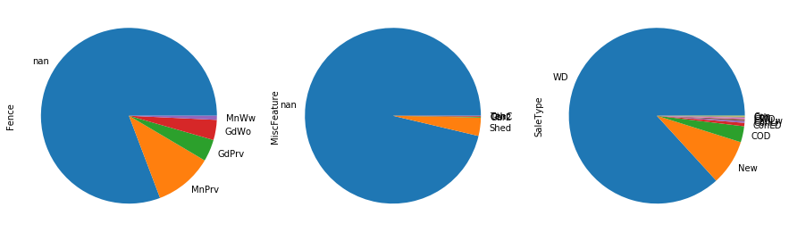
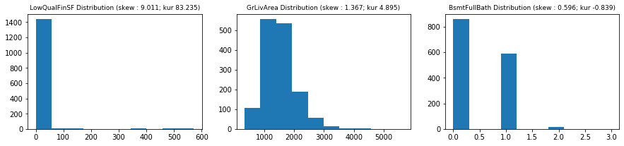
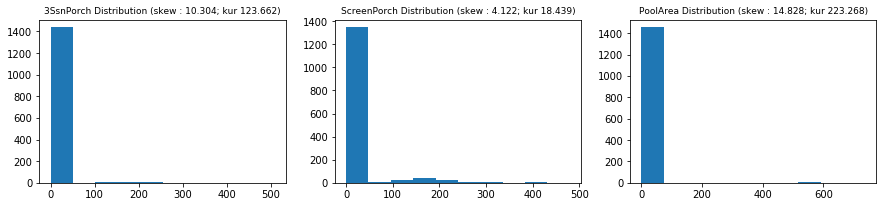

# House Pricing


<font size = 6>Welcome to this house pricing project!</font>

Today we will predict house price with advanced regression technique. If you already think this subject is awesome, 

A guided line will be followed to lead us to good results:
+ **Part 1 - Exploratory Data Analysis:**\
*Goal: Get a deep understanding on data. Nothing will be modified, and statistical test will be used when necessary*
+ **[Part 2 - Preprocessing:](https://github.com/JClappe/House-Pricing-Kaggle/tree/master/Part2_Preprocessing)**\
*Goal: Prepare data to machine learning and obtain some bright new informations.*
+ **[Part 3 - Machine Learning:](https://github.com/JClappe/House-Pricing-Kaggle/tree/master/Part3_Machine_Learning)**\
*Goal: Implementing machine learning regression models, analyse their performance.*

I'm really happy to share this work with you.\
I wish you a good reading!


First let's import necessary librairies and datasets:


```python
import pandas as pd
import numpy as np
import matplotlib.pyplot as plt
import seaborn as sns
from scipy.stats import norm
import warnings
warnings.simplefilter('ignore')
pd.set_option('display.max_columns',None)
```


```python
df_tr = pd.read_csv('train.csv')
df_te = pd.read_csv('test.csv')
df_train = df_tr.copy()
df_test = df_te.copy()
```

There are two data set:
+ **Train set:** data set to train predicting models
+ **Test set:** data set whitout the target. Prediction with our best model on theses datas will be submited on Kaggle to obtain our final score.

# 1 - Exploratory Data Anaysis

## 1.1 - Shape Analysis

### 1.1.1 - First routine
The function below will be used to have a first glimpse on the data set:
+ **Shape**
+ **Head & Tail**
+ **Columns dtypes**
+ **NaN value number**
+ **NaN mapping**


```python
def shape_routine(df,display_values=5,limit=10000,dimension = (12,7)):
    '''Make the shape routine
    df : dataframe to be explored
    display_values : int (number of displayed elements)
    limit : int (max elements to do the NaN map step via seaborn heatmap)
    dimension : tuple (NaN map dimension)
    '''
    
    # Step 1 = Print the general shape
    shape = df.shape
    s_shape = 'Shape '
    print(f'{s_shape :-<50} {shape}')
    
    # Step 2 = Print head / tail / dtypes / NaN
    dfn = pd.DataFrame(data= df.isna().sum(),columns=['NaN_Nb'])
    dfn['NaN_%']=round(df.isna().sum()/df.shape[0]*100,2)
    dfn['dtype']=df.dtypes
    
    # Step 3 = Map NaN
    if df.shape[0]*df.shape[1]<=limit:
        plt.figure(figsize=dimension)
        sns.heatmap(~df.isna(),cbar=False,vmin=0,vmax=1)
        plt.title('Map NaN :     Black >> NaN   |   White >> Not NaN',fontsize=17)      
    else:
        print('NaN not map due to limit')
        
    # Step 4 = Return the general infomation
    return pd.concat([dfn.T,df.head(display_values),df.tail(display_values)],axis='index')
```


```python
shape_routine(df_train,limit=200000,dimension = (20,7))
```

    Shape -------------------------------------------- (1460, 81)
    


<div>
<style scoped>
    .dataframe tbody tr th:only-of-type {
        vertical-align: middle;
    }

    .dataframe tbody tr th {
        vertical-align: top;
    }

    .dataframe thead th {
        text-align: right;
    }
</style>
<table border="1" class="dataframe">
  <thead>
    <tr style="text-align: right;">
      <th></th>
      <th>Id</th>
      <th>MSSubClass</th>
      <th>MSZoning</th>
      <th>LotFrontage</th>
      <th>LotArea</th>
      <th>Street</th>
      <th>Alley</th>
      <th>LotShape</th>
      <th>LandContour</th>
      <th>Utilities</th>
      <th>LotConfig</th>
      <th>LandSlope</th>
      <th>Neighborhood</th>
      <th>Condition1</th>
      <th>Condition2</th>
      <th>BldgType</th>
      <th>HouseStyle</th>
      <th>OverallQual</th>
      <th>OverallCond</th>
      <th>YearBuilt</th>
      <th>YearRemodAdd</th>
      <th>RoofStyle</th>
      <th>RoofMatl</th>
      <th>Exterior1st</th>
      <th>Exterior2nd</th>
      <th>MasVnrType</th>
      <th>MasVnrArea</th>
      <th>ExterQual</th>
      <th>ExterCond</th>
      <th>Foundation</th>
      <th>BsmtQual</th>
      <th>BsmtCond</th>
      <th>BsmtExposure</th>
      <th>BsmtFinType1</th>
      <th>BsmtFinSF1</th>
      <th>BsmtFinType2</th>
      <th>BsmtFinSF2</th>
      <th>BsmtUnfSF</th>
      <th>TotalBsmtSF</th>
      <th>Heating</th>
      <th>HeatingQC</th>
      <th>CentralAir</th>
      <th>Electrical</th>
      <th>1stFlrSF</th>
      <th>2ndFlrSF</th>
      <th>LowQualFinSF</th>
      <th>GrLivArea</th>
      <th>BsmtFullBath</th>
      <th>BsmtHalfBath</th>
      <th>FullBath</th>
      <th>HalfBath</th>
      <th>BedroomAbvGr</th>
      <th>KitchenAbvGr</th>
      <th>KitchenQual</th>
      <th>TotRmsAbvGrd</th>
      <th>Functional</th>
      <th>Fireplaces</th>
      <th>FireplaceQu</th>
      <th>GarageType</th>
      <th>GarageYrBlt</th>
      <th>GarageFinish</th>
      <th>GarageCars</th>
      <th>GarageArea</th>
      <th>GarageQual</th>
      <th>GarageCond</th>
      <th>PavedDrive</th>
      <th>WoodDeckSF</th>
      <th>OpenPorchSF</th>
      <th>EnclosedPorch</th>
      <th>3SsnPorch</th>
      <th>ScreenPorch</th>
      <th>PoolArea</th>
      <th>PoolQC</th>
      <th>Fence</th>
      <th>MiscFeature</th>
      <th>MiscVal</th>
      <th>MoSold</th>
      <th>YrSold</th>
      <th>SaleType</th>
      <th>SaleCondition</th>
      <th>SalePrice</th>
    </tr>
  </thead>
  <tbody>
    <tr>
      <th>NaN_Nb</th>
      <td>0</td>
      <td>0</td>
      <td>0</td>
      <td>259</td>
      <td>0</td>
      <td>0</td>
      <td>1369</td>
      <td>0</td>
      <td>0</td>
      <td>0</td>
      <td>0</td>
      <td>0</td>
      <td>0</td>
      <td>0</td>
      <td>0</td>
      <td>0</td>
      <td>0</td>
      <td>0</td>
      <td>0</td>
      <td>0</td>
      <td>0</td>
      <td>0</td>
      <td>0</td>
      <td>0</td>
      <td>0</td>
      <td>8</td>
      <td>8</td>
      <td>0</td>
      <td>0</td>
      <td>0</td>
      <td>37</td>
      <td>37</td>
      <td>38</td>
      <td>37</td>
      <td>0</td>
      <td>38</td>
      <td>0</td>
      <td>0</td>
      <td>0</td>
      <td>0</td>
      <td>0</td>
      <td>0</td>
      <td>1</td>
      <td>0</td>
      <td>0</td>
      <td>0</td>
      <td>0</td>
      <td>0</td>
      <td>0</td>
      <td>0</td>
      <td>0</td>
      <td>0</td>
      <td>0</td>
      <td>0</td>
      <td>0</td>
      <td>0</td>
      <td>0</td>
      <td>690</td>
      <td>81</td>
      <td>81</td>
      <td>81</td>
      <td>0</td>
      <td>0</td>
      <td>81</td>
      <td>81</td>
      <td>0</td>
      <td>0</td>
      <td>0</td>
      <td>0</td>
      <td>0</td>
      <td>0</td>
      <td>0</td>
      <td>1453</td>
      <td>1179</td>
      <td>1406</td>
      <td>0</td>
      <td>0</td>
      <td>0</td>
      <td>0</td>
      <td>0</td>
      <td>0</td>
    </tr>
    <tr>
      <th>NaN_%</th>
      <td>0</td>
      <td>0</td>
      <td>0</td>
      <td>17.74</td>
      <td>0</td>
      <td>0</td>
      <td>93.77</td>
      <td>0</td>
      <td>0</td>
      <td>0</td>
      <td>0</td>
      <td>0</td>
      <td>0</td>
      <td>0</td>
      <td>0</td>
      <td>0</td>
      <td>0</td>
      <td>0</td>
      <td>0</td>
      <td>0</td>
      <td>0</td>
      <td>0</td>
      <td>0</td>
      <td>0</td>
      <td>0</td>
      <td>0.55</td>
      <td>0.55</td>
      <td>0</td>
      <td>0</td>
      <td>0</td>
      <td>2.53</td>
      <td>2.53</td>
      <td>2.6</td>
      <td>2.53</td>
      <td>0</td>
      <td>2.6</td>
      <td>0</td>
      <td>0</td>
      <td>0</td>
      <td>0</td>
      <td>0</td>
      <td>0</td>
      <td>0.07</td>
      <td>0</td>
      <td>0</td>
      <td>0</td>
      <td>0</td>
      <td>0</td>
      <td>0</td>
      <td>0</td>
      <td>0</td>
      <td>0</td>
      <td>0</td>
      <td>0</td>
      <td>0</td>
      <td>0</td>
      <td>0</td>
      <td>47.26</td>
      <td>5.55</td>
      <td>5.55</td>
      <td>5.55</td>
      <td>0</td>
      <td>0</td>
      <td>5.55</td>
      <td>5.55</td>
      <td>0</td>
      <td>0</td>
      <td>0</td>
      <td>0</td>
      <td>0</td>
      <td>0</td>
      <td>0</td>
      <td>99.52</td>
      <td>80.75</td>
      <td>96.3</td>
      <td>0</td>
      <td>0</td>
      <td>0</td>
      <td>0</td>
      <td>0</td>
      <td>0</td>
    </tr>
    <tr>
      <th>dtype</th>
      <td>int64</td>
      <td>int64</td>
      <td>object</td>
      <td>float64</td>
      <td>int64</td>
      <td>object</td>
      <td>object</td>
      <td>object</td>
      <td>object</td>
      <td>object</td>
      <td>object</td>
      <td>object</td>
      <td>object</td>
      <td>object</td>
      <td>object</td>
      <td>object</td>
      <td>object</td>
      <td>int64</td>
      <td>int64</td>
      <td>int64</td>
      <td>int64</td>
      <td>object</td>
      <td>object</td>
      <td>object</td>
      <td>object</td>
      <td>object</td>
      <td>float64</td>
      <td>object</td>
      <td>object</td>
      <td>object</td>
      <td>object</td>
      <td>object</td>
      <td>object</td>
      <td>object</td>
      <td>int64</td>
      <td>object</td>
      <td>int64</td>
      <td>int64</td>
      <td>int64</td>
      <td>object</td>
      <td>object</td>
      <td>object</td>
      <td>object</td>
      <td>int64</td>
      <td>int64</td>
      <td>int64</td>
      <td>int64</td>
      <td>int64</td>
      <td>int64</td>
      <td>int64</td>
      <td>int64</td>
      <td>int64</td>
      <td>int64</td>
      <td>object</td>
      <td>int64</td>
      <td>object</td>
      <td>int64</td>
      <td>object</td>
      <td>object</td>
      <td>float64</td>
      <td>object</td>
      <td>int64</td>
      <td>int64</td>
      <td>object</td>
      <td>object</td>
      <td>object</td>
      <td>int64</td>
      <td>int64</td>
      <td>int64</td>
      <td>int64</td>
      <td>int64</td>
      <td>int64</td>
      <td>object</td>
      <td>object</td>
      <td>object</td>
      <td>int64</td>
      <td>int64</td>
      <td>int64</td>
      <td>object</td>
      <td>object</td>
      <td>int64</td>
    </tr>
    <tr>
      <th>0</th>
      <td>1</td>
      <td>60</td>
      <td>RL</td>
      <td>65</td>
      <td>8450</td>
      <td>Pave</td>
      <td>NaN</td>
      <td>Reg</td>
      <td>Lvl</td>
      <td>AllPub</td>
      <td>Inside</td>
      <td>Gtl</td>
      <td>CollgCr</td>
      <td>Norm</td>
      <td>Norm</td>
      <td>1Fam</td>
      <td>2Story</td>
      <td>7</td>
      <td>5</td>
      <td>2003</td>
      <td>2003</td>
      <td>Gable</td>
      <td>CompShg</td>
      <td>VinylSd</td>
      <td>VinylSd</td>
      <td>BrkFace</td>
      <td>196</td>
      <td>Gd</td>
      <td>TA</td>
      <td>PConc</td>
      <td>Gd</td>
      <td>TA</td>
      <td>No</td>
      <td>GLQ</td>
      <td>706</td>
      <td>Unf</td>
      <td>0</td>
      <td>150</td>
      <td>856</td>
      <td>GasA</td>
      <td>Ex</td>
      <td>Y</td>
      <td>SBrkr</td>
      <td>856</td>
      <td>854</td>
      <td>0</td>
      <td>1710</td>
      <td>1</td>
      <td>0</td>
      <td>2</td>
      <td>1</td>
      <td>3</td>
      <td>1</td>
      <td>Gd</td>
      <td>8</td>
      <td>Typ</td>
      <td>0</td>
      <td>NaN</td>
      <td>Attchd</td>
      <td>2003</td>
      <td>RFn</td>
      <td>2</td>
      <td>548</td>
      <td>TA</td>
      <td>TA</td>
      <td>Y</td>
      <td>0</td>
      <td>61</td>
      <td>0</td>
      <td>0</td>
      <td>0</td>
      <td>0</td>
      <td>NaN</td>
      <td>NaN</td>
      <td>NaN</td>
      <td>0</td>
      <td>2</td>
      <td>2008</td>
      <td>WD</td>
      <td>Normal</td>
      <td>208500</td>
    </tr>
    <tr>
      <th>1</th>
      <td>2</td>
      <td>20</td>
      <td>RL</td>
      <td>80</td>
      <td>9600</td>
      <td>Pave</td>
      <td>NaN</td>
      <td>Reg</td>
      <td>Lvl</td>
      <td>AllPub</td>
      <td>FR2</td>
      <td>Gtl</td>
      <td>Veenker</td>
      <td>Feedr</td>
      <td>Norm</td>
      <td>1Fam</td>
      <td>1Story</td>
      <td>6</td>
      <td>8</td>
      <td>1976</td>
      <td>1976</td>
      <td>Gable</td>
      <td>CompShg</td>
      <td>MetalSd</td>
      <td>MetalSd</td>
      <td>None</td>
      <td>0</td>
      <td>TA</td>
      <td>TA</td>
      <td>CBlock</td>
      <td>Gd</td>
      <td>TA</td>
      <td>Gd</td>
      <td>ALQ</td>
      <td>978</td>
      <td>Unf</td>
      <td>0</td>
      <td>284</td>
      <td>1262</td>
      <td>GasA</td>
      <td>Ex</td>
      <td>Y</td>
      <td>SBrkr</td>
      <td>1262</td>
      <td>0</td>
      <td>0</td>
      <td>1262</td>
      <td>0</td>
      <td>1</td>
      <td>2</td>
      <td>0</td>
      <td>3</td>
      <td>1</td>
      <td>TA</td>
      <td>6</td>
      <td>Typ</td>
      <td>1</td>
      <td>TA</td>
      <td>Attchd</td>
      <td>1976</td>
      <td>RFn</td>
      <td>2</td>
      <td>460</td>
      <td>TA</td>
      <td>TA</td>
      <td>Y</td>
      <td>298</td>
      <td>0</td>
      <td>0</td>
      <td>0</td>
      <td>0</td>
      <td>0</td>
      <td>NaN</td>
      <td>NaN</td>
      <td>NaN</td>
      <td>0</td>
      <td>5</td>
      <td>2007</td>
      <td>WD</td>
      <td>Normal</td>
      <td>181500</td>
    </tr>
    <tr>
      <th>2</th>
      <td>3</td>
      <td>60</td>
      <td>RL</td>
      <td>68</td>
      <td>11250</td>
      <td>Pave</td>
      <td>NaN</td>
      <td>IR1</td>
      <td>Lvl</td>
      <td>AllPub</td>
      <td>Inside</td>
      <td>Gtl</td>
      <td>CollgCr</td>
      <td>Norm</td>
      <td>Norm</td>
      <td>1Fam</td>
      <td>2Story</td>
      <td>7</td>
      <td>5</td>
      <td>2001</td>
      <td>2002</td>
      <td>Gable</td>
      <td>CompShg</td>
      <td>VinylSd</td>
      <td>VinylSd</td>
      <td>BrkFace</td>
      <td>162</td>
      <td>Gd</td>
      <td>TA</td>
      <td>PConc</td>
      <td>Gd</td>
      <td>TA</td>
      <td>Mn</td>
      <td>GLQ</td>
      <td>486</td>
      <td>Unf</td>
      <td>0</td>
      <td>434</td>
      <td>920</td>
      <td>GasA</td>
      <td>Ex</td>
      <td>Y</td>
      <td>SBrkr</td>
      <td>920</td>
      <td>866</td>
      <td>0</td>
      <td>1786</td>
      <td>1</td>
      <td>0</td>
      <td>2</td>
      <td>1</td>
      <td>3</td>
      <td>1</td>
      <td>Gd</td>
      <td>6</td>
      <td>Typ</td>
      <td>1</td>
      <td>TA</td>
      <td>Attchd</td>
      <td>2001</td>
      <td>RFn</td>
      <td>2</td>
      <td>608</td>
      <td>TA</td>
      <td>TA</td>
      <td>Y</td>
      <td>0</td>
      <td>42</td>
      <td>0</td>
      <td>0</td>
      <td>0</td>
      <td>0</td>
      <td>NaN</td>
      <td>NaN</td>
      <td>NaN</td>
      <td>0</td>
      <td>9</td>
      <td>2008</td>
      <td>WD</td>
      <td>Normal</td>
      <td>223500</td>
    </tr>
    <tr>
      <th>3</th>
      <td>4</td>
      <td>70</td>
      <td>RL</td>
      <td>60</td>
      <td>9550</td>
      <td>Pave</td>
      <td>NaN</td>
      <td>IR1</td>
      <td>Lvl</td>
      <td>AllPub</td>
      <td>Corner</td>
      <td>Gtl</td>
      <td>Crawfor</td>
      <td>Norm</td>
      <td>Norm</td>
      <td>1Fam</td>
      <td>2Story</td>
      <td>7</td>
      <td>5</td>
      <td>1915</td>
      <td>1970</td>
      <td>Gable</td>
      <td>CompShg</td>
      <td>Wd Sdng</td>
      <td>Wd Shng</td>
      <td>None</td>
      <td>0</td>
      <td>TA</td>
      <td>TA</td>
      <td>BrkTil</td>
      <td>TA</td>
      <td>Gd</td>
      <td>No</td>
      <td>ALQ</td>
      <td>216</td>
      <td>Unf</td>
      <td>0</td>
      <td>540</td>
      <td>756</td>
      <td>GasA</td>
      <td>Gd</td>
      <td>Y</td>
      <td>SBrkr</td>
      <td>961</td>
      <td>756</td>
      <td>0</td>
      <td>1717</td>
      <td>1</td>
      <td>0</td>
      <td>1</td>
      <td>0</td>
      <td>3</td>
      <td>1</td>
      <td>Gd</td>
      <td>7</td>
      <td>Typ</td>
      <td>1</td>
      <td>Gd</td>
      <td>Detchd</td>
      <td>1998</td>
      <td>Unf</td>
      <td>3</td>
      <td>642</td>
      <td>TA</td>
      <td>TA</td>
      <td>Y</td>
      <td>0</td>
      <td>35</td>
      <td>272</td>
      <td>0</td>
      <td>0</td>
      <td>0</td>
      <td>NaN</td>
      <td>NaN</td>
      <td>NaN</td>
      <td>0</td>
      <td>2</td>
      <td>2006</td>
      <td>WD</td>
      <td>Abnorml</td>
      <td>140000</td>
    </tr>
    <tr>
      <th>4</th>
      <td>5</td>
      <td>60</td>
      <td>RL</td>
      <td>84</td>
      <td>14260</td>
      <td>Pave</td>
      <td>NaN</td>
      <td>IR1</td>
      <td>Lvl</td>
      <td>AllPub</td>
      <td>FR2</td>
      <td>Gtl</td>
      <td>NoRidge</td>
      <td>Norm</td>
      <td>Norm</td>
      <td>1Fam</td>
      <td>2Story</td>
      <td>8</td>
      <td>5</td>
      <td>2000</td>
      <td>2000</td>
      <td>Gable</td>
      <td>CompShg</td>
      <td>VinylSd</td>
      <td>VinylSd</td>
      <td>BrkFace</td>
      <td>350</td>
      <td>Gd</td>
      <td>TA</td>
      <td>PConc</td>
      <td>Gd</td>
      <td>TA</td>
      <td>Av</td>
      <td>GLQ</td>
      <td>655</td>
      <td>Unf</td>
      <td>0</td>
      <td>490</td>
      <td>1145</td>
      <td>GasA</td>
      <td>Ex</td>
      <td>Y</td>
      <td>SBrkr</td>
      <td>1145</td>
      <td>1053</td>
      <td>0</td>
      <td>2198</td>
      <td>1</td>
      <td>0</td>
      <td>2</td>
      <td>1</td>
      <td>4</td>
      <td>1</td>
      <td>Gd</td>
      <td>9</td>
      <td>Typ</td>
      <td>1</td>
      <td>TA</td>
      <td>Attchd</td>
      <td>2000</td>
      <td>RFn</td>
      <td>3</td>
      <td>836</td>
      <td>TA</td>
      <td>TA</td>
      <td>Y</td>
      <td>192</td>
      <td>84</td>
      <td>0</td>
      <td>0</td>
      <td>0</td>
      <td>0</td>
      <td>NaN</td>
      <td>NaN</td>
      <td>NaN</td>
      <td>0</td>
      <td>12</td>
      <td>2008</td>
      <td>WD</td>
      <td>Normal</td>
      <td>250000</td>
    </tr>
    <tr>
      <th>1455</th>
      <td>1456</td>
      <td>60</td>
      <td>RL</td>
      <td>62</td>
      <td>7917</td>
      <td>Pave</td>
      <td>NaN</td>
      <td>Reg</td>
      <td>Lvl</td>
      <td>AllPub</td>
      <td>Inside</td>
      <td>Gtl</td>
      <td>Gilbert</td>
      <td>Norm</td>
      <td>Norm</td>
      <td>1Fam</td>
      <td>2Story</td>
      <td>6</td>
      <td>5</td>
      <td>1999</td>
      <td>2000</td>
      <td>Gable</td>
      <td>CompShg</td>
      <td>VinylSd</td>
      <td>VinylSd</td>
      <td>None</td>
      <td>0</td>
      <td>TA</td>
      <td>TA</td>
      <td>PConc</td>
      <td>Gd</td>
      <td>TA</td>
      <td>No</td>
      <td>Unf</td>
      <td>0</td>
      <td>Unf</td>
      <td>0</td>
      <td>953</td>
      <td>953</td>
      <td>GasA</td>
      <td>Ex</td>
      <td>Y</td>
      <td>SBrkr</td>
      <td>953</td>
      <td>694</td>
      <td>0</td>
      <td>1647</td>
      <td>0</td>
      <td>0</td>
      <td>2</td>
      <td>1</td>
      <td>3</td>
      <td>1</td>
      <td>TA</td>
      <td>7</td>
      <td>Typ</td>
      <td>1</td>
      <td>TA</td>
      <td>Attchd</td>
      <td>1999</td>
      <td>RFn</td>
      <td>2</td>
      <td>460</td>
      <td>TA</td>
      <td>TA</td>
      <td>Y</td>
      <td>0</td>
      <td>40</td>
      <td>0</td>
      <td>0</td>
      <td>0</td>
      <td>0</td>
      <td>NaN</td>
      <td>NaN</td>
      <td>NaN</td>
      <td>0</td>
      <td>8</td>
      <td>2007</td>
      <td>WD</td>
      <td>Normal</td>
      <td>175000</td>
    </tr>
    <tr>
      <th>1456</th>
      <td>1457</td>
      <td>20</td>
      <td>RL</td>
      <td>85</td>
      <td>13175</td>
      <td>Pave</td>
      <td>NaN</td>
      <td>Reg</td>
      <td>Lvl</td>
      <td>AllPub</td>
      <td>Inside</td>
      <td>Gtl</td>
      <td>NWAmes</td>
      <td>Norm</td>
      <td>Norm</td>
      <td>1Fam</td>
      <td>1Story</td>
      <td>6</td>
      <td>6</td>
      <td>1978</td>
      <td>1988</td>
      <td>Gable</td>
      <td>CompShg</td>
      <td>Plywood</td>
      <td>Plywood</td>
      <td>Stone</td>
      <td>119</td>
      <td>TA</td>
      <td>TA</td>
      <td>CBlock</td>
      <td>Gd</td>
      <td>TA</td>
      <td>No</td>
      <td>ALQ</td>
      <td>790</td>
      <td>Rec</td>
      <td>163</td>
      <td>589</td>
      <td>1542</td>
      <td>GasA</td>
      <td>TA</td>
      <td>Y</td>
      <td>SBrkr</td>
      <td>2073</td>
      <td>0</td>
      <td>0</td>
      <td>2073</td>
      <td>1</td>
      <td>0</td>
      <td>2</td>
      <td>0</td>
      <td>3</td>
      <td>1</td>
      <td>TA</td>
      <td>7</td>
      <td>Min1</td>
      <td>2</td>
      <td>TA</td>
      <td>Attchd</td>
      <td>1978</td>
      <td>Unf</td>
      <td>2</td>
      <td>500</td>
      <td>TA</td>
      <td>TA</td>
      <td>Y</td>
      <td>349</td>
      <td>0</td>
      <td>0</td>
      <td>0</td>
      <td>0</td>
      <td>0</td>
      <td>NaN</td>
      <td>MnPrv</td>
      <td>NaN</td>
      <td>0</td>
      <td>2</td>
      <td>2010</td>
      <td>WD</td>
      <td>Normal</td>
      <td>210000</td>
    </tr>
    <tr>
      <th>1457</th>
      <td>1458</td>
      <td>70</td>
      <td>RL</td>
      <td>66</td>
      <td>9042</td>
      <td>Pave</td>
      <td>NaN</td>
      <td>Reg</td>
      <td>Lvl</td>
      <td>AllPub</td>
      <td>Inside</td>
      <td>Gtl</td>
      <td>Crawfor</td>
      <td>Norm</td>
      <td>Norm</td>
      <td>1Fam</td>
      <td>2Story</td>
      <td>7</td>
      <td>9</td>
      <td>1941</td>
      <td>2006</td>
      <td>Gable</td>
      <td>CompShg</td>
      <td>CemntBd</td>
      <td>CmentBd</td>
      <td>None</td>
      <td>0</td>
      <td>Ex</td>
      <td>Gd</td>
      <td>Stone</td>
      <td>TA</td>
      <td>Gd</td>
      <td>No</td>
      <td>GLQ</td>
      <td>275</td>
      <td>Unf</td>
      <td>0</td>
      <td>877</td>
      <td>1152</td>
      <td>GasA</td>
      <td>Ex</td>
      <td>Y</td>
      <td>SBrkr</td>
      <td>1188</td>
      <td>1152</td>
      <td>0</td>
      <td>2340</td>
      <td>0</td>
      <td>0</td>
      <td>2</td>
      <td>0</td>
      <td>4</td>
      <td>1</td>
      <td>Gd</td>
      <td>9</td>
      <td>Typ</td>
      <td>2</td>
      <td>Gd</td>
      <td>Attchd</td>
      <td>1941</td>
      <td>RFn</td>
      <td>1</td>
      <td>252</td>
      <td>TA</td>
      <td>TA</td>
      <td>Y</td>
      <td>0</td>
      <td>60</td>
      <td>0</td>
      <td>0</td>
      <td>0</td>
      <td>0</td>
      <td>NaN</td>
      <td>GdPrv</td>
      <td>Shed</td>
      <td>2500</td>
      <td>5</td>
      <td>2010</td>
      <td>WD</td>
      <td>Normal</td>
      <td>266500</td>
    </tr>
    <tr>
      <th>1458</th>
      <td>1459</td>
      <td>20</td>
      <td>RL</td>
      <td>68</td>
      <td>9717</td>
      <td>Pave</td>
      <td>NaN</td>
      <td>Reg</td>
      <td>Lvl</td>
      <td>AllPub</td>
      <td>Inside</td>
      <td>Gtl</td>
      <td>NAmes</td>
      <td>Norm</td>
      <td>Norm</td>
      <td>1Fam</td>
      <td>1Story</td>
      <td>5</td>
      <td>6</td>
      <td>1950</td>
      <td>1996</td>
      <td>Hip</td>
      <td>CompShg</td>
      <td>MetalSd</td>
      <td>MetalSd</td>
      <td>None</td>
      <td>0</td>
      <td>TA</td>
      <td>TA</td>
      <td>CBlock</td>
      <td>TA</td>
      <td>TA</td>
      <td>Mn</td>
      <td>GLQ</td>
      <td>49</td>
      <td>Rec</td>
      <td>1029</td>
      <td>0</td>
      <td>1078</td>
      <td>GasA</td>
      <td>Gd</td>
      <td>Y</td>
      <td>FuseA</td>
      <td>1078</td>
      <td>0</td>
      <td>0</td>
      <td>1078</td>
      <td>1</td>
      <td>0</td>
      <td>1</td>
      <td>0</td>
      <td>2</td>
      <td>1</td>
      <td>Gd</td>
      <td>5</td>
      <td>Typ</td>
      <td>0</td>
      <td>NaN</td>
      <td>Attchd</td>
      <td>1950</td>
      <td>Unf</td>
      <td>1</td>
      <td>240</td>
      <td>TA</td>
      <td>TA</td>
      <td>Y</td>
      <td>366</td>
      <td>0</td>
      <td>112</td>
      <td>0</td>
      <td>0</td>
      <td>0</td>
      <td>NaN</td>
      <td>NaN</td>
      <td>NaN</td>
      <td>0</td>
      <td>4</td>
      <td>2010</td>
      <td>WD</td>
      <td>Normal</td>
      <td>142125</td>
    </tr>
    <tr>
      <th>1459</th>
      <td>1460</td>
      <td>20</td>
      <td>RL</td>
      <td>75</td>
      <td>9937</td>
      <td>Pave</td>
      <td>NaN</td>
      <td>Reg</td>
      <td>Lvl</td>
      <td>AllPub</td>
      <td>Inside</td>
      <td>Gtl</td>
      <td>Edwards</td>
      <td>Norm</td>
      <td>Norm</td>
      <td>1Fam</td>
      <td>1Story</td>
      <td>5</td>
      <td>6</td>
      <td>1965</td>
      <td>1965</td>
      <td>Gable</td>
      <td>CompShg</td>
      <td>HdBoard</td>
      <td>HdBoard</td>
      <td>None</td>
      <td>0</td>
      <td>Gd</td>
      <td>TA</td>
      <td>CBlock</td>
      <td>TA</td>
      <td>TA</td>
      <td>No</td>
      <td>BLQ</td>
      <td>830</td>
      <td>LwQ</td>
      <td>290</td>
      <td>136</td>
      <td>1256</td>
      <td>GasA</td>
      <td>Gd</td>
      <td>Y</td>
      <td>SBrkr</td>
      <td>1256</td>
      <td>0</td>
      <td>0</td>
      <td>1256</td>
      <td>1</td>
      <td>0</td>
      <td>1</td>
      <td>1</td>
      <td>3</td>
      <td>1</td>
      <td>TA</td>
      <td>6</td>
      <td>Typ</td>
      <td>0</td>
      <td>NaN</td>
      <td>Attchd</td>
      <td>1965</td>
      <td>Fin</td>
      <td>1</td>
      <td>276</td>
      <td>TA</td>
      <td>TA</td>
      <td>Y</td>
      <td>736</td>
      <td>68</td>
      <td>0</td>
      <td>0</td>
      <td>0</td>
      <td>0</td>
      <td>NaN</td>
      <td>NaN</td>
      <td>NaN</td>
      <td>0</td>
      <td>6</td>
      <td>2008</td>
      <td>WD</td>
      <td>Normal</td>
      <td>147500</td>
    </tr>
  </tbody>
</table>
</div>


+ **Shape:** (1460,81)

+ **Target:** SalePrice

+ **NaN values:** Some columns have a lot of NaN value (more than 80% Alley, PoolQC, Fence, MiscFeature) but in some columns NaN values just means the lack of the considered element in the house.

+ **Dtypes:**
    + **Int64:**
        - **Area :** LotArea, BsmtFinSF1, BsmtFinSF2, BsmtUnfSF, TotalBsmtSF, 1stFlrSF, 2ndFlrSF, LowQualFinSF, GrLivArea, GarageArea, WoodDeckSF, OpenPorchSF, EnclosedPorch, 3SsnPorch, ScreenPorch, PoolArea, 
        - **Quality :** OverallQual, OverallCond, KitchenQual
        - **Date :** YearBuilt, YearRemodAdd, MoSold, YrSold
        - **Element number :** BsmtFullBath, BsmtHalfBath, FullBath, HalfBath, BedroomAbvGr, KitchenAbvGr, TotRmsAbvGrd, Fireplaces, GarageCars
        - **Other :** Id, MSSubClass, MiscVal, SalePrice
    + **Object:** 
        - **Quality:** ExterQual, ExterCond, BsmtQual, BsmtCond, BsmtExposure, BsmtFinType1, BsmtFinType2, HeatingQC, Functional, FireplaceQu, GarageFinish, GarageQual, GarageCond, PoolQC, Fence, 
        - **Area Description:** MSZoning, Street, LotConfig, Neighborhood, Condition1, Condition2, PavedDrive
        - **House Descritpion:** 
            - Inside :  Utilities, Heating, CentralAir, Electrical
            - Outside : Alley, Exterior1st, Exterior2nd, MasVnrType, LandContour, LandSlope, BldgType, RoofMatl, 
            - Structure & Type : Foundation, LotShape, RoofStyle, HouseStyle, GarageType, MiscFeature
        - **Other:** SaleCondition

    + **Float:** LotFrontage, MasVnrArea, GarageYrBlt, SaleType
    
+ **Observations**:
    + Columns number are very high considering the row number. We have to keep in mind issues cause by too many dimension in a problem. **Encoding will probably make our data set too large**, we have to be careful on this step!
    + Int columns often describe **area** and numerate **house's elements**
    + Object columns often describe **quality** or **house description**
    + Most of columns are about theses main points:
        - House's location
        - House's structure, style and materials
        - House's rooms (exterior, basement, 1stFloor, 2ndFloor, Bathroom, Bedroom, Kitchen, Garage, Porch)
        - House's equipement
        - House's area
        - House's quality


```python
shape_routine(df_test,limit=200000,dimension = (20,7))
```

    Shape -------------------------------------------- (1459, 80)
    


<div>
<style scoped>
    .dataframe tbody tr th:only-of-type {
        vertical-align: middle;
    }

    .dataframe tbody tr th {
        vertical-align: top;
    }

    .dataframe thead th {
        text-align: right;
    }
</style>
<table border="1" class="dataframe">
  <thead>
    <tr style="text-align: right;">
      <th></th>
      <th>Id</th>
      <th>MSSubClass</th>
      <th>MSZoning</th>
      <th>LotFrontage</th>
      <th>LotArea</th>
      <th>Street</th>
      <th>Alley</th>
      <th>LotShape</th>
      <th>LandContour</th>
      <th>Utilities</th>
      <th>LotConfig</th>
      <th>LandSlope</th>
      <th>Neighborhood</th>
      <th>Condition1</th>
      <th>Condition2</th>
      <th>BldgType</th>
      <th>HouseStyle</th>
      <th>OverallQual</th>
      <th>OverallCond</th>
      <th>YearBuilt</th>
      <th>YearRemodAdd</th>
      <th>RoofStyle</th>
      <th>RoofMatl</th>
      <th>Exterior1st</th>
      <th>Exterior2nd</th>
      <th>MasVnrType</th>
      <th>MasVnrArea</th>
      <th>ExterQual</th>
      <th>ExterCond</th>
      <th>Foundation</th>
      <th>BsmtQual</th>
      <th>BsmtCond</th>
      <th>BsmtExposure</th>
      <th>BsmtFinType1</th>
      <th>BsmtFinSF1</th>
      <th>BsmtFinType2</th>
      <th>BsmtFinSF2</th>
      <th>BsmtUnfSF</th>
      <th>TotalBsmtSF</th>
      <th>Heating</th>
      <th>HeatingQC</th>
      <th>CentralAir</th>
      <th>Electrical</th>
      <th>1stFlrSF</th>
      <th>2ndFlrSF</th>
      <th>LowQualFinSF</th>
      <th>GrLivArea</th>
      <th>BsmtFullBath</th>
      <th>BsmtHalfBath</th>
      <th>FullBath</th>
      <th>HalfBath</th>
      <th>BedroomAbvGr</th>
      <th>KitchenAbvGr</th>
      <th>KitchenQual</th>
      <th>TotRmsAbvGrd</th>
      <th>Functional</th>
      <th>Fireplaces</th>
      <th>FireplaceQu</th>
      <th>GarageType</th>
      <th>GarageYrBlt</th>
      <th>GarageFinish</th>
      <th>GarageCars</th>
      <th>GarageArea</th>
      <th>GarageQual</th>
      <th>GarageCond</th>
      <th>PavedDrive</th>
      <th>WoodDeckSF</th>
      <th>OpenPorchSF</th>
      <th>EnclosedPorch</th>
      <th>3SsnPorch</th>
      <th>ScreenPorch</th>
      <th>PoolArea</th>
      <th>PoolQC</th>
      <th>Fence</th>
      <th>MiscFeature</th>
      <th>MiscVal</th>
      <th>MoSold</th>
      <th>YrSold</th>
      <th>SaleType</th>
      <th>SaleCondition</th>
    </tr>
  </thead>
  <tbody>
    <tr>
      <th>NaN_Nb</th>
      <td>0</td>
      <td>0</td>
      <td>4</td>
      <td>227</td>
      <td>0</td>
      <td>0</td>
      <td>1352</td>
      <td>0</td>
      <td>0</td>
      <td>2</td>
      <td>0</td>
      <td>0</td>
      <td>0</td>
      <td>0</td>
      <td>0</td>
      <td>0</td>
      <td>0</td>
      <td>0</td>
      <td>0</td>
      <td>0</td>
      <td>0</td>
      <td>0</td>
      <td>0</td>
      <td>1</td>
      <td>1</td>
      <td>16</td>
      <td>15</td>
      <td>0</td>
      <td>0</td>
      <td>0</td>
      <td>44</td>
      <td>45</td>
      <td>44</td>
      <td>42</td>
      <td>1</td>
      <td>42</td>
      <td>1</td>
      <td>1</td>
      <td>1</td>
      <td>0</td>
      <td>0</td>
      <td>0</td>
      <td>0</td>
      <td>0</td>
      <td>0</td>
      <td>0</td>
      <td>0</td>
      <td>2</td>
      <td>2</td>
      <td>0</td>
      <td>0</td>
      <td>0</td>
      <td>0</td>
      <td>1</td>
      <td>0</td>
      <td>2</td>
      <td>0</td>
      <td>730</td>
      <td>76</td>
      <td>78</td>
      <td>78</td>
      <td>1</td>
      <td>1</td>
      <td>78</td>
      <td>78</td>
      <td>0</td>
      <td>0</td>
      <td>0</td>
      <td>0</td>
      <td>0</td>
      <td>0</td>
      <td>0</td>
      <td>1456</td>
      <td>1169</td>
      <td>1408</td>
      <td>0</td>
      <td>0</td>
      <td>0</td>
      <td>1</td>
      <td>0</td>
    </tr>
    <tr>
      <th>NaN_%</th>
      <td>0</td>
      <td>0</td>
      <td>0.27</td>
      <td>15.56</td>
      <td>0</td>
      <td>0</td>
      <td>92.67</td>
      <td>0</td>
      <td>0</td>
      <td>0.14</td>
      <td>0</td>
      <td>0</td>
      <td>0</td>
      <td>0</td>
      <td>0</td>
      <td>0</td>
      <td>0</td>
      <td>0</td>
      <td>0</td>
      <td>0</td>
      <td>0</td>
      <td>0</td>
      <td>0</td>
      <td>0.07</td>
      <td>0.07</td>
      <td>1.1</td>
      <td>1.03</td>
      <td>0</td>
      <td>0</td>
      <td>0</td>
      <td>3.02</td>
      <td>3.08</td>
      <td>3.02</td>
      <td>2.88</td>
      <td>0.07</td>
      <td>2.88</td>
      <td>0.07</td>
      <td>0.07</td>
      <td>0.07</td>
      <td>0</td>
      <td>0</td>
      <td>0</td>
      <td>0</td>
      <td>0</td>
      <td>0</td>
      <td>0</td>
      <td>0</td>
      <td>0.14</td>
      <td>0.14</td>
      <td>0</td>
      <td>0</td>
      <td>0</td>
      <td>0</td>
      <td>0.07</td>
      <td>0</td>
      <td>0.14</td>
      <td>0</td>
      <td>50.03</td>
      <td>5.21</td>
      <td>5.35</td>
      <td>5.35</td>
      <td>0.07</td>
      <td>0.07</td>
      <td>5.35</td>
      <td>5.35</td>
      <td>0</td>
      <td>0</td>
      <td>0</td>
      <td>0</td>
      <td>0</td>
      <td>0</td>
      <td>0</td>
      <td>99.79</td>
      <td>80.12</td>
      <td>96.5</td>
      <td>0</td>
      <td>0</td>
      <td>0</td>
      <td>0.07</td>
      <td>0</td>
    </tr>
    <tr>
      <th>dtype</th>
      <td>int64</td>
      <td>int64</td>
      <td>object</td>
      <td>float64</td>
      <td>int64</td>
      <td>object</td>
      <td>object</td>
      <td>object</td>
      <td>object</td>
      <td>object</td>
      <td>object</td>
      <td>object</td>
      <td>object</td>
      <td>object</td>
      <td>object</td>
      <td>object</td>
      <td>object</td>
      <td>int64</td>
      <td>int64</td>
      <td>int64</td>
      <td>int64</td>
      <td>object</td>
      <td>object</td>
      <td>object</td>
      <td>object</td>
      <td>object</td>
      <td>float64</td>
      <td>object</td>
      <td>object</td>
      <td>object</td>
      <td>object</td>
      <td>object</td>
      <td>object</td>
      <td>object</td>
      <td>float64</td>
      <td>object</td>
      <td>float64</td>
      <td>float64</td>
      <td>float64</td>
      <td>object</td>
      <td>object</td>
      <td>object</td>
      <td>object</td>
      <td>int64</td>
      <td>int64</td>
      <td>int64</td>
      <td>int64</td>
      <td>float64</td>
      <td>float64</td>
      <td>int64</td>
      <td>int64</td>
      <td>int64</td>
      <td>int64</td>
      <td>object</td>
      <td>int64</td>
      <td>object</td>
      <td>int64</td>
      <td>object</td>
      <td>object</td>
      <td>float64</td>
      <td>object</td>
      <td>float64</td>
      <td>float64</td>
      <td>object</td>
      <td>object</td>
      <td>object</td>
      <td>int64</td>
      <td>int64</td>
      <td>int64</td>
      <td>int64</td>
      <td>int64</td>
      <td>int64</td>
      <td>object</td>
      <td>object</td>
      <td>object</td>
      <td>int64</td>
      <td>int64</td>
      <td>int64</td>
      <td>object</td>
      <td>object</td>
    </tr>
    <tr>
      <th>0</th>
      <td>1461</td>
      <td>20</td>
      <td>RH</td>
      <td>80</td>
      <td>11622</td>
      <td>Pave</td>
      <td>NaN</td>
      <td>Reg</td>
      <td>Lvl</td>
      <td>AllPub</td>
      <td>Inside</td>
      <td>Gtl</td>
      <td>NAmes</td>
      <td>Feedr</td>
      <td>Norm</td>
      <td>1Fam</td>
      <td>1Story</td>
      <td>5</td>
      <td>6</td>
      <td>1961</td>
      <td>1961</td>
      <td>Gable</td>
      <td>CompShg</td>
      <td>VinylSd</td>
      <td>VinylSd</td>
      <td>None</td>
      <td>0</td>
      <td>TA</td>
      <td>TA</td>
      <td>CBlock</td>
      <td>TA</td>
      <td>TA</td>
      <td>No</td>
      <td>Rec</td>
      <td>468</td>
      <td>LwQ</td>
      <td>144</td>
      <td>270</td>
      <td>882</td>
      <td>GasA</td>
      <td>TA</td>
      <td>Y</td>
      <td>SBrkr</td>
      <td>896</td>
      <td>0</td>
      <td>0</td>
      <td>896</td>
      <td>0</td>
      <td>0</td>
      <td>1</td>
      <td>0</td>
      <td>2</td>
      <td>1</td>
      <td>TA</td>
      <td>5</td>
      <td>Typ</td>
      <td>0</td>
      <td>NaN</td>
      <td>Attchd</td>
      <td>1961</td>
      <td>Unf</td>
      <td>1</td>
      <td>730</td>
      <td>TA</td>
      <td>TA</td>
      <td>Y</td>
      <td>140</td>
      <td>0</td>
      <td>0</td>
      <td>0</td>
      <td>120</td>
      <td>0</td>
      <td>NaN</td>
      <td>MnPrv</td>
      <td>NaN</td>
      <td>0</td>
      <td>6</td>
      <td>2010</td>
      <td>WD</td>
      <td>Normal</td>
    </tr>
    <tr>
      <th>1</th>
      <td>1462</td>
      <td>20</td>
      <td>RL</td>
      <td>81</td>
      <td>14267</td>
      <td>Pave</td>
      <td>NaN</td>
      <td>IR1</td>
      <td>Lvl</td>
      <td>AllPub</td>
      <td>Corner</td>
      <td>Gtl</td>
      <td>NAmes</td>
      <td>Norm</td>
      <td>Norm</td>
      <td>1Fam</td>
      <td>1Story</td>
      <td>6</td>
      <td>6</td>
      <td>1958</td>
      <td>1958</td>
      <td>Hip</td>
      <td>CompShg</td>
      <td>Wd Sdng</td>
      <td>Wd Sdng</td>
      <td>BrkFace</td>
      <td>108</td>
      <td>TA</td>
      <td>TA</td>
      <td>CBlock</td>
      <td>TA</td>
      <td>TA</td>
      <td>No</td>
      <td>ALQ</td>
      <td>923</td>
      <td>Unf</td>
      <td>0</td>
      <td>406</td>
      <td>1329</td>
      <td>GasA</td>
      <td>TA</td>
      <td>Y</td>
      <td>SBrkr</td>
      <td>1329</td>
      <td>0</td>
      <td>0</td>
      <td>1329</td>
      <td>0</td>
      <td>0</td>
      <td>1</td>
      <td>1</td>
      <td>3</td>
      <td>1</td>
      <td>Gd</td>
      <td>6</td>
      <td>Typ</td>
      <td>0</td>
      <td>NaN</td>
      <td>Attchd</td>
      <td>1958</td>
      <td>Unf</td>
      <td>1</td>
      <td>312</td>
      <td>TA</td>
      <td>TA</td>
      <td>Y</td>
      <td>393</td>
      <td>36</td>
      <td>0</td>
      <td>0</td>
      <td>0</td>
      <td>0</td>
      <td>NaN</td>
      <td>NaN</td>
      <td>Gar2</td>
      <td>12500</td>
      <td>6</td>
      <td>2010</td>
      <td>WD</td>
      <td>Normal</td>
    </tr>
    <tr>
      <th>2</th>
      <td>1463</td>
      <td>60</td>
      <td>RL</td>
      <td>74</td>
      <td>13830</td>
      <td>Pave</td>
      <td>NaN</td>
      <td>IR1</td>
      <td>Lvl</td>
      <td>AllPub</td>
      <td>Inside</td>
      <td>Gtl</td>
      <td>Gilbert</td>
      <td>Norm</td>
      <td>Norm</td>
      <td>1Fam</td>
      <td>2Story</td>
      <td>5</td>
      <td>5</td>
      <td>1997</td>
      <td>1998</td>
      <td>Gable</td>
      <td>CompShg</td>
      <td>VinylSd</td>
      <td>VinylSd</td>
      <td>None</td>
      <td>0</td>
      <td>TA</td>
      <td>TA</td>
      <td>PConc</td>
      <td>Gd</td>
      <td>TA</td>
      <td>No</td>
      <td>GLQ</td>
      <td>791</td>
      <td>Unf</td>
      <td>0</td>
      <td>137</td>
      <td>928</td>
      <td>GasA</td>
      <td>Gd</td>
      <td>Y</td>
      <td>SBrkr</td>
      <td>928</td>
      <td>701</td>
      <td>0</td>
      <td>1629</td>
      <td>0</td>
      <td>0</td>
      <td>2</td>
      <td>1</td>
      <td>3</td>
      <td>1</td>
      <td>TA</td>
      <td>6</td>
      <td>Typ</td>
      <td>1</td>
      <td>TA</td>
      <td>Attchd</td>
      <td>1997</td>
      <td>Fin</td>
      <td>2</td>
      <td>482</td>
      <td>TA</td>
      <td>TA</td>
      <td>Y</td>
      <td>212</td>
      <td>34</td>
      <td>0</td>
      <td>0</td>
      <td>0</td>
      <td>0</td>
      <td>NaN</td>
      <td>MnPrv</td>
      <td>NaN</td>
      <td>0</td>
      <td>3</td>
      <td>2010</td>
      <td>WD</td>
      <td>Normal</td>
    </tr>
    <tr>
      <th>3</th>
      <td>1464</td>
      <td>60</td>
      <td>RL</td>
      <td>78</td>
      <td>9978</td>
      <td>Pave</td>
      <td>NaN</td>
      <td>IR1</td>
      <td>Lvl</td>
      <td>AllPub</td>
      <td>Inside</td>
      <td>Gtl</td>
      <td>Gilbert</td>
      <td>Norm</td>
      <td>Norm</td>
      <td>1Fam</td>
      <td>2Story</td>
      <td>6</td>
      <td>6</td>
      <td>1998</td>
      <td>1998</td>
      <td>Gable</td>
      <td>CompShg</td>
      <td>VinylSd</td>
      <td>VinylSd</td>
      <td>BrkFace</td>
      <td>20</td>
      <td>TA</td>
      <td>TA</td>
      <td>PConc</td>
      <td>TA</td>
      <td>TA</td>
      <td>No</td>
      <td>GLQ</td>
      <td>602</td>
      <td>Unf</td>
      <td>0</td>
      <td>324</td>
      <td>926</td>
      <td>GasA</td>
      <td>Ex</td>
      <td>Y</td>
      <td>SBrkr</td>
      <td>926</td>
      <td>678</td>
      <td>0</td>
      <td>1604</td>
      <td>0</td>
      <td>0</td>
      <td>2</td>
      <td>1</td>
      <td>3</td>
      <td>1</td>
      <td>Gd</td>
      <td>7</td>
      <td>Typ</td>
      <td>1</td>
      <td>Gd</td>
      <td>Attchd</td>
      <td>1998</td>
      <td>Fin</td>
      <td>2</td>
      <td>470</td>
      <td>TA</td>
      <td>TA</td>
      <td>Y</td>
      <td>360</td>
      <td>36</td>
      <td>0</td>
      <td>0</td>
      <td>0</td>
      <td>0</td>
      <td>NaN</td>
      <td>NaN</td>
      <td>NaN</td>
      <td>0</td>
      <td>6</td>
      <td>2010</td>
      <td>WD</td>
      <td>Normal</td>
    </tr>
    <tr>
      <th>4</th>
      <td>1465</td>
      <td>120</td>
      <td>RL</td>
      <td>43</td>
      <td>5005</td>
      <td>Pave</td>
      <td>NaN</td>
      <td>IR1</td>
      <td>HLS</td>
      <td>AllPub</td>
      <td>Inside</td>
      <td>Gtl</td>
      <td>StoneBr</td>
      <td>Norm</td>
      <td>Norm</td>
      <td>TwnhsE</td>
      <td>1Story</td>
      <td>8</td>
      <td>5</td>
      <td>1992</td>
      <td>1992</td>
      <td>Gable</td>
      <td>CompShg</td>
      <td>HdBoard</td>
      <td>HdBoard</td>
      <td>None</td>
      <td>0</td>
      <td>Gd</td>
      <td>TA</td>
      <td>PConc</td>
      <td>Gd</td>
      <td>TA</td>
      <td>No</td>
      <td>ALQ</td>
      <td>263</td>
      <td>Unf</td>
      <td>0</td>
      <td>1017</td>
      <td>1280</td>
      <td>GasA</td>
      <td>Ex</td>
      <td>Y</td>
      <td>SBrkr</td>
      <td>1280</td>
      <td>0</td>
      <td>0</td>
      <td>1280</td>
      <td>0</td>
      <td>0</td>
      <td>2</td>
      <td>0</td>
      <td>2</td>
      <td>1</td>
      <td>Gd</td>
      <td>5</td>
      <td>Typ</td>
      <td>0</td>
      <td>NaN</td>
      <td>Attchd</td>
      <td>1992</td>
      <td>RFn</td>
      <td>2</td>
      <td>506</td>
      <td>TA</td>
      <td>TA</td>
      <td>Y</td>
      <td>0</td>
      <td>82</td>
      <td>0</td>
      <td>0</td>
      <td>144</td>
      <td>0</td>
      <td>NaN</td>
      <td>NaN</td>
      <td>NaN</td>
      <td>0</td>
      <td>1</td>
      <td>2010</td>
      <td>WD</td>
      <td>Normal</td>
    </tr>
    <tr>
      <th>1454</th>
      <td>2915</td>
      <td>160</td>
      <td>RM</td>
      <td>21</td>
      <td>1936</td>
      <td>Pave</td>
      <td>NaN</td>
      <td>Reg</td>
      <td>Lvl</td>
      <td>AllPub</td>
      <td>Inside</td>
      <td>Gtl</td>
      <td>MeadowV</td>
      <td>Norm</td>
      <td>Norm</td>
      <td>Twnhs</td>
      <td>2Story</td>
      <td>4</td>
      <td>7</td>
      <td>1970</td>
      <td>1970</td>
      <td>Gable</td>
      <td>CompShg</td>
      <td>CemntBd</td>
      <td>CmentBd</td>
      <td>None</td>
      <td>0</td>
      <td>TA</td>
      <td>TA</td>
      <td>CBlock</td>
      <td>TA</td>
      <td>TA</td>
      <td>No</td>
      <td>Unf</td>
      <td>0</td>
      <td>Unf</td>
      <td>0</td>
      <td>546</td>
      <td>546</td>
      <td>GasA</td>
      <td>Gd</td>
      <td>Y</td>
      <td>SBrkr</td>
      <td>546</td>
      <td>546</td>
      <td>0</td>
      <td>1092</td>
      <td>0</td>
      <td>0</td>
      <td>1</td>
      <td>1</td>
      <td>3</td>
      <td>1</td>
      <td>TA</td>
      <td>5</td>
      <td>Typ</td>
      <td>0</td>
      <td>NaN</td>
      <td>NaN</td>
      <td>NaN</td>
      <td>NaN</td>
      <td>0</td>
      <td>0</td>
      <td>NaN</td>
      <td>NaN</td>
      <td>Y</td>
      <td>0</td>
      <td>0</td>
      <td>0</td>
      <td>0</td>
      <td>0</td>
      <td>0</td>
      <td>NaN</td>
      <td>NaN</td>
      <td>NaN</td>
      <td>0</td>
      <td>6</td>
      <td>2006</td>
      <td>WD</td>
      <td>Normal</td>
    </tr>
    <tr>
      <th>1455</th>
      <td>2916</td>
      <td>160</td>
      <td>RM</td>
      <td>21</td>
      <td>1894</td>
      <td>Pave</td>
      <td>NaN</td>
      <td>Reg</td>
      <td>Lvl</td>
      <td>AllPub</td>
      <td>Inside</td>
      <td>Gtl</td>
      <td>MeadowV</td>
      <td>Norm</td>
      <td>Norm</td>
      <td>TwnhsE</td>
      <td>2Story</td>
      <td>4</td>
      <td>5</td>
      <td>1970</td>
      <td>1970</td>
      <td>Gable</td>
      <td>CompShg</td>
      <td>CemntBd</td>
      <td>CmentBd</td>
      <td>None</td>
      <td>0</td>
      <td>TA</td>
      <td>TA</td>
      <td>CBlock</td>
      <td>TA</td>
      <td>TA</td>
      <td>No</td>
      <td>Rec</td>
      <td>252</td>
      <td>Unf</td>
      <td>0</td>
      <td>294</td>
      <td>546</td>
      <td>GasA</td>
      <td>TA</td>
      <td>Y</td>
      <td>SBrkr</td>
      <td>546</td>
      <td>546</td>
      <td>0</td>
      <td>1092</td>
      <td>0</td>
      <td>0</td>
      <td>1</td>
      <td>1</td>
      <td>3</td>
      <td>1</td>
      <td>TA</td>
      <td>6</td>
      <td>Typ</td>
      <td>0</td>
      <td>NaN</td>
      <td>CarPort</td>
      <td>1970</td>
      <td>Unf</td>
      <td>1</td>
      <td>286</td>
      <td>TA</td>
      <td>TA</td>
      <td>Y</td>
      <td>0</td>
      <td>24</td>
      <td>0</td>
      <td>0</td>
      <td>0</td>
      <td>0</td>
      <td>NaN</td>
      <td>NaN</td>
      <td>NaN</td>
      <td>0</td>
      <td>4</td>
      <td>2006</td>
      <td>WD</td>
      <td>Abnorml</td>
    </tr>
    <tr>
      <th>1456</th>
      <td>2917</td>
      <td>20</td>
      <td>RL</td>
      <td>160</td>
      <td>20000</td>
      <td>Pave</td>
      <td>NaN</td>
      <td>Reg</td>
      <td>Lvl</td>
      <td>AllPub</td>
      <td>Inside</td>
      <td>Gtl</td>
      <td>Mitchel</td>
      <td>Norm</td>
      <td>Norm</td>
      <td>1Fam</td>
      <td>1Story</td>
      <td>5</td>
      <td>7</td>
      <td>1960</td>
      <td>1996</td>
      <td>Gable</td>
      <td>CompShg</td>
      <td>VinylSd</td>
      <td>VinylSd</td>
      <td>None</td>
      <td>0</td>
      <td>TA</td>
      <td>TA</td>
      <td>CBlock</td>
      <td>TA</td>
      <td>TA</td>
      <td>No</td>
      <td>ALQ</td>
      <td>1224</td>
      <td>Unf</td>
      <td>0</td>
      <td>0</td>
      <td>1224</td>
      <td>GasA</td>
      <td>Ex</td>
      <td>Y</td>
      <td>SBrkr</td>
      <td>1224</td>
      <td>0</td>
      <td>0</td>
      <td>1224</td>
      <td>1</td>
      <td>0</td>
      <td>1</td>
      <td>0</td>
      <td>4</td>
      <td>1</td>
      <td>TA</td>
      <td>7</td>
      <td>Typ</td>
      <td>1</td>
      <td>TA</td>
      <td>Detchd</td>
      <td>1960</td>
      <td>Unf</td>
      <td>2</td>
      <td>576</td>
      <td>TA</td>
      <td>TA</td>
      <td>Y</td>
      <td>474</td>
      <td>0</td>
      <td>0</td>
      <td>0</td>
      <td>0</td>
      <td>0</td>
      <td>NaN</td>
      <td>NaN</td>
      <td>NaN</td>
      <td>0</td>
      <td>9</td>
      <td>2006</td>
      <td>WD</td>
      <td>Abnorml</td>
    </tr>
    <tr>
      <th>1457</th>
      <td>2918</td>
      <td>85</td>
      <td>RL</td>
      <td>62</td>
      <td>10441</td>
      <td>Pave</td>
      <td>NaN</td>
      <td>Reg</td>
      <td>Lvl</td>
      <td>AllPub</td>
      <td>Inside</td>
      <td>Gtl</td>
      <td>Mitchel</td>
      <td>Norm</td>
      <td>Norm</td>
      <td>1Fam</td>
      <td>SFoyer</td>
      <td>5</td>
      <td>5</td>
      <td>1992</td>
      <td>1992</td>
      <td>Gable</td>
      <td>CompShg</td>
      <td>HdBoard</td>
      <td>Wd Shng</td>
      <td>None</td>
      <td>0</td>
      <td>TA</td>
      <td>TA</td>
      <td>PConc</td>
      <td>Gd</td>
      <td>TA</td>
      <td>Av</td>
      <td>GLQ</td>
      <td>337</td>
      <td>Unf</td>
      <td>0</td>
      <td>575</td>
      <td>912</td>
      <td>GasA</td>
      <td>TA</td>
      <td>Y</td>
      <td>SBrkr</td>
      <td>970</td>
      <td>0</td>
      <td>0</td>
      <td>970</td>
      <td>0</td>
      <td>1</td>
      <td>1</td>
      <td>0</td>
      <td>3</td>
      <td>1</td>
      <td>TA</td>
      <td>6</td>
      <td>Typ</td>
      <td>0</td>
      <td>NaN</td>
      <td>NaN</td>
      <td>NaN</td>
      <td>NaN</td>
      <td>0</td>
      <td>0</td>
      <td>NaN</td>
      <td>NaN</td>
      <td>Y</td>
      <td>80</td>
      <td>32</td>
      <td>0</td>
      <td>0</td>
      <td>0</td>
      <td>0</td>
      <td>NaN</td>
      <td>MnPrv</td>
      <td>Shed</td>
      <td>700</td>
      <td>7</td>
      <td>2006</td>
      <td>WD</td>
      <td>Normal</td>
    </tr>
    <tr>
      <th>1458</th>
      <td>2919</td>
      <td>60</td>
      <td>RL</td>
      <td>74</td>
      <td>9627</td>
      <td>Pave</td>
      <td>NaN</td>
      <td>Reg</td>
      <td>Lvl</td>
      <td>AllPub</td>
      <td>Inside</td>
      <td>Mod</td>
      <td>Mitchel</td>
      <td>Norm</td>
      <td>Norm</td>
      <td>1Fam</td>
      <td>2Story</td>
      <td>7</td>
      <td>5</td>
      <td>1993</td>
      <td>1994</td>
      <td>Gable</td>
      <td>CompShg</td>
      <td>HdBoard</td>
      <td>HdBoard</td>
      <td>BrkFace</td>
      <td>94</td>
      <td>TA</td>
      <td>TA</td>
      <td>PConc</td>
      <td>Gd</td>
      <td>TA</td>
      <td>Av</td>
      <td>LwQ</td>
      <td>758</td>
      <td>Unf</td>
      <td>0</td>
      <td>238</td>
      <td>996</td>
      <td>GasA</td>
      <td>Ex</td>
      <td>Y</td>
      <td>SBrkr</td>
      <td>996</td>
      <td>1004</td>
      <td>0</td>
      <td>2000</td>
      <td>0</td>
      <td>0</td>
      <td>2</td>
      <td>1</td>
      <td>3</td>
      <td>1</td>
      <td>TA</td>
      <td>9</td>
      <td>Typ</td>
      <td>1</td>
      <td>TA</td>
      <td>Attchd</td>
      <td>1993</td>
      <td>Fin</td>
      <td>3</td>
      <td>650</td>
      <td>TA</td>
      <td>TA</td>
      <td>Y</td>
      <td>190</td>
      <td>48</td>
      <td>0</td>
      <td>0</td>
      <td>0</td>
      <td>0</td>
      <td>NaN</td>
      <td>NaN</td>
      <td>NaN</td>
      <td>0</td>
      <td>11</td>
      <td>2006</td>
      <td>WD</td>
      <td>Normal</td>
    </tr>
  </tbody>
</table>
</div>


+ **Shape:** (1459,80)

+ **Target:** No target (test set)

+ **NaN values:** There are more columns with one NaN value at least than in train set.

+ **Dtypes:** Same as above

+ **Observations**:\ Same as above

### 1.1.2 - Duplicates Gestion


```python
Dupl = {
    'train' : df_train.duplicated().sum(),
     'test' : df_test.duplicated().sum()
}

for i in ['train','test']:
    print('>>>{} set duplicated number: {}'.format(i,Dupl[i]))
```

    >>>train set duplicated number: 0
    >>>test set duplicated number: 0
    

## 1.2 - Substantive Analysis

### 1.2.1 - Target Analysis


```python
df_train['SalePrice'].describe()
```


    count      1460.000000
    mean     180921.195890
    std       79442.502883
    min       34900.000000
    25%      129975.000000
    50%      163000.000000
    75%      214000.000000
    max      755000.000000
    Name: SalePrice, dtype: float64


```python
skew = round(df_train['SalePrice'].skew(),3)
kur = round(df_train['SalePrice'].kurtosis(),3)

plt.figure(figsize=(12,5))
sns.distplot(df_train['SalePrice'],fit = norm)
plt.xlabel('SalePrice')
plt.title('Sale Price Distribution (skew : {}; kur {})'.format(skew,kur),fontsize= 16)
plt.legend(['Norm','SalePrice'])
plt.show()
```


Target variable is right skewed. Few house price are more expensive than 600000$, it probably is outliers. SalePrice must be corrected to the sake of some machine learning regression algorthims.

###  1.2.2 Variable's sence

**Categorical variables:**


```python
L_Object = list(df_train.select_dtypes('object').columns)

nb_plot = len(L_Object)
ncols = 3

plt.figure(figsize = (15,10))

for indice in range(len(L_Object)):
    plt.subplot(1,ncols,indice%ncols+1)
    df_train[L_Object[indice]].value_counts(dropna=False).plot.pie()
    if (indice+1)%ncols == 0:
        plt.show()
        plt.figure(figsize = (15,10))
```





Categories in each variables are very unbalanced. This phenomeneon could deteriorate regression model performances.\
Neigborhood, Condition1, Exterior1st and Exterior2nd inclues many different cases.


```python
L_int = list(df_train.select_dtypes('int64').columns)
L_int.remove('Id')

nb_plot = len(L_int)
ncols = 3

plt.figure(figsize = (15,3))
for indice in range(len(L_int)):
    skew = round(df_train[L_int[indice]].skew(),3)
    kur = round(df_train[L_int[indice]].kurtosis(),3)
    plt.subplot(1,ncols,indice%ncols+1)
    _ = plt.hist(df_train[L_int[indice]])
    plt.title('{} Distribution (skew : {}; kur {})'.format(L_int[indice],skew,kur),fontsize= 9)
    if (indice+1)%ncols == 0:
        plt.show()
        plt.figure(figsize = (15,3))
```








Lots of quantitative variables are strongly skewed. This is a big issue, because normally distribued variables is a need for most of regression models. We have to fix the problem in feature engineering step.

### 1.2.3 - Quantitative variables relation

**Correlation Target/Variable:**


```python
limit = 0.5

Without_Target = df_train.drop(['SalePrice'],axis='columns')
Corr_Target = Without_Target.corrwith(df_train['SalePrice'])
Corr_Target = Corr_Target.sort_values(ascending = False)
Corr_Target_mask = abs(Corr_Target)>=limit

Corr_Target[Corr_Target_mask]
```


    OverallQual     0.790982
    GrLivArea       0.708624
    GarageCars      0.640409
    GarageArea      0.623431
    TotalBsmtSF     0.613581
    1stFlrSF        0.605852
    FullBath        0.560664
    TotRmsAbvGrd    0.533723
    YearBuilt       0.522897
    YearRemodAdd    0.507101
    dtype: float64


Some variable are correlated to the target. With no surprise OverAllQual is the most significant variable, followed by GrLivArea.\
Let's see what they look like:


```python
plt.figure(figsize=(15,5))
plt.subplot(1,2,1)
sns.regplot(df_train['OverallQual'],df_train['SalePrice'],{'alpha':0.3})
plt.title('Plot regression',fontsize = 16)

plt.subplot(1,2,2)
sns.residplot(df_train['OverallQual'],df_train['SalePrice'],{'alpha':0.3},color = 'grey')
plt.title('Resids plot',fontsize=16)
plt.show()
```


```python
plt.figure(figsize=(15,5))
plt.subplot(1,2,1)
sns.regplot(df_train['GrLivArea'],df_train['SalePrice'],{'alpha':0.3})
plt.title('Regression Plot',fontsize = 16)

plt.subplot(1,2,2)
sns.residplot(df_train['GrLivArea'],df_train['SalePrice'],{'alpha':0.3},color = 'grey')
plt.title('Resids plot',fontsize=16)
plt.show()
```


The target is not normally distribued, we can see that on the resid plot. There are two outliers on the right of the regression plot.


```python
df_train[(df_train['GrLivArea']>=4000) & (df_train['SalePrice']<300000)]
```


<div>
<style scoped>
    .dataframe tbody tr th:only-of-type {
        vertical-align: middle;
    }

    .dataframe tbody tr th {
        vertical-align: top;
    }

    .dataframe thead th {
        text-align: right;
    }
</style>
<table border="1" class="dataframe">
  <thead>
    <tr style="text-align: right;">
      <th></th>
      <th>Id</th>
      <th>MSSubClass</th>
      <th>MSZoning</th>
      <th>LotFrontage</th>
      <th>LotArea</th>
      <th>Street</th>
      <th>Alley</th>
      <th>LotShape</th>
      <th>LandContour</th>
      <th>Utilities</th>
      <th>LotConfig</th>
      <th>LandSlope</th>
      <th>Neighborhood</th>
      <th>Condition1</th>
      <th>Condition2</th>
      <th>BldgType</th>
      <th>HouseStyle</th>
      <th>OverallQual</th>
      <th>OverallCond</th>
      <th>YearBuilt</th>
      <th>YearRemodAdd</th>
      <th>RoofStyle</th>
      <th>RoofMatl</th>
      <th>Exterior1st</th>
      <th>Exterior2nd</th>
      <th>MasVnrType</th>
      <th>MasVnrArea</th>
      <th>ExterQual</th>
      <th>ExterCond</th>
      <th>Foundation</th>
      <th>BsmtQual</th>
      <th>BsmtCond</th>
      <th>BsmtExposure</th>
      <th>BsmtFinType1</th>
      <th>BsmtFinSF1</th>
      <th>BsmtFinType2</th>
      <th>BsmtFinSF2</th>
      <th>BsmtUnfSF</th>
      <th>TotalBsmtSF</th>
      <th>Heating</th>
      <th>HeatingQC</th>
      <th>CentralAir</th>
      <th>Electrical</th>
      <th>1stFlrSF</th>
      <th>2ndFlrSF</th>
      <th>LowQualFinSF</th>
      <th>GrLivArea</th>
      <th>BsmtFullBath</th>
      <th>BsmtHalfBath</th>
      <th>FullBath</th>
      <th>HalfBath</th>
      <th>BedroomAbvGr</th>
      <th>KitchenAbvGr</th>
      <th>KitchenQual</th>
      <th>TotRmsAbvGrd</th>
      <th>Functional</th>
      <th>Fireplaces</th>
      <th>FireplaceQu</th>
      <th>GarageType</th>
      <th>GarageYrBlt</th>
      <th>GarageFinish</th>
      <th>GarageCars</th>
      <th>GarageArea</th>
      <th>GarageQual</th>
      <th>GarageCond</th>
      <th>PavedDrive</th>
      <th>WoodDeckSF</th>
      <th>OpenPorchSF</th>
      <th>EnclosedPorch</th>
      <th>3SsnPorch</th>
      <th>ScreenPorch</th>
      <th>PoolArea</th>
      <th>PoolQC</th>
      <th>Fence</th>
      <th>MiscFeature</th>
      <th>MiscVal</th>
      <th>MoSold</th>
      <th>YrSold</th>
      <th>SaleType</th>
      <th>SaleCondition</th>
      <th>SalePrice</th>
    </tr>
  </thead>
  <tbody>
    <tr>
      <th>523</th>
      <td>524</td>
      <td>60</td>
      <td>RL</td>
      <td>130.0</td>
      <td>40094</td>
      <td>Pave</td>
      <td>NaN</td>
      <td>IR1</td>
      <td>Bnk</td>
      <td>AllPub</td>
      <td>Inside</td>
      <td>Gtl</td>
      <td>Edwards</td>
      <td>PosN</td>
      <td>PosN</td>
      <td>1Fam</td>
      <td>2Story</td>
      <td>10</td>
      <td>5</td>
      <td>2007</td>
      <td>2008</td>
      <td>Hip</td>
      <td>CompShg</td>
      <td>CemntBd</td>
      <td>CmentBd</td>
      <td>Stone</td>
      <td>762.0</td>
      <td>Ex</td>
      <td>TA</td>
      <td>PConc</td>
      <td>Ex</td>
      <td>TA</td>
      <td>Gd</td>
      <td>GLQ</td>
      <td>2260</td>
      <td>Unf</td>
      <td>0</td>
      <td>878</td>
      <td>3138</td>
      <td>GasA</td>
      <td>Ex</td>
      <td>Y</td>
      <td>SBrkr</td>
      <td>3138</td>
      <td>1538</td>
      <td>0</td>
      <td>4676</td>
      <td>1</td>
      <td>0</td>
      <td>3</td>
      <td>1</td>
      <td>3</td>
      <td>1</td>
      <td>Ex</td>
      <td>11</td>
      <td>Typ</td>
      <td>1</td>
      <td>Gd</td>
      <td>BuiltIn</td>
      <td>2007.0</td>
      <td>Fin</td>
      <td>3</td>
      <td>884</td>
      <td>TA</td>
      <td>TA</td>
      <td>Y</td>
      <td>208</td>
      <td>406</td>
      <td>0</td>
      <td>0</td>
      <td>0</td>
      <td>0</td>
      <td>NaN</td>
      <td>NaN</td>
      <td>NaN</td>
      <td>0</td>
      <td>10</td>
      <td>2007</td>
      <td>New</td>
      <td>Partial</td>
      <td>184750</td>
    </tr>
    <tr>
      <th>1298</th>
      <td>1299</td>
      <td>60</td>
      <td>RL</td>
      <td>313.0</td>
      <td>63887</td>
      <td>Pave</td>
      <td>NaN</td>
      <td>IR3</td>
      <td>Bnk</td>
      <td>AllPub</td>
      <td>Corner</td>
      <td>Gtl</td>
      <td>Edwards</td>
      <td>Feedr</td>
      <td>Norm</td>
      <td>1Fam</td>
      <td>2Story</td>
      <td>10</td>
      <td>5</td>
      <td>2008</td>
      <td>2008</td>
      <td>Hip</td>
      <td>ClyTile</td>
      <td>Stucco</td>
      <td>Stucco</td>
      <td>Stone</td>
      <td>796.0</td>
      <td>Ex</td>
      <td>TA</td>
      <td>PConc</td>
      <td>Ex</td>
      <td>TA</td>
      <td>Gd</td>
      <td>GLQ</td>
      <td>5644</td>
      <td>Unf</td>
      <td>0</td>
      <td>466</td>
      <td>6110</td>
      <td>GasA</td>
      <td>Ex</td>
      <td>Y</td>
      <td>SBrkr</td>
      <td>4692</td>
      <td>950</td>
      <td>0</td>
      <td>5642</td>
      <td>2</td>
      <td>0</td>
      <td>2</td>
      <td>1</td>
      <td>3</td>
      <td>1</td>
      <td>Ex</td>
      <td>12</td>
      <td>Typ</td>
      <td>3</td>
      <td>Gd</td>
      <td>Attchd</td>
      <td>2008.0</td>
      <td>Fin</td>
      <td>2</td>
      <td>1418</td>
      <td>TA</td>
      <td>TA</td>
      <td>Y</td>
      <td>214</td>
      <td>292</td>
      <td>0</td>
      <td>0</td>
      <td>0</td>
      <td>480</td>
      <td>Gd</td>
      <td>NaN</td>
      <td>NaN</td>
      <td>0</td>
      <td>1</td>
      <td>2008</td>
      <td>New</td>
      <td>Partial</td>
      <td>160000</td>
    </tr>
  </tbody>
</table>
</div>


**Correlation Variable / Variable:**


```python
L_int.remove('SalePrice')

mask = np.zeros_like(df_train[L_int].corr(),dtype=np.bool)
mask[np.triu_indices_from(mask)] = True


plt.figure(figsize=(35,20))
sns.heatmap(df_train[L_int].corr(),annot = True,center = 0,mask=mask)
```


    <matplotlib.axes._subplots.AxesSubplot at 0x23716110a88>


We can get all correlations between variables above a given limit.


```python
limit = 0.6
d_cor = abs(df_train[L_int].corr())              #DataFrame with absolute correlation
named = []                                       #List to store all informations
for c in d_cor.columns:                          #Get one column
    mask_on_column = d_cor[c]>=limit             #Mask to get every correlation with the column above the limit 
    cor_index = d_cor[c].index[mask_on_column]   #Get corresponding index
    cor_index = cor_index.drop(c)                
    cor_index = list(cor_index)
    
    if len(cor_index)>0:                         
        for l in cor_index:
            named.append((c,l,d_cor[c][l]))
Corr = pd.DataFrame(named,columns=['Var1','Var2','Corr'])
Corr = Corr.sort_values(by=['Corr'],ascending=False)
Corr.drop_duplicates(subset=['Corr'],inplace = True) #Get ride of duplicated correlation
Corr
```


<div>
<style scoped>
    .dataframe tbody tr th:only-of-type {
        vertical-align: middle;
    }

    .dataframe tbody tr th {
        vertical-align: top;
    }

    .dataframe thead th {
        text-align: right;
    }
</style>
<table border="1" class="dataframe">
  <thead>
    <tr style="text-align: right;">
      <th></th>
      <th>Var1</th>
      <th>Var2</th>
      <th>Corr</th>
    </tr>
  </thead>
  <tbody>
    <tr>
      <th>19</th>
      <td>GarageArea</td>
      <td>GarageCars</td>
      <td>0.882475</td>
    </tr>
    <tr>
      <th>15</th>
      <td>TotRmsAbvGrd</td>
      <td>GrLivArea</td>
      <td>0.825489</td>
    </tr>
    <tr>
      <th>2</th>
      <td>TotalBsmtSF</td>
      <td>1stFlrSF</td>
      <td>0.819530</td>
    </tr>
    <tr>
      <th>4</th>
      <td>2ndFlrSF</td>
      <td>GrLivArea</td>
      <td>0.687501</td>
    </tr>
    <tr>
      <th>13</th>
      <td>BedroomAbvGr</td>
      <td>TotRmsAbvGrd</td>
      <td>0.676620</td>
    </tr>
    <tr>
      <th>10</th>
      <td>BsmtFullBath</td>
      <td>BsmtFinSF1</td>
      <td>0.649212</td>
    </tr>
    <tr>
      <th>11</th>
      <td>FullBath</td>
      <td>GrLivArea</td>
      <td>0.630012</td>
    </tr>
    <tr>
      <th>14</th>
      <td>TotRmsAbvGrd</td>
      <td>2ndFlrSF</td>
      <td>0.616423</td>
    </tr>
    <tr>
      <th>12</th>
      <td>HalfBath</td>
      <td>2ndFlrSF</td>
      <td>0.609707</td>
    </tr>
    <tr>
      <th>17</th>
      <td>GarageCars</td>
      <td>OverallQual</td>
      <td>0.600671</td>
    </tr>
  </tbody>
</table>
</div>


### 1.2.3 - Qualitative relation variable

**Relation with Target:**

This part needs to take a minute to think right. What do we want to do? We want to know which variable is significant on the target. A statistical test for independancy is needed to answer our question. Ok, fine...but which one? 
We can describe our need as below:
* Independancy test
* Quantitative endogene variable
* Qualitative exogene variables

Independancy parametrics test depends on variables type, it could be summarize as follow:

+ Categorical Endog Variable
    + Categorical Exog Variable: **CHI2 test**
    + Quantitative Exog Variable: **T_test**
+ Numerical Endog Variable
    + Categorical Exog Variable: **ANOVA**
    + Quantitative Exog Variable: **PEARSON correlation**
    
Other test could make the same job of course, if you comfortable with unlisted one, fare enough! Here ANOVA will be applied.\
How to calculate ANOVA (ANalyse Of VAriance) and how it works?
This test is applied when we want to know if one categorical variable is significant on quantitative target.\
The theorical formula is:\
<font size = 4>$y_{i,j,k...} = \mu + f(i,j,k...)+ \epsilon_i $ </font>

With:
+ $y$: the target values
+ $\mu$: constant
+ $f(i,j,k..)$: relation between the target and the categorical variable
+ $\epsilon$ : errors (which **have to be normally distribued**)

So, on each variable, this formula can be written:\
<font size = 4>$y_i = \mu + \alpha_i+ \epsilon_i $ </font>

The distribution with categorical variable is supposed to comes from a normal law.

That's why 2 conditions must be respected:
+ Normality between groups (with Shapiro Wilks)
+ Variance equality between groups (with Levene)

In ANOVA calculation, three measures are made in the categorical variable distribution:
+ Sum Of Square Within Groups: Variance Calculation in each group $\sum_{i=1}^{NGroups}\sum_{j=1}^{elements}(\bar{u}-x_j)^2$
    - $\bar{u}$ : mean in the group
    - $x_i$ : current element in the group
+ Total Sum Of Square: Variance in the total distribution $\sum_{j=1}^{AllElements}(\bar{u}-x_i)^2$
    - $\bar{u}$ : total distribution mean
+ Sum Of Square Between Groups: Variance between groups $TotalSumOfSquare-SumOfSquareWithinGoups$

If you want more details, you can watch [this video](https://www.youtube.com/watch?v=-yQb_ZJnFXw&t=761s) with clear explanations, and a good example is given.

Currently, **normality condition is not respected.** Log function must be apply on the target, this will help to get normality. Shapiro and Levene will be apply to verify the conditions:


```python
from scipy.stats import bartlett,shapiro, kruskal,levene
import statsmodels.formula.api as smf
import statsmodels.api as sm
```

**H00 hypothesis :** There is homoscedasticity between groups\
**H01 hypothesis :** There is normality between groups

**Test for H00:** Levene\
**Test for H01:** Shapiro

**Condition for H00:** None\
**Condition for H01:** None


```python
df_train_copy = df_train.copy()
df_train_copy['SalePrice'] = np.log1p(df_train_copy['SalePrice'])


L_levene = []
L_shapiro = []
for col in L_Object:
    Groups = []
    for unique in df_train_copy[col].unique():
        tmp = df_train_copy[df_train_copy[col]==unique]['SalePrice']
        Groups.append(tmp)
        if tmp.shape[0]>2:
            L_shapiro.append(shapiro(tmp)[1])
    L_levene.append(levene(*Groups,center='median')[1])

Lev_min = min(L_levene)
Shap_min = min(L_shapiro)
print(">>> Homoscedasticity max p_value: {}\n>>> Normality max p_value : {}".format(Lev_min,Shap_min))
```

    >>> Homoscedasticity max p_value: 2.927746154694986e-14
    >>> Normality max p_value : 7.638812000478057e-13
    

**H00 results:** Min p_value for one group equal to **2.927746154694986e-14**\
**H01 results:** Min p_value for one group equal to **7.638812000478057e-13**

**Conclusion H00:** H00 hypothesis is **rejected**, there is no homscedasticity between groups in one variable at least.\
**Conclusion H01:** H01 hypothesis is **rejected**, there is no normallity between groups in one variable at least.

ANOVA can't be applied because of not respected conditions above. Kruskal Wallis will be used instead but it will be less efficent.


```python
L_Kruskal = []
for col in L_Object:
    Groups = []
    for unique in df_train_copy[col].unique():
        tmp = df_train_copy[df_train_copy[col]==unique]['SalePrice']
        Groups.append(tmp)
    L_Kruskal.append(kruskal(*Groups)[1])
    
df_KRUSKAL = pd.DataFrame(L_Kruskal,index = L_Object, columns=['P_Value'])
df_KRUSKAL.sort_values(by='P_Value',inplace = True, ascending=True)
isna_mask = df_KRUSKAL['P_Value'].isna()

df_KRUSKAL[~isna_mask]
```


<div>
<style scoped>
    .dataframe tbody tr th:only-of-type {
        vertical-align: middle;
    }

    .dataframe tbody tr th {
        vertical-align: top;
    }

    .dataframe thead th {
        text-align: right;
    }
</style>
<table border="1" class="dataframe">
  <thead>
    <tr style="text-align: right;">
      <th></th>
      <th>P_Value</th>
    </tr>
  </thead>
  <tbody>
    <tr>
      <th>Neighborhood</th>
      <td>6.696799e-168</td>
    </tr>
    <tr>
      <th>ExterQual</th>
      <td>8.180798e-148</td>
    </tr>
    <tr>
      <th>KitchenQual</th>
      <td>4.720113e-143</td>
    </tr>
    <tr>
      <th>Foundation</th>
      <td>2.169096e-103</td>
    </tr>
    <tr>
      <th>HeatingQC</th>
      <td>6.036449e-76</td>
    </tr>
    <tr>
      <th>MSZoning</th>
      <td>3.080724e-57</td>
    </tr>
    <tr>
      <th>Exterior1st</th>
      <td>1.694486e-56</td>
    </tr>
    <tr>
      <th>Exterior2nd</th>
      <td>1.047636e-51</td>
    </tr>
    <tr>
      <th>HouseStyle</th>
      <td>1.388507e-36</td>
    </tr>
    <tr>
      <th>SaleCondition</th>
      <td>1.663313e-34</td>
    </tr>
    <tr>
      <th>CentralAir</th>
      <td>5.319642e-33</td>
    </tr>
    <tr>
      <th>LotShape</th>
      <td>1.640323e-32</td>
    </tr>
    <tr>
      <th>SaleType</th>
      <td>9.119744e-30</td>
    </tr>
    <tr>
      <th>PavedDrive</th>
      <td>7.012268e-26</td>
    </tr>
    <tr>
      <th>BldgType</th>
      <td>2.500858e-14</td>
    </tr>
    <tr>
      <th>Condition1</th>
      <td>6.492600e-13</td>
    </tr>
    <tr>
      <th>ExterCond</th>
      <td>1.832365e-09</td>
    </tr>
    <tr>
      <th>LandContour</th>
      <td>1.047923e-07</td>
    </tr>
    <tr>
      <th>RoofStyle</th>
      <td>1.580733e-07</td>
    </tr>
    <tr>
      <th>LotConfig</th>
      <td>3.297912e-07</td>
    </tr>
    <tr>
      <th>Heating</th>
      <td>3.331280e-06</td>
    </tr>
    <tr>
      <th>Functional</th>
      <td>1.274180e-05</td>
    </tr>
    <tr>
      <th>RoofMatl</th>
      <td>8.597464e-03</td>
    </tr>
    <tr>
      <th>Condition2</th>
      <td>1.303159e-02</td>
    </tr>
    <tr>
      <th>Street</th>
      <td>8.012556e-02</td>
    </tr>
    <tr>
      <th>LandSlope</th>
      <td>1.395380e-01</td>
    </tr>
    <tr>
      <th>Utilities</th>
      <td>5.233080e-01</td>
    </tr>
  </tbody>
</table>
</div>


This result is **incroyably interresting!** Most of variable are **extremely significant** on target variation, but Neighborhood, ExterQual, KitchenQual and Foundation are widely ahead.\
These datas has something disturbing... do you notice that only 3 variables on 43 has a p_value above 0.05?


```python
df_KRUSKAL[(df_KRUSKAL['P_Value']>0.05) & (~isna_mask)]
```


<div>
<style scoped>
    .dataframe tbody tr th:only-of-type {
        vertical-align: middle;
    }

    .dataframe tbody tr th {
        vertical-align: top;
    }

    .dataframe thead th {
        text-align: right;
    }
</style>
<table border="1" class="dataframe">
  <thead>
    <tr style="text-align: right;">
      <th></th>
      <th>P_Value</th>
    </tr>
  </thead>
  <tbody>
    <tr>
      <th>Street</th>
      <td>0.080126</td>
    </tr>
    <tr>
      <th>LandSlope</th>
      <td>0.139538</td>
    </tr>
    <tr>
      <th>Utilities</th>
      <td>0.523308</td>
    </tr>
  </tbody>
</table>
</div>


What about dimentionnal issues? Now we know that we can't delete many variable to reduce dimention... Encoding step will create a lot of new columns and that's not good, four option are available on preprocessing:
+ Do nothing (risky)
+ Apply PCA
+ Apply a features selection
+ Reduce group in each categorical variables


We will choose the best solution in the second notebook. If you want to share this amazing adventure with me again, go to the next part named:\
+ **[Part 2 - Preprocessing:](https://github.com/JClappe/House-Pricing-Kaggle/tree/master/Part2_Preprocessing)**\
+ **[Part 3 - Machine Learning:](https://github.com/JClappe/House-Pricing-Kaggle/tree/master/Part3_Machine_Learning)**\


I hope you enjoyed reading this work.

This Kernel will always be a work in progress.\
If you want to discuss any other projects or just have a chat about data science topics, I'll be more than happy to connect with you on:
+ [LinkedIn](https://www.linkedin.com/in/jerome-clappe-3997b8149/)
+ [GitHub](https://github.com/JClappe)

See you and have a wonderful day!
