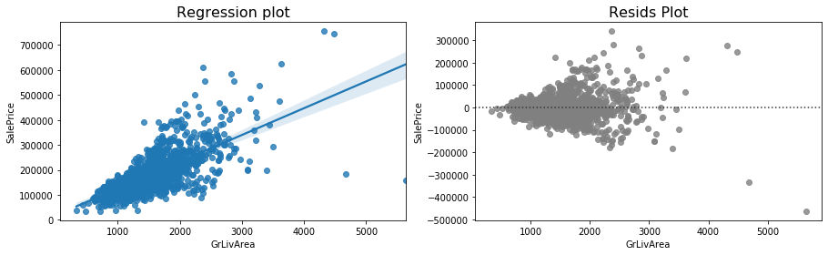
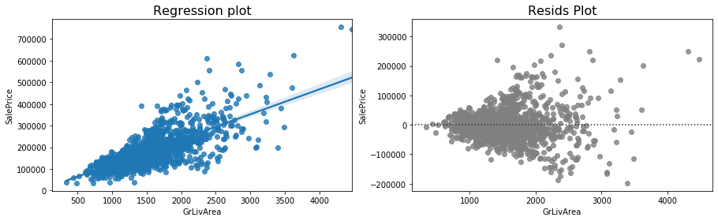
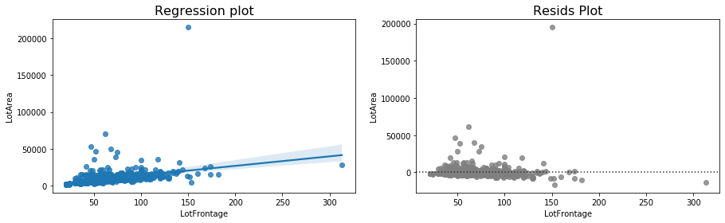
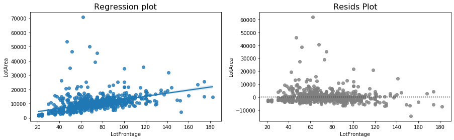
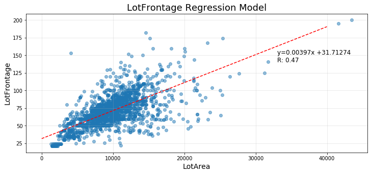
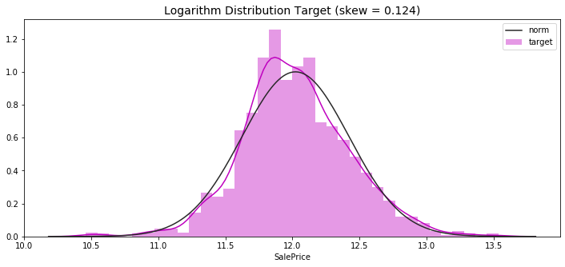

# House Pricing


<font size = 6>Welcome to this house pricing project!</font>

Today we will predict house price with advanced regression technique.

A guided line is followed to lead us to good results:
+ **Part 1 - Exploratory Data Analysis:**\
*Goal: Get a deep understanding on data. Nothing will be modified, and statistical test will be used when necessary*
+ **Part 2 - Preprocessing:**\
*Goal: Prepare data to machine learning and obtain some bright new informations.*
+ **Part 3 - Machine Learning:**\
*Goal: Implementing machine learning regression models, analyse their performance.*

Part 1 was already made in a previous notebook, in this one Part 2 - Preprocessing is about to be made.\
I'm really happy to share this work with you...the advendure keeps running! I wish you a good reading!


First let's import necessary librairies and datasets:


```python
import pandas as pd
import numpy as np
import matplotlib.pyplot as plt
import seaborn as sns

import warnings
warnings.simplefilter('ignore')
pd.set_option('display.max_columns',None)
```


```python
df_tr = pd.read_csv('train.csv')
df_te = pd.read_csv('test.csv')
df_train = df_tr.copy()
df_test = df_te.copy()
```

Two outilers were found in the exploratory data analysis step, it's time to remove them:


```python
plt.figure(figsize=(15,4))
plt.subplot(1,2,1)
sns.regplot(df_train['GrLivArea'],df_train['SalePrice'],{'alpha':0.3})
plt.title('Regression plot',fontsize=16)
plt.subplot(1,2,2)
sns.residplot(df_train['GrLivArea'],df_train['SalePrice'],{'alpha':0.3},color='grey')
plt.title('Resids Plot',fontsize=16)
plt.show()
```





```python
outliers_mask = (df_train['GrLivArea']>4000) & (df_train['SalePrice']<250000)
df_train = df_train[~outliers_mask].reset_index(drop = True)

plt.figure(figsize=(15,4))
plt.subplot(1,2,1)
sns.regplot(df_train['GrLivArea'],df_train['SalePrice'],{'alpha':0.3})
plt.title('Regression plot',fontsize=16)
plt.subplot(1,2,2)
sns.residplot(df_train['GrLivArea'],df_train['SalePrice'],{'alpha':0.3},color='grey')
plt.title('Resids Plot',fontsize=16)
plt.show()
```





LotFrontage shows another outliers and we will remove it:


```python
plt.figure(figsize=(15,4))
plt.subplot(1,2,1)
sns.regplot(df_train['LotFrontage'],df_train['LotArea'],{'alpha':0.3})
plt.title('Regression plot',fontsize=16)
plt.subplot(1,2,2)
sns.residplot(df_train['LotFrontage'],df_train['LotArea'],{'alpha':0.3},color='grey')
plt.title('Resids Plot',fontsize=16)
plt.show()
```





```python
outliersmask = (df_train['LotFrontage']>250) | (df_train['LotArea']>150000)
df_train = df_train[~outliersmask].reset_index(drop = True)

plt.figure(figsize=(15,4))
plt.subplot(1,2,1)
sns.regplot(df_train['LotFrontage'],df_train['LotArea'],{'alpha':0.3})
plt.title('Regression plot',fontsize=16)
plt.subplot(1,2,2)
sns.residplot(df_train['LotFrontage'],df_train['LotArea'],{'alpha':0.3},color='grey')
plt.title('Resids Plot',fontsize=16)
plt.show()
```





It seems better now, train set and test set are concatenated:


```python
Target = df_train['SalePrice']
df_all_data = pd.concat([df_train.drop(['SalePrice'],axis='columns'),df_test],axis='index')
```

# 2 - Preprocessing

## 2.1 - Data Gestion

### 2.1.1 - NaN Gestion

NaN values doesn't really mean the same thing for each columns. For given columns NaN values means **the lack of the observed element** (for instance Basement NaN value means there is no basement), for the other it means that the **cell wasn't filled by mistake**.

NaN can't be filled the same way on the whole dataset. Troubles comes on certains columns when NaN means *the lack of the observed element* **and** *some cells aren't filled by mistake*. To work properly, and because we have some times, NaN will be corrected by family columns:
+ Basement columns
+ Garage columns
+ FirePlace columns
+ Pool columns
+ MasVnr columns

Columns without a familly will be made last.

The same method will be applied and adapted on each different case:
1. **Fill NaN didn't filled by mistake**
    + The considered element noted in one family's column at least implies that other columns with NaN value must be displayed and filled. 
2. **Fill NaN which means the lack of the element**
    + The considered element is noted as lacking when there are NaN or 0 value in each family's columns. So NaN value will be filled by 'None' if cells expected a category and "0" if not. 

Let's start with basement family.

<font size = 4 color='purple'>**Basement:**</font>


```python
family_grp1 = [ 'BsmtQual', 'BsmtCond','BsmtExposure', 'BsmtFinType1','BsmtFinType2']
NaN_by_row = df_all_data[family_grp1].isna().sum(axis='columns') #NaN Number by row
All_NaN = df_all_data[family_grp1].isna().all(axis='columns')    #Rows with only NaN

#Mask to keep raws which has at least 1 NaN value in familly's columns and at least one filled value
inconsistent_values = (NaN_by_row>0) & (~All_NaN) 
df_tmp = df_all_data[inconsistent_values][family_grp1]
df_tmp.head(8)
```


<div>
<style scoped>
    .dataframe tbody tr th:only-of-type {
        vertical-align: middle;
    }

    .dataframe tbody tr th {
        vertical-align: top;
    }

    .dataframe thead th {
        text-align: right;
    }
</style>
<table border="1" class="dataframe">
  <thead>
    <tr style="text-align: right;">
      <th></th>
      <th>BsmtQual</th>
      <th>BsmtCond</th>
      <th>BsmtExposure</th>
      <th>BsmtFinType1</th>
      <th>BsmtFinType2</th>
    </tr>
  </thead>
  <tbody>
    <tr>
      <th>330</th>
      <td>Gd</td>
      <td>TA</td>
      <td>No</td>
      <td>GLQ</td>
      <td>NaN</td>
    </tr>
    <tr>
      <th>943</th>
      <td>Gd</td>
      <td>TA</td>
      <td>NaN</td>
      <td>Unf</td>
      <td>Unf</td>
    </tr>
    <tr>
      <th>27</th>
      <td>Gd</td>
      <td>TA</td>
      <td>NaN</td>
      <td>Unf</td>
      <td>Unf</td>
    </tr>
    <tr>
      <th>580</th>
      <td>Gd</td>
      <td>NaN</td>
      <td>Mn</td>
      <td>GLQ</td>
      <td>Rec</td>
    </tr>
    <tr>
      <th>725</th>
      <td>TA</td>
      <td>NaN</td>
      <td>No</td>
      <td>BLQ</td>
      <td>Unf</td>
    </tr>
    <tr>
      <th>757</th>
      <td>NaN</td>
      <td>Fa</td>
      <td>No</td>
      <td>Unf</td>
      <td>Unf</td>
    </tr>
    <tr>
      <th>758</th>
      <td>NaN</td>
      <td>TA</td>
      <td>No</td>
      <td>Unf</td>
      <td>Unf</td>
    </tr>
    <tr>
      <th>888</th>
      <td>Gd</td>
      <td>TA</td>
      <td>NaN</td>
      <td>Unf</td>
      <td>Unf</td>
    </tr>
  </tbody>
</table>
</div>


NaN value by mistake are found with this simple observation: it's impossible to have quality for a lacking element or an element without quality!

There are only two real cases:
+ The element is lacking so there is no quality
+ The element exist so his quality exist too

That's why we are looking inconscistent raws with at least one NaN and one value. Filling with the most common value is made.


```python
for column in family_grp1:
    most_common = df_all_data[column].value_counts().index[0]
    df_tmp[column].fillna(most_common,inplace=True)
    
df_all_data.loc[inconsistent_values,family_grp1] = df_tmp[family_grp1]
df_all_data.loc[inconsistent_values,family_grp1].head(8)
```


<div>
<style scoped>
    .dataframe tbody tr th:only-of-type {
        vertical-align: middle;
    }

    .dataframe tbody tr th {
        vertical-align: top;
    }

    .dataframe thead th {
        text-align: right;
    }
</style>
<table border="1" class="dataframe">
  <thead>
    <tr style="text-align: right;">
      <th></th>
      <th>BsmtQual</th>
      <th>BsmtCond</th>
      <th>BsmtExposure</th>
      <th>BsmtFinType1</th>
      <th>BsmtFinType2</th>
    </tr>
  </thead>
  <tbody>
    <tr>
      <th>330</th>
      <td>Gd</td>
      <td>TA</td>
      <td>No</td>
      <td>GLQ</td>
      <td>Unf</td>
    </tr>
    <tr>
      <th>943</th>
      <td>Gd</td>
      <td>TA</td>
      <td>No</td>
      <td>Unf</td>
      <td>Unf</td>
    </tr>
    <tr>
      <th>27</th>
      <td>Gd</td>
      <td>TA</td>
      <td>No</td>
      <td>Unf</td>
      <td>Unf</td>
    </tr>
    <tr>
      <th>580</th>
      <td>Gd</td>
      <td>TA</td>
      <td>Mn</td>
      <td>GLQ</td>
      <td>Rec</td>
    </tr>
    <tr>
      <th>725</th>
      <td>TA</td>
      <td>TA</td>
      <td>No</td>
      <td>BLQ</td>
      <td>Unf</td>
    </tr>
    <tr>
      <th>757</th>
      <td>TA</td>
      <td>Fa</td>
      <td>No</td>
      <td>Unf</td>
      <td>Unf</td>
    </tr>
    <tr>
      <th>758</th>
      <td>TA</td>
      <td>TA</td>
      <td>No</td>
      <td>Unf</td>
      <td>Unf</td>
    </tr>
    <tr>
      <th>888</th>
      <td>Gd</td>
      <td>TA</td>
      <td>No</td>
      <td>Unf</td>
      <td>Unf</td>
    </tr>
  </tbody>
</table>
</div>


Basement family inclue other columns as area number, all of these onces must be added to ensure that there are no others inconsistants raws:
+ No basement but existing basement square feet
+ Basement but no basement square feet


```python
family_grp2 = ['BsmtFinSF1','BsmtFinSF2','BsmtUnfSF','TotalBsmtSF']
family_grp3 = ['BsmtFullBath','BsmtHalfBath']

With_grp2 = df_all_data['TotalBsmtSF']>1.0        #All raws with TotalBsmtSF less than 1
NaN_rows = df_all_data[family_grp1].isna().all(axis='columns')        

NaN_with_grp2 = (NaN_rows) & (With_grp2)
Not_NaN_with_No_grp2 = (~NaN_rows) & (~With_grp2)
All_NaN_Rows = df_all_data[family_grp1+family_grp2+family_grp3].isna().all(axis='columns')  

inconsisent_value = NaN_with_grp2 | Not_NaN_with_No_grp2 | All_NaN_Rows

df_all_data[inconsisent_value][family_grp1+family_grp2+family_grp3]
```


<div>
<style scoped>
    .dataframe tbody tr th:only-of-type {
        vertical-align: middle;
    }

    .dataframe tbody tr th {
        vertical-align: top;
    }

    .dataframe thead th {
        text-align: right;
    }
</style>
<table border="1" class="dataframe">
  <thead>
    <tr style="text-align: right;">
      <th></th>
      <th>BsmtQual</th>
      <th>BsmtCond</th>
      <th>BsmtExposure</th>
      <th>BsmtFinType1</th>
      <th>BsmtFinType2</th>
      <th>BsmtFinSF1</th>
      <th>BsmtFinSF2</th>
      <th>BsmtUnfSF</th>
      <th>TotalBsmtSF</th>
      <th>BsmtFullBath</th>
      <th>BsmtHalfBath</th>
    </tr>
  </thead>
  <tbody>
    <tr>
      <th>660</th>
      <td>NaN</td>
      <td>NaN</td>
      <td>NaN</td>
      <td>NaN</td>
      <td>NaN</td>
      <td>NaN</td>
      <td>NaN</td>
      <td>NaN</td>
      <td>NaN</td>
      <td>NaN</td>
      <td>NaN</td>
    </tr>
  </tbody>
</table>
</div>


```python
df_all_data.loc[inconsisent_value,family_grp2+family_grp3] = df_all_data.loc[inconsisent_value,family_grp2+family_grp3].fillna(0.0)
df_all_data[family_grp1] = df_all_data[family_grp1].fillna('None',axis = 'columns')
```

One NaN value left in BsmtFullBath and BsmtHalfBath, seeing this raw(s) will help to take a stand.


```python
tmp_mask = df_all_data[family_grp3].isna().any(axis='columns')
df_all_data[tmp_mask][family_grp1+family_grp2+family_grp3]
```


<div>
<style scoped>
    .dataframe tbody tr th:only-of-type {
        vertical-align: middle;
    }

    .dataframe tbody tr th {
        vertical-align: top;
    }

    .dataframe thead th {
        text-align: right;
    }
</style>
<table border="1" class="dataframe">
  <thead>
    <tr style="text-align: right;">
      <th></th>
      <th>BsmtQual</th>
      <th>BsmtCond</th>
      <th>BsmtExposure</th>
      <th>BsmtFinType1</th>
      <th>BsmtFinType2</th>
      <th>BsmtFinSF1</th>
      <th>BsmtFinSF2</th>
      <th>BsmtUnfSF</th>
      <th>TotalBsmtSF</th>
      <th>BsmtFullBath</th>
      <th>BsmtHalfBath</th>
    </tr>
  </thead>
  <tbody>
    <tr>
      <th>728</th>
      <td>None</td>
      <td>None</td>
      <td>None</td>
      <td>None</td>
      <td>None</td>
      <td>0.0</td>
      <td>0.0</td>
      <td>0.0</td>
      <td>0.0</td>
      <td>NaN</td>
      <td>NaN</td>
    </tr>
  </tbody>
</table>
</div>


```python
df_all_data[family_grp3] = df_all_data[family_grp3].fillna(0.0,axis = 'columns')
```

All NaN value are corrected in Basement columns, let's continue with others ones.

<font size=4 color='purple'>**Garage :**</font>

The same method is applied below:


```python
family_grp1 =['GarageType', 'GarageFinish','GarageQual','GarageCond']
family_grp2 = ['GarageCars', 'GarageYrBlt']
family_grp3 = ['GarageArea']

NaN_by_row = df_all_data[family_grp1].isna().sum(axis='columns')
All_NaN = df_all_data[family_grp1].isna().all(axis='columns')

inconsistent_values = (NaN_by_row>0) & (~All_NaN) 

df_tmp = df_all_data[inconsistent_values][family_grp1]
df_tmp.head(8)
```


<div>
<style scoped>
    .dataframe tbody tr th:only-of-type {
        vertical-align: middle;
    }

    .dataframe tbody tr th {
        vertical-align: top;
    }

    .dataframe thead th {
        text-align: right;
    }
</style>
<table border="1" class="dataframe">
  <thead>
    <tr style="text-align: right;">
      <th></th>
      <th>GarageType</th>
      <th>GarageFinish</th>
      <th>GarageQual</th>
      <th>GarageCond</th>
    </tr>
  </thead>
  <tbody>
    <tr>
      <th>666</th>
      <td>Detchd</td>
      <td>NaN</td>
      <td>NaN</td>
      <td>NaN</td>
    </tr>
    <tr>
      <th>1116</th>
      <td>Detchd</td>
      <td>NaN</td>
      <td>NaN</td>
      <td>NaN</td>
    </tr>
  </tbody>
</table>
</div>


```python
for column in family_grp1:
    most_commom = df_all_data[column].value_counts().index[0]
    df_tmp[column].fillna(most_commom,inplace=True)
    
df_all_data.loc[inconsistent_values,family_grp1] = df_tmp[family_grp1]
df_all_data.loc[inconsistent_values,family_grp1].head(8)
```


<div>
<style scoped>
    .dataframe tbody tr th:only-of-type {
        vertical-align: middle;
    }

    .dataframe tbody tr th {
        vertical-align: top;
    }

    .dataframe thead th {
        text-align: right;
    }
</style>
<table border="1" class="dataframe">
  <thead>
    <tr style="text-align: right;">
      <th></th>
      <th>GarageType</th>
      <th>GarageFinish</th>
      <th>GarageQual</th>
      <th>GarageCond</th>
    </tr>
  </thead>
  <tbody>
    <tr>
      <th>666</th>
      <td>Detchd</td>
      <td>Unf</td>
      <td>TA</td>
      <td>TA</td>
    </tr>
    <tr>
      <th>1116</th>
      <td>Detchd</td>
      <td>Unf</td>
      <td>TA</td>
      <td>TA</td>
    </tr>
  </tbody>
</table>
</div>


```python
With_grp = (df_all_data[family_grp2+family_grp3]>0.0).all(axis='columns') #All raws with TotalBsmtSF less than 1
NaN_rows = df_all_data[family_grp1].isna().all(axis='columns')        

NaN_with_grp = (NaN_rows) & (With_grp)
Not_NaN_with_No_grp = (~NaN_rows) & (~With_grp)
All_NaN_Rows = df_all_data[family_grp1+family_grp2+family_grp3].isna().all(axis='columns')  

inconsistent_values = NaN_with_grp | Not_NaN_with_No_grp | All_NaN_Rows

df_all_data[inconsistent_values][family_grp1+family_grp3+family_grp2]
```


<div>
<style scoped>
    .dataframe tbody tr th:only-of-type {
        vertical-align: middle;
    }

    .dataframe tbody tr th {
        vertical-align: top;
    }

    .dataframe thead th {
        text-align: right;
    }
</style>
<table border="1" class="dataframe">
  <thead>
    <tr style="text-align: right;">
      <th></th>
      <th>GarageType</th>
      <th>GarageFinish</th>
      <th>GarageQual</th>
      <th>GarageCond</th>
      <th>GarageArea</th>
      <th>GarageCars</th>
      <th>GarageYrBlt</th>
    </tr>
  </thead>
  <tbody>
    <tr>
      <th>666</th>
      <td>Detchd</td>
      <td>Unf</td>
      <td>TA</td>
      <td>TA</td>
      <td>360.0</td>
      <td>1.0</td>
      <td>NaN</td>
    </tr>
    <tr>
      <th>1116</th>
      <td>Detchd</td>
      <td>Unf</td>
      <td>TA</td>
      <td>TA</td>
      <td>NaN</td>
      <td>NaN</td>
      <td>NaN</td>
    </tr>
  </tbody>
</table>
</div>


```python
for col in family_grp2+family_grp3:
    tmp_median = df_all_data[df_all_data['GarageType']=='Detchd'][col].median()
    df_all_data.loc[inconsistent_values,col] = df_all_data.loc[inconsistent_values,col].fillna(tmp_median)
    
df_all_data[inconsistent_values][family_grp1+family_grp3+family_grp2]
```


<div>
<style scoped>
    .dataframe tbody tr th:only-of-type {
        vertical-align: middle;
    }

    .dataframe tbody tr th {
        vertical-align: top;
    }

    .dataframe thead th {
        text-align: right;
    }
</style>
<table border="1" class="dataframe">
  <thead>
    <tr style="text-align: right;">
      <th></th>
      <th>GarageType</th>
      <th>GarageFinish</th>
      <th>GarageQual</th>
      <th>GarageCond</th>
      <th>GarageArea</th>
      <th>GarageCars</th>
      <th>GarageYrBlt</th>
    </tr>
  </thead>
  <tbody>
    <tr>
      <th>666</th>
      <td>Detchd</td>
      <td>Unf</td>
      <td>TA</td>
      <td>TA</td>
      <td>360.0</td>
      <td>1.0</td>
      <td>1962.0</td>
    </tr>
    <tr>
      <th>1116</th>
      <td>Detchd</td>
      <td>Unf</td>
      <td>TA</td>
      <td>TA</td>
      <td>399.5</td>
      <td>2.0</td>
      <td>1962.0</td>
    </tr>
  </tbody>
</table>
</div>


```python
#df_all_data['GarageYrBlt'].fillna(0.0,inplace=True)

val_to_fill = min(df_train['GarageYrBlt'].min(),df_test['GarageYrBlt'].min())
df_all_data['GarageYrBlt'].fillna(val_to_fill,inplace=True)
df_all_data[family_grp1] = df_all_data[family_grp1].fillna('None',inplace=False)
```

<font size=4 color='purple'>**Fireplace:**</font>


```python
fireplaces = df_all_data['Fireplaces']>0
no_quality = df_all_data['FireplaceQu'].isna()

fireplace_no_quality = fireplaces & no_quality
quality_no_fireplace = ~fireplaces & ~no_quality
inconsistent_values = fireplace_no_quality | quality_no_fireplace

df_all_data[inconsistent_values][['Fireplaces','FireplaceQu']].shape[0]
```


    0


There are no inconsistent values, which means all FireplaceQu NaN can already be filled by "None" 


```python
df_all_data['FireplaceQu'].fillna('None',inplace = True)
```

<font size=4 color='purple'>**Pool:**</font>


```python
Pool_Nb = (~df_all_data['PoolQC'].isna()).sum()
print('>>>Not NaN Pool: {}'.format(Pool_Nb))
```

    >>>Not NaN Pool: 9
    


```python
Pool = df_all_data['PoolArea']>0
no_quality = df_all_data['PoolQC'].isna()

pool_no_quality = Pool & no_quality
quality_no_pool = ~Pool & ~no_quality
inconsistent_values = pool_no_quality | quality_no_pool

df_all_data[inconsistent_values][['PoolArea','PoolQC']]
```


<div>
<style scoped>
    .dataframe tbody tr th:only-of-type {
        vertical-align: middle;
    }

    .dataframe tbody tr th {
        vertical-align: top;
    }

    .dataframe thead th {
        text-align: right;
    }
</style>
<table border="1" class="dataframe">
  <thead>
    <tr style="text-align: right;">
      <th></th>
      <th>PoolArea</th>
      <th>PoolQC</th>
    </tr>
  </thead>
  <tbody>
    <tr>
      <th>960</th>
      <td>368</td>
      <td>NaN</td>
    </tr>
    <tr>
      <th>1043</th>
      <td>444</td>
      <td>NaN</td>
    </tr>
    <tr>
      <th>1139</th>
      <td>561</td>
      <td>NaN</td>
    </tr>
  </tbody>
</table>
</div>


Only 9 Pool quality are registered (12 if NaN are filled). In this case, this variable probably doesn't mean anything or it could decrease models performances, that's why it is removed with Alley.


```python
l_del = ['Alley','PoolQC']
df_all_data.drop(l_del,axis='columns',inplace=True)
```


```python
l_fill_None = ['Fence','MiscFeature']
df_all_data.loc[:,l_fill_None] = df_all_data[l_fill_None].fillna('None')
```

<font size=4 color='purple'>**MasVnr:**</font>


```python
MasVnr = ~(df_all_data['MasVnrArea'].isna())
No_type = df_all_data['MasVnrType'].isna()

MasVnr_no_type = MasVnr & No_type
type_no_MasVnr = ~MasVnr & ~No_type
inconsistent_values = MasVnr_no_type | type_no_MasVnr

df_all_data[inconsistent_values][['MasVnrArea','MasVnrType']]
```


<div>
<style scoped>
    .dataframe tbody tr th:only-of-type {
        vertical-align: middle;
    }

    .dataframe tbody tr th {
        vertical-align: top;
    }

    .dataframe thead th {
        text-align: right;
    }
</style>
<table border="1" class="dataframe">
  <thead>
    <tr style="text-align: right;">
      <th></th>
      <th>MasVnrArea</th>
      <th>MasVnrType</th>
    </tr>
  </thead>
  <tbody>
    <tr>
      <th>1150</th>
      <td>198.0</td>
      <td>NaN</td>
    </tr>
  </tbody>
</table>
</div>


MasVnrType has 1 NaN value by mistake to fill. In order to get the median of the hole distribution, median will be take from an arbitrary area interval.


```python
lower_area = df_all_data['MasVnrArea']>150
higher_area = df_all_data['MasVnrArea']<250
interval = lower_area & higher_area

most_commom = df_all_data[interval]['MasVnrType'].value_counts().index[0]
df_all_data.loc[inconsistent_values,'MasVnrType'] = most_commom
df_all_data['MasVnrType'].fillna('None',inplace = True)
df_all_data['MasVnrArea'].fillna(0,inplace=True)
```

<font size=4 color='purple'>**Without family colums:**</font>

Theses columns will be filled with the most common value


```python
l_most_common = ['MSZoning','Utilities','Exterior1st','Exterior2nd','Electrical','KitchenQual','Functional','SaleType']

for column in l_most_common:
    most_common = df_all_data[column].value_counts().index[0]
    df_all_data[column].fillna(most_common,inplace=True)
```

<font size=4 color='purple'>**LotFrontage:**</font>

Last NaN value are contained in LotFrontage. This column is really interresting, a strong correlation exist with LotArea. So, we can fill missing value with a linear regression.

To do that ols from statsmodels.formula.api will be used.


```python
import statsmodels.formula.api as smf
tmp_mask = df_all_data['LotFrontage']<(-150+0.008*df_all_data['LotArea'])
```

A temporary mask is applied to get ride of some enoying value and get a better model.


```python
ols = smf.ols('LotFrontage~LotArea',data=df_all_data[~tmp_mask]).fit()
b,a = ols.params
R = ols.rsquared

Lot_min = 0
Lot_max = 40000
X = np.linspace(Lot_min,Lot_max,50)
Y = [a*x+b for x in X]
t = 'y='+str(round(a,5))+'x +'+str(round(b,5))+'\nR: '+str(round(R,3))

plt.figure(figsize=(12,5))
plt.scatter(df_all_data[~tmp_mask]['LotArea'],df_all_data[~tmp_mask]['LotFrontage'],alpha=0.5)
plt.plot(X,Y,'r',linestyle='dashed')
plt.grid(alpha=0.3)
plt.title('LotFrontage Regression Model',fontsize=18)
plt.xlabel('LotArea',fontsize=14)
plt.ylabel('LotFrontage',fontsize=14)
plt.text(33000,140,t,fontsize=12)
plt.show()
```





Calculated coefficents are used to fill LotFrontage NaN values.


```python
tmp_mask = df_all_data['LotFrontage'].isna()
df_all_data.loc[tmp_mask,'LotFrontage'] = round(df_all_data[tmp_mask]['LotArea']*a+b)
```


```python
print('>>>Total NaN values: {}'.format(df_all_data.isna().sum().sum()))
```

    >>>Total NaN values: 0
    

Congratulation, we made it! All NaN values were replace. This step took some times but it allowed us to understand more our data and that's never a bad thing to be a little bit meticulous if it's possible.


### 2.1.2 - Features Engineering

The target isn't normally distribued, better results can be found with logarithm function.


```python
from scipy.stats import boxcox_normmax,skew,norm
from scipy.special import boxcox1p
df_all_data_copy = df_all_data.copy()
```


```python
Target = np.log1p(Target)
sk = skew(Target)
plt.figure(figsize=(12,5))
sns.distplot(Target,fit = norm,color='m')
plt.title('Logarithm Distribution Target (skew = {})'.format(round(sk,3)),fontsize=14)
plt.legend(['norm','target'])
plt.show()
```





Skewness is now better and log SalePrice distribution fit more with normal distribution. Some Additionnal features can be added to increase models performances:


```python
df_all_data['OverallTot']=df_all_data['OverallQual']+df_all_data['OverallCond']
df_all_data['TotalSF'] = df_all_data['TotalBsmtSF']+df_all_data['1stFlrSF']+df_all_data['2ndFlrSF']
df_all_data['PorchSF'] = df_all_data['WoodDeckSF']+df_all_data['OpenPorchSF']+df_all_data['EnclosedPorch']+df_all_data['3SsnPorch']+df_all_data['ScreenPorch']

df_all_data['TotBath'] = df_all_data['BsmtFullBath']+0.5*df_all_data['BsmtHalfBath']+df_all_data['FullBath']+0.5*df_all_data['HalfBath']

df_all_data['HasPool'] = df_all_data['PoolArea'].apply(lambda x: 1 if x>0 else 0)
df_all_data['HasBsmt'] = df_all_data['TotalBsmtSF'].apply(lambda x: 1 if x>0 else 0)
df_all_data['Has2ndFlr'] = df_all_data['2ndFlrSF'].apply(lambda x: 1 if x>0 else 0)
df_all_data['HasFirePlace'] = df_all_data['Fireplaces'].apply(lambda x: 1 if x>0 else 0)
df_all_data['HasGarage'] = df_all_data['GarageArea'].apply(lambda x: 1 if x>0 else 0)

#Modify date value for better feature selection
df_all_data['YearBuilt'] = df_all_data['YearBuilt'] - df_all_data['YearBuilt'].min()
df_all_data['YrSold'] = df_all_data['YrSold'] - df_all_data['YrSold'].min()
df_all_data['MoSold'] = df_all_data['MoSold']//7  #0 : January->June 1:Jully->December
df_all_data['YearRemodAdd'] = df_all_data['YearRemodAdd'] - df_all_data['YearRemodAdd'].min()


df_all_data.loc[df_all_data['GarageYrBlt'] == df_all_data['GarageYrBlt'].max(),'GarageYrBlt'] = 2007.0 # outlier
df_all_data['GarageYrBlt'] = df_all_data['GarageYrBlt'] - df_all_data['GarageYrBlt'].min()
```

Year features needs a particular attention. In fact few houses can be really old while others are recents. It is unwise to let this with no retake at all. Here, fibonacci will be used (which return the sum of its last two values 0, 1, 1, 2, 3, 5, ...). Why? Because we want to make less details on houses built for decades! That's not a big deal if the house is 105 year olds instead of 115... But 10 years old instead of recents houses is a real change on the sale price. 
Fibonnaci will help us to get ride of all details we don't want that can badly impact models performance.


```python
def fibonacci(start = 0 , stop=5):
    a,b,c = 0,1,0
    l_c = [a,b]
    for i in range(stop):
        c = a + b
        l_c.append(c)
        a = b
        b = c
    return l_c[start:stop+2]

# =================================== Year Built Encoding
bins = [0] + fibonacci(start=2,stop=11)
labels = np.arange(11)[::-1]
df_all_data['YearBuilt'] = abs(df_all_data['YearBuilt'] - df_all_data['YearBuilt'].max())
df_all_data['YearBuilt'] = pd.cut(df_all_data['YearBuilt'],bins = bins,include_lowest=True,labels=labels)
df_all_data['YearBuilt'] = df_all_data['YearBuilt'].astype('int')

# =================================== Garage Year Built Encoding
bins = [0] + fibonacci(start=2,stop=13)
labels = np.arange(13)[::-1]
df_all_data['GarageYrBlt'] = abs(df_all_data['GarageYrBlt'] - df_all_data['GarageYrBlt'].max())
df_all_data['GarageYrBlt'] = pd.cut(df_all_data['GarageYrBlt'],bins = bins,include_lowest=True,labels=labels)
df_all_data['GarageYrBlt'] = df_all_data['GarageYrBlt'].astype('int')

# =================================== Year Remod Add Encoding
bins = [0] + fibonacci(start=2,stop=10)
labels = np.arange(10)[::-1]
df_all_data['YearRemodAdd'] = abs(df_all_data['YearRemodAdd'] - df_all_data['YearRemodAdd'].max())
df_all_data['YearRemodAdd'] = pd.cut(df_all_data['YearRemodAdd'],bins = bins,include_lowest=True,labels=labels)
df_all_data['YearRemodAdd'] = df_all_data['YearRemodAdd'].astype('int')
```

Theses two function below are really usefull.

The first one gathers all uncrowded subgroup in the same categorical feature until reaching an arbitray people limit. This has to be done for one thing: Once the dataset is encoded, an overfit reducer will be applied in the machine learning part, and will delete all columns with an extremly large majority of the same element.\
If we think twice, this step is risky without the function below because every uncrowded subgroup of each categorical feature will be deleted... the overfit reducer could delete subgroups of the same intial feature wich has not the same sale price (neighborhood for instance). So few totally different subgroups could be associated by the lack of information.

Gatering theses smalls subgroups before the overfit reducer could be a great idea in certains cases.


```python
def rare_gathering(col_to_turn,limit=10):
    
    # Dataframe giving the median SalePrice of every groups included in the categorical variable
    df_toy = df_train[[col_to_turn,'SalePrice']].groupby(col_to_turn).agg(['mean','median','count'])
    df_toy.sort_values(by=('SalePrice','median'),ascending=True,inplace=True)
    df_toy[('SalePrice','Value')] = df_toy.index

    for line in df_toy.index:
        if df_toy[('SalePrice','count')][line]<limit:
            # Distance between all other groups median
            absolute_distance = (df_toy['SalePrice']['median']-df_toy['SalePrice']['median'][line]).abs()
            # Taking the nearest groups regarding to the median SalePrice
            nearest = absolute_distance.sort_values().index[1]
            # Current group
            current_val = df_toy.loc[line,('SalePrice','Value')]
            # Changing all the current group to the nearest
            df_toy[('SalePrice','Value')] = df_toy[('SalePrice','Value')].apply(lambda x: nearest if x== current_val else x)
            
            #Count increasing
            df_toy.loc[nearest,('SalePrice','count')] += df_toy.loc[line,('SalePrice','count')]
            df_toy.loc[line,('SalePrice','median')] = -1
        
    print(df_toy.drop([('SalePrice','Value')],axis='columns')[df_toy[('SalePrice','median')]>limit])
    return df_toy[('SalePrice','Value')].to_dict()
```

The last function comes up with another observation. To get it easily, let's take an example : quality variable (None, Po, Fa, TA, Gd, Ex). Two option are availables for encoding: one hot encoding / ordinal encoding. If the second choice is made, encoding like None = 0, Po=1, Fa=2, TA = 3... is clearly not the better idea you could have. Sale price litteraly goes up to the sky when quality become good or excellent. In other words, the price increase a lot more between Gd to Ex than Fa to TA.

Linear_gatering take a given interval and use it to return the best number on ordinal encoding regarding to the saleprice median. It could help us to get getter score on machine learning step.


```python
def linear_gathering (col_to_linearize,nb_intervals=False):
    #Get df_toy, all SalePrice grouped by Overallcond 
    df_toy = df_train[[col_to_linearize,'SalePrice']].groupby(col_to_linearize).agg(['median','count'])
    #Sort df_toy by median SalePrice
    df_toy.sort_values(by=[('SalePrice','median')],ascending=True,inplace=True)
    
    if nb_intervals==False:
        #Substract all median SalePrice with the previous value to get the difference
        l_median = np.concatenate([0,np.array(df_toy[('SalePrice','median')])[:-1]],axis=None)
        l_distance = (df_toy[('SalePrice','median')]-l_median)[1:]
        #Get the median difference
        median_distance = l_distance.median()

        #Get the total difference of the median column
        tot_distance = df_toy[('SalePrice','median')].max()-df_toy[('SalePrice','median')].min()
        #Calculate the total interval number with the median distance
        interval_number = np.ceil(tot_distance/median_distance)
    else : 
        interval_number = nb_intervals
        tot_distance = df_toy[('SalePrice','median')].max()-df_toy[('SalePrice','median')].min()
        median_distance = tot_distance/interval_number
        
    linearized = pd.cut(df_toy[('SalePrice','median')],bins = int(interval_number),labels=np.arange(interval_number))
    df_toy[('SalePrice','Assigned')] = linearized
    print("***** Gathering report *****\n>>>Interval Number : {}\n>>>Typical interval : {}".format(interval_number,median_distance))
    print(df_toy) 
    return linearized.to_dict()
```

Theses two function are made for differents cases:
+ rare_gathering is made for categorical variable which has very small subgroup before one hot encoding. 
+ linear_gathering is made for ordinal categorical variable which has to different SalePrice distances between subgroups.

We will use them on some variables.


```python
bins = [0] + fibonacci(start=2,stop=11)
labels = np.arange(11)[::-1]
df_train['YearBuilt'] = abs(df_train['YearBuilt'] - max(df_tr['YearBuilt'].max(),df_te['YearBuilt'].max()))
df_train['YearBuilt'] = pd.cut(df_train['YearBuilt'],bins = bins,include_lowest=True,labels=labels)
df_train['YearBuilt'] = df_train['YearBuilt'].astype('int')

#Gathering step
tmp_Dict = rare_gathering('YearBuilt',25)
df_all_data['YearBuilt'] = df_all_data['YearBuilt'].map(tmp_Dict)
df_train['YearBuilt'] = df_train['YearBuilt'].map(tmp_Dict)
tmp_Dict = linear_gathering('YearBuilt')
df_all_data['YearBuilt'] = df_all_data['YearBuilt'].map(tmp_Dict)
```

                   SalePrice               
                        mean  median  count
    YearBuilt                              
    0          132788.737288  122250  118.0
    1          132705.670412  125000  267.0
    2          147155.422764  141000  369.0
    3          172198.493243  162700  148.0
    6          219755.434426  201950  122.0
    4          238066.862745  207500  102.0
    5          219412.666667  213125  108.0
    7          240981.190840  220000  150.0
    8          256833.833333  242000   70.0
    ***** Gathering report *****
    >>>Interval Number : 11.0
    >>>Typical interval : 13562.5
              SalePrice               
                 median count Assigned
    YearBuilt                         
    0            122250   118      0.0
    1            125000   267      0.0
    2            141000   369      1.0
    3            162700   148      3.0
    6            201950   122      5.0
    4            207500   102      6.0
    5            213125   108      6.0
    7            224250   150      7.0
    8            270066    70     10.0
    


```python
df_train['GarageYrBlt'].fillna(min(df_train['GarageYrBlt'].min(),df_test['GarageYrBlt'].min()),inplace=True)
bins = [0] + fibonacci(start=2,stop=13)
labels = np.arange(13)[::-1]
df_train['GarageYrBlt'] = abs(df_train['GarageYrBlt'] - df_tr['GarageYrBlt'].max()) #only df_tr taken because of outlier in df_te
df_train['GarageYrBlt'] = pd.cut(df_train['GarageYrBlt'],bins = bins,include_lowest=True,labels=labels)
df_train['GarageYrBlt'] = df_train['GarageYrBlt'].astype('int')


#Gathering step
tmp_Dict = rare_gathering('GarageYrBlt',30)
df_all_data['GarageYrBlt'] = df_all_data['GarageYrBlt'].map(tmp_Dict)
df_train['GarageYrBlt'] = df_train['GarageYrBlt'].map(tmp_Dict)
tmp_Dict = linear_gathering('GarageYrBlt')
df_all_data['GarageYrBlt'] = df_all_data['GarageYrBlt'].map(tmp_Dict)
```

                     SalePrice                 
                          mean    median  count
    GarageYrBlt                                
    2            111292.741071  106125.0  112.0
    3            140315.994924  131000.0  197.0
    4            147457.078652  142000.0  356.0
    5            164538.398907  150500.0  183.0
    6            222189.547619  190500.0  126.0
    7            209313.055118  200000.0  127.0
    8            217047.581395  200000.0  129.0
    9            238880.693548  219605.0  124.0
    10           241531.645833  226437.5  100.0
    ***** Gathering report *****
    >>>Interval Number : 10.0
    >>>Typical interval : 15302.5
                SalePrice               
                   median count Assigned
    GarageYrBlt                         
    2              106125   112      0.0
    3              131000   197      1.0
    4              142000   356      2.0
    5              150500   183      3.0
    6              190500   126      5.0
    7              200000   127      6.0
    8              200000   129      6.0
    9              219605   124      7.0
    10             249740   100      9.0
    


```python
bins = [0] + fibonacci(start=2,stop=10)
labels = np.arange(10)[::-1]
df_train['YearRemodAdd'] = abs(df_train['YearRemodAdd'] - df_train['YearRemodAdd'].max())
df_train['YearRemodAdd'] = pd.cut(df_train['YearRemodAdd'],bins = bins,include_lowest=True,labels=labels)
df_train['YearRemodAdd'] = df_train['YearRemodAdd'].astype('int')

#Gathering step
tmp_Dict = rare_gathering('YearRemodAdd',30)
df_all_data['YearRemodAdd'] = df_all_data['YearRemodAdd'].map(tmp_Dict)
df_train['YearRemodAdd'] = df_train['YearRemodAdd'].map(tmp_Dict)
tmp_Dict = linear_gathering('YearRemodAdd')
df_all_data['YearRemodAdd'] = df_all_data['YearRemodAdd'].map(tmp_Dict)
```

                      SalePrice                 
                           mean    median  count
    YearRemodAdd                                
    0             119207.189573  117500.0  211.0
    1             139239.706294  136500.0  286.0
    2             164902.790850  155000.0  153.0
    3             204530.357576  179900.0  165.0
    4             198615.646707  188000.0  167.0
    5             201002.981366  192000.0  161.0
    6             221013.810651  202500.0  169.0
    7             224578.013333  205000.0   75.0
    8             274831.947368  278604.5   67.0
    ***** Gathering report *****
    >>>Interval Number : 10.0
    >>>Typical interval : 14500.0
                 SalePrice               
                    median count Assigned
    YearRemodAdd                         
    0               117500   211      0.0
    1               136500   286      1.0
    2               155000   153      2.0
    3               179900   165      4.0
    4               188000   167      4.0
    5               192000   161      5.0
    6               202500   169      5.0
    7               205000    75      6.0
    8               262500    67      9.0
    


```python
SubClass_Dict = linear_gathering('MSSubClass',10)
SubClass_Dict[150]=SubClass_Dict[80]
df_all_data['MSSubClass'] = df_all_data['MSSubClass'].map(SubClass_Dict)
```

    ***** Gathering report *****
    >>>Interval Number : 10
    >>>Typical interval : 12750.0
               SalePrice               
                  median count Assigned
    MSSubClass                         
    180            88500    10        0
    30             99900    69        0
    45            107500    12        1
    190           127500    29        3
    50            131500   143        3
    90            135980    52        3
    85            140750    20        4
    40            142500     4        4
    160           146000    63        4
    70            156000    60        5
    20            159000   534        5
    75            163500    16        5
    80            166500    58        6
    120           192000    87        8
    60            216000   297        9
    


```python
Neighborhood_Dict = linear_gathering('Neighborhood')
df_all_data['Neighborhood']=df_all_data['Neighborhood'].map(Neighborhood_Dict)
```

    ***** Gathering report *****
    >>>Interval Number : 38.0
    >>>Typical interval : 6100.0
                 SalePrice               
                    median count Assigned
    Neighborhood                         
    MeadowV          88000    17      0.0
    IDOTRR          103000    37      2.0
    BrDale          106000    16      3.0
    OldTown         119000   113      5.0
    Edwards         119500    98      5.0
    BrkSide         124300    58      6.0
    Sawyer          135000    74      7.0
    Blueste         137500     2      8.0
    SWISU           139500    25      8.0
    NAmes           140000   224      8.0
    NPkVill         146000     9      9.0
    Mitchel         153500    49     10.0
    SawyerW         179900    59     15.0
    Gilbert         181000    79     15.0
    NWAmes          182900    73     15.0
    Blmngtn         191000    17     17.0
    CollgCr         197200   150     18.0
    ClearCr         200000    27     18.0
    Crawfor         200624    51     18.0
    Veenker         218000    11     21.0
    Somerst         225500    86     23.0
    Timber          226250    36     23.0
    StoneBr         278000    25     31.0
    NoRidge         301500    41     35.0
    NridgHt         315000    77     37.0
    


```python
tmp_Dict = linear_gathering('HouseStyle')
df_all_data['HouseStyle']=df_all_data['HouseStyle'].map(tmp_Dict)
```

    ***** Gathering report *****
    >>>Interval Number : 9.0
    >>>Typical interval : 10250.0
               SalePrice               
                  median count Assigned
    HouseStyle                         
    1.5Unf        111250    14      0.0
    1.5Fin        131250   152      2.0
    2.5Unf        133900    11      2.0
    SFoyer        135960    37      2.0
    1Story        154250   724      4.0
    SLvl          164500    65      5.0
    2Story        190000   443      8.0
    2.5Fin        194000     8      8.0
    


```python
tmp_Dict = linear_gathering('Functional',10)
df_all_data['Functional']=df_all_data['Functional'].map(tmp_Dict)
```

    ***** Gathering report *****
    >>>Interval Number : 10
    >>>Typical interval : 8020.0
               SalePrice               
                  median count Assigned
    Functional                         
    Maj2           85000     5        0
    Sev           129000     1        5
    Mod           137900    15        6
    Min1          139000    31        6
    Min2          140000    34        6
    Maj1          140750    14        6
    Typ           165200  1354        9
    


```python
tmp_Dict = linear_gathering('LotShape')
df_all_data['LotShape']=df_all_data['LotShape'].map(tmp_Dict)
```

    ***** Gathering report *****
    >>>Interval Number : 5.0
    >>>Typical interval : 14570.0
             SalePrice               
                median count Assigned
    LotShape                         
    Reg         146000   925      0.0
    IR1         189000   482      3.0
    IR3         203570     8      4.0
    IR2         212000    39      4.0
    


```python
# Necessary transformation to apply linear_gathering before encoding

#------------------ ENCODING ON VERY IMPORTANT VARIABLES
df_train['OverallTot']=df_train['OverallQual']+df_train['OverallCond']
df_train['TotBath'] = df_train['BsmtFullBath']+0.5*df_train['BsmtHalfBath']+df_train['FullBath']+0.5*df_train['HalfBath']


# OVERALLTOT 
#-------------  Prepare for linear_gathering
tmp_Dict = rare_gathering('OverallTot',limit=10)
tmp_Dict[3]=6
df_train['OverallTot'] = df_train['OverallTot'].map(tmp_Dict)
df_all_data['OverallTot'] = df_all_data['OverallTot'].map(tmp_Dict)
tmp_Dict = linear_gathering('OverallTot',35)
df_all_data['OverallTot'] = df_all_data['OverallTot'].map(tmp_Dict)


# TOTALBATH
tmp_Dict = rare_gathering('TotBath',limit=10)
tmp_Dict[7]=3
df_train['TotBath'] = df_train['TotBath'].map(tmp_Dict)
df_all_data['TotBath'] = df_all_data['TotBath'].map(tmp_Dict)
tmp_Dict = linear_gathering('TotBath',25)
df_all_data['TotBath'] = df_all_data['TotBath'].map(tmp_Dict)


# Garage Cars
tmp_Dict = linear_gathering('GarageCars',10)
tmp_Dict[5]=tmp_Dict[3]
df_all_data['GarageCars'] = df_all_data['GarageCars'].map(tmp_Dict)

# OVERALL qual & cond
tmp_Dict = linear_gathering('OverallQual',30)
df_all_data['OverallQual'] = df_all_data['OverallQual'].map(tmp_Dict)

tmp_Dict = linear_gathering('OverallCond',10)
df_all_data['OverallCond'] = df_all_data['OverallCond'].map(tmp_Dict)
```

                    SalePrice               
                         mean  median  count
    OverallTot                              
    6            73625.000000   74500   10.0
    7            96684.615385   92900   13.0
    8            97837.620690   93000   29.0
    9           116149.657895  115000   76.0
    10          129983.143678  129500  174.0
    11          151004.319218  146800  307.0
    12          180675.076010  179400  421.0
    13          228233.845018  230000  271.0
    14          259605.780952  250000  105.0
    16          276250.000000  250250   12.0
    15          322280.354839  310000   36.0
    ***** Gathering report *****
    >>>Interval Number : 35
    >>>Typical interval : 7242.857142857143
               SalePrice               
                  median count Assigned
    OverallTot                         
    6              64000    10        0
    7              92900    13        3
    8              93000    29        4
    9             115000    76        7
    10            129500   174        9
    11            146800   307       11
    12            179400   421       15
    13            230000   271       22
    14            250000   105       25
    16            250250    12       25
    15            317500    36       34
                 SalePrice               
                      mean  median  count
    TotBath                              
    1.0      110869.671053  112250  228.0
    1.5      142692.372093  142500  129.0
    2.0      158116.103070  145000  457.0
    2.5      199461.139456  183750  295.0
    3.0      230463.648649  213500  185.0
    3.5      273512.902778  247000  144.0
    4.0      322235.818182  299800   16.0
    ***** Gathering report *****
    >>>Interval Number : 25
    >>>Typical interval : 7906.0
            SalePrice               
               median count Assigned
    TotBath                         
    1.0        112250   228        0
    1.5        142500   129        3
    2.0        145000   457        4
    2.5        183500   295        9
    3.0        213500   185       12
    3.5        247000   144       17
    4.0        309900    16       24
    ***** Gathering report *****
    >>>Interval Number : 10
    >>>Typical interval : 19524.65
               SalePrice               
                  median count Assigned
    GarageCars                         
    0           100000.0    81        0
    1           128000.0   369        1
    2           177500.0   819        3
    4           200000.0     5        5
    3           295246.5   180        9
    ***** Gathering report *****
    >>>Interval Number : 30
    >>>Typical interval : 13173.833333333334
                SalePrice               
                   median count Assigned
    OverallQual                         
    1               50150     2        0
    2               60000     3        0
    3               86250    20        2
    4              108000   116        4
    5              133000   396        6
    6              160000   373        8
    7              200100   317       11
    8              269750   168       16
    9              345000    43       22
    10             445365    16       29
    ***** Gathering report *****
    >>>Interval Number : 10
    >>>Typical interval : 12425.0
                SalePrice               
                   median count Assigned
    OverallCond                         
    1               61000     1        0
    2               85000     5        1
    3               89500    25        2
    4              115000    57        4
    6              142500   251        6
    8              142500    72        6
    7              145000   203        6
    9              176200    22        9
    5              185250   818        9
    


```python
#Other quality variables

tmp_Dict = linear_gathering('BsmtQual',16)
tmp_Dict['None']=0
df_all_data['BsmtQual'] = df_all_data['BsmtQual'].map(tmp_Dict)

tmp_Dict = linear_gathering('BsmtCond',10)
tmp_Dict['None']=0
df_all_data['BsmtCond'] = df_all_data['BsmtCond'].map(tmp_Dict)

tmp_Dict = linear_gathering('FireplaceQu',16)
tmp_Dict['None']=0
df_all_data['FireplaceQu'] = df_all_data['FireplaceQu'].map(tmp_Dict)

tmp_Dict = linear_gathering('GarageQual',10)
tmp_Dict['None']=0
df_all_data['GarageQual'] = df_all_data['GarageQual'].map(tmp_Dict)

tmp_Dict = linear_gathering('GarageCond',10)
tmp_Dict['None']=0
df_all_data['GarageCond'] = df_all_data['GarageCond'].map(tmp_Dict)

tmp_Dict = linear_gathering('ExterQual',20)
df_all_data['ExterQual'] = df_all_data['ExterQual'].map(tmp_Dict)

tmp_Dict = linear_gathering('ExterCond')
df_all_data['ExterCond'] = df_all_data['ExterCond'].map(tmp_Dict)

tmp_Dict = linear_gathering('HeatingQC',10)
df_all_data['HeatingQC'] = df_all_data['HeatingQC'].map(tmp_Dict)  


tmp_Dict = linear_gathering('KitchenQual',10)
df_all_data['KitchenQual'] = df_all_data['KitchenQual'].map(tmp_Dict)

tmp_Dict = linear_gathering('BsmtExposure',5)
tmp_Dict['None']=tmp_Dict['No']
df_all_data['BsmtExposure'] = df_all_data['BsmtExposure'].map(tmp_Dict)

tmp_Dict = linear_gathering('BsmtFinType1',10)
tmp_Dict['None']=tmp_Dict['LwQ']
df_all_data['BsmtFinType1'] = df_all_data['BsmtFinType1'].map(tmp_Dict)

tmp_Dict = linear_gathering('BsmtFinType2',10)
tmp_Dict['None']=tmp_Dict['LwQ']
df_all_data['BsmtFinType2'] = df_all_data['BsmtFinType2'].map(tmp_Dict)

tmp_Dict = linear_gathering('GarageFinish',10)
tmp_Dict['None']=tmp_Dict['Unf']
df_all_data['GarageFinish'] = df_all_data['GarageFinish'].map(tmp_Dict)
```

    ***** Gathering report *****
    >>>Interval Number : 16
    >>>Typical interval : 12875.0
             SalePrice               
                median count Assigned
    BsmtQual                         
    Fa          112000    35        0
    TA          135500   648        1
    Gd          192000   615        6
    Ex          318000   119       15
    ***** Gathering report *****
    >>>Interval Number : 10
    >>>Typical interval : 12987.9
             SalePrice               
                median count Assigned
    BsmtCond                         
    Po           64000     2        0
    Fa          118500    45        4
    TA          165000  1305        7
    Gd          193879    65        9
    ***** Gathering report *****
    >>>Interval Number : 16
    >>>Typical interval : 11421.875
                SalePrice               
                   median count Assigned
    FireplaceQu                         
    Po             131500    20        0
    Fa             158000    33        2
    TA             187250   312        4
    Gd             206900   375        6
    Ex             314250    24       15
    ***** Gathering report *****
    >>>Interval Number : 10
    >>>Typical interval : 11261.5
               SalePrice               
                  median count Assigned
    GarageQual                         
    Po             96500     3        0
    Fa            115000    48        1
    Ex            127500     3        2
    TA            169900  1305        6
    Gd            209115    14        9
    ***** Gathering report *****
    >>>Interval Number : 10
    >>>Typical interval : 6200.0
               SalePrice               
                  median count Assigned
    GarageCond                         
    Po            108000     7        0
    Fa            114504    35        1
    Ex            124000     2        2
    Gd            148000     9        6
    TA            170000  1320        9
    ***** Gathering report *****
    >>>Interval Number : 20
    >>>Typical interval : 14341.8
              SalePrice               
                 median count Assigned
    ExterQual                         
    Fa            82250    14        0
    TA           139400   903        3
    Gd           220000   487        9
    Ex           369086    50       19
    ***** Gathering report *****
    >>>Interval Number : 7.0
    >>>Typical interval : 14500.0
              SalePrice               
                 median count Assigned
    ExterCond                         
    Po            76500     1      0.0
    Fa            95750    28      1.0
    Gd           151250   146      5.0
    Ex           161000     3      6.0
    TA           167000  1276      6.0
    ***** Gathering report *****
    >>>Interval Number : 10
    >>>Typical interval : 10770.0
              SalePrice               
                 median count Assigned
    HeatingQC                         
    Po            87000     1        0
    Fa           123500    49        3
    TA           135000   427        4
    Gd           151700   240        6
    Ex           194700   737        9
    ***** Gathering report *****
    >>>Interval Number : 10
    >>>Typical interval : 20303.05
                SalePrice               
                   median count Assigned
    KitchenQual                         
    Fa           115000.0    39        0
    TA           136905.0   733        1
    Gd           201000.0   584        4
    Ex           318030.5    98        9
    ***** Gathering report *****
    >>>Interval Number : 5
    >>>Typical interval : 14050.0
                 SalePrice               
                    median count Assigned
    BsmtExposure                         
    No              154000   953        0
    Mn              182450   114        2
    Av              185850   221        2
    Gd              224250   128        4
    ***** Gathering report *****
    >>>Interval Number : 10
    >>>Typical interval : 7500.0
                 SalePrice               
                    median count Assigned
    BsmtFinType1                         
    LwQ             139000    74        0
    BLQ             139100   148        0
    Rec             141500   132        0
    ALQ             148750   218        1
    Unf             161750   430        3
    GLQ             214000   415        9
    ***** Gathering report *****
    >>>Interval Number : 10
    >>>Typical interval : 6012.5
                 SalePrice               
                    median count Assigned
    BsmtFinType2                         
    BLQ             143000    32        0
    Rec             147000    53        0
    LwQ             154000    46        1
    Unf             167000  1252        3
    ALQ             174900    19        5
    GLQ             203125    14        9
    ***** Gathering report *****
    >>>Interval Number : 10
    >>>Typical interval : 8000.0
                 SalePrice               
                    median count Assigned
    GarageFinish                         
    Unf             135000   605        0
    RFn             190000   420        6
    Fin             215000   348        9
    


```python
tmp_Dict = linear_gathering('MSZoning',10)
df_all_data['MSZoning'] = df_all_data['MSZoning'].map(tmp_Dict)

tmp_Dict = rare_gathering('GarageType',limit=10)
tmp_Dict['None']='None'
df_all_data['GarageType'] = df_all_data['GarageType'].map(tmp_Dict)

l_to_gather = ['Condition2','RoofStyle','RoofMatl',
               'Exterior1st','Exterior2nd','Foundation','Heating',
               'Electrical','SaleType','SaleCondition',
               'Utilities','LotConfig','Condition1'
              ]

for col in l_to_gather:
    tmp_Dict = rare_gathering(col,limit=10)
    df_all_data[col] = df_all_data[col].map(tmp_Dict)    
```

    ***** Gathering report *****
    >>>Interval Number : 10
    >>>Typical interval : 13125.0
             SalePrice               
                median count Assigned
    MSZoning                         
    C (all)      74700    10        0
    RM          120500   218        3
    RH          136500    16        4
    RL          174000  1145        7
    FV          205950    65        9
                    SalePrice              
                         mean  median count
    GarageType                             
    Detchd      134091.162791  129500   396
    Basment     160570.684211  148000    25
    Attchd      202582.267052  185000   865
    BuiltIn     255556.356322  230000    87
                    SalePrice              
                         mean  median count
    Condition2                             
    Feedr       121166.666667  127500    11
    Norm        180907.528472  163000  1443
                   SalePrice              
                        mean  median count
    RoofStyle                             
    Gambrel    148909.090909  139000    11
    Gable      171340.863916  159950  1139
    Hip        218653.897527  176500   290
    Flat       190747.500000  182500    14
                  SalePrice              
                       mean  median count
    RoofMatl                             
    CompShg   179561.381818  161875  1431
    Tar&Grv   179747.000000  166000    23
                     SalePrice                
                          mean    median count
    Exterior1st                               
    AsbShng      107385.550000  108000.0    24
    WdShing      150655.076923  128700.0    26
    Wd Sdng      148766.563725  138393.5   204
    MetalSd      149422.177273  139000.0   220
    Stucco       163114.583333  142000.0    24
    HdBoard      163077.450450  149900.0   222
    BrkFace      190890.816327  165500.0    49
    Plywood      175446.981308  167000.0   107
    VinylSd      213732.900971  200000.0   515
    CemntBd      232473.000000  238750.0    63
                     SalePrice                
                          mean    median count
    Exterior2nd                               
    AsbShng      114060.550000  111000.0    21
    Wd Sdng      147908.443878  137950.0   196
    Wd Shng      161328.947368  138225.0    38
    MetalSd      149803.172897  138750.0   217
    Stucco       155741.360000  140000.0    32
    HdBoard      167130.796117  154750.0   206
    Plywood      167680.914894  159500.0   141
    BrkFace      188352.083333  159750.0    24
    ImStucc      252070.000000  187600.0    15
    VinylSd      214432.460317  200070.5   504
    CmentBd      230862.372881  241000.0    60
                    SalePrice              
                         mean  median count
    Foundation                             
    Slab        107365.625000  104150    24
    BrkTil      132291.075342  125250   152
    CBlock      148974.401587  141000   633
    PConc       225394.334884  205000   645
                 SalePrice              
                      mean  median count
    Heating                             
    Wall      92100.000000   91450    12
    GasW     154375.235294  133900    19
    GasA     181892.879129  164000  1423
                    SalePrice              
                         mean  median count
    Electrical                             
    FuseF       107675.444444  115000    31
    FuseA       122196.893617  121250    94
    SBrkr       186564.006777  169995  1328
                  SalePrice              
                       mean  median count
    SaleType                             
    COD       143973.255814  139000    65
    WD        173061.897862  158000  1267
    New       276654.925000  248614   122
                       SalePrice              
                            mean  median count
    SaleCondition                             
    Abnorml        146526.623762  130000   105
    Family         149600.000000  140500    20
    Alloca         167377.416667  148145    12
    Normal         174848.667504  160000  1194
    Partial        273916.414634  246578   123
                   SalePrice              
                        mean  median count
    Utilities                             
    AllPub     180688.056435  163000  1454
                   SalePrice              
                        mean  median count
    LotConfig                             
    Inside     176679.767398  159434  1049
    Corner     181524.946360  160000   261
    FR2        177934.574468  165000    47
    CulDSac    223283.161290  197900    97
                    SalePrice              
                         mean  median count
    Condition1                             
    Artery      135091.666667  119550    48
    Feedr       142256.425000  139500    80
    RRAe        138400.000000  142500    11
    Norm        184234.980111  165600  1257
    RRAn        184396.615385  171495    26
    PosN        216875.000000  206000    32
    

A last a new feature can be added: SizeByLoc, giving the house size corresponding to the location.


```python
label = ['Small','Medium','Big']

for unique in df_all_data['Neighborhood'].unique():
    tmp_mask = df_all_data['Neighborhood']==unique
    tmp_Serie = df_all_data[tmp_mask]['TotalSF']
    tmp_max = max(tmp_Serie)
    tmp_min = min(tmp_Serie)
    q= round(tmp_Serie.quantile(1/3)),round(tmp_Serie.quantile(2/3))
    tmp_cut = pd.cut(df_all_data.loc[tmp_mask,'TotalSF'],bins=[tmp_min-1,q[0],q[1],tmp_max+1],labels=label)
    df_all_data.loc[tmp_mask,'SizeByLoc'] = tmp_cut
```

Highly skewed numerical variable must be corrected, to do that boxcox transformation will be used.


```python
numeric_feats = df_all_data.dtypes[df_all_data.dtypes != "object"].index
df_all_data[numeric_feats].apply(lambda x: skew(x)).sort_values(ascending=False)
```


    MiscVal         21.947774
    PoolArea        17.676417
    HasPool         15.483996
    LowQualFinSF    12.076090
    3SsnPorch       11.364106
                      ...    
    BsmtCond        -3.675848
    HasGarage       -3.951089
    Functional      -4.942493
    ExterCond       -5.061738
    HasBsmt         -5.822482
    Length: 64, dtype: float64


```python
def fixing_skew (df,skew_limit=0.5):
    numeric_feats = df.dtypes[df.dtypes != "object"].index
    skewed_feats = df[numeric_feats].apply(lambda x: skew(x)).sort_values(ascending=False)
    high_skew = skewed_feats[abs(skewed_feats)>=skew_limit]
    
    
    for col in high_skew.index:
        df[col] = boxcox1p(df[col],boxcox_normmax(df[col]+1))
        
fixing_skew(df_all_data)

numeric_feats = df_all_data.dtypes[df_all_data.dtypes != "object"].index
df_all_data[numeric_feats].apply(lambda x: skew(x)).sort_values(ascending=False)
```


    PoolArea        15.584284
    HasPool         15.483996
    3SsnPorch        8.855842
    LowQualFinSF     8.486637
    MiscVal          5.288969
                      ...    
    ExterCond       -2.437825
    GarageCond      -2.881642
    Functional      -3.525553
    HasGarage       -3.951089
    HasBsmt         -5.822482
    Length: 64, dtype: float64


## 2.3 - Encoding


```python
df_all_encoded = pd.get_dummies(df_all_data)
```


```python
print('Dataset columns evolution : {}  >>>   {}'.format(df_all_data.shape[1],df_all_encoded.shape[1]))
```

    Dataset columns evolution : 88  >>>   163
    

## 2.4 - Saving


```python
len_train = df_train.shape[0]
df_train_encoded = df_all_encoded.iloc[:len_train,:]
df_test_encoded = df_all_encoded.iloc[len_train:,:]
df_train_encoded['SalePrice'] = Target
```


```python
df_train_encoded.to_csv('encoded_train_set.csv',index=None)
df_test_encoded.to_csv('encoded_test_set.csv',index=None)
```

Here is the end of the second part, if you want to see advanced regression technique go to the last notebook named:\
**[House Pricing] - Part 3 - Machine Learning.**
    
I hope you enjoyed reading this work.

This Kernel will always be a work in progress.\
If you want to discuss any other projects or just have a chat about data science topics, I'll be more than happy to connect with you on:
+ [LinkedIn](https://www.linkedin.com/in/jerome-clappe-3997b8149/)
+ [GitHub](https://github.com/JClappe)

See you and have a wonderful day!


