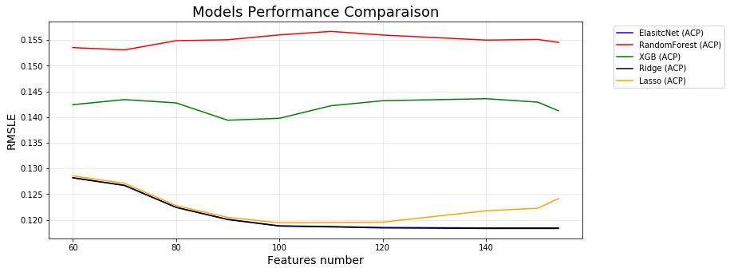

# House Pricing


<font size = 6>Welcome to this house pricing project!</font>

Today we will predict house price with advanced regression technique.

A guided line is followed to lead us to good results:
+ **Part 1 - Exploratory Data Analysis:**\
*Goal: Get a deep understanding on data. Nothing will be modified, and statistical test will be used when necessary*
+ **Part 2 - Preprocessing:**\
*Goal: Prepare data to machine learning and obtain some bright new informations.*
+ **Part 3 - Machine Learning:**\
*Goal: Implementing machine learning regression models, analyse their performance.*

Part 1 and 2 was already made in previous notebooks, in this one Part 3 - Machine Learning is about to be made.\
I'm really happy to share this work with you...the advendure keeps running! I wish you a good reading!


First let's import necessary librairies and datasets:


```python
import pandas as pd
import numpy as np
import matplotlib.pyplot as plt
import seaborn as sns

import sklearn.model_selection as skm
import statsmodels.stats as sst
import statsmodels.formula.api as smf
import sklearn.ensemble as skens
import sklearn.preprocessing as skp
import sklearn.linear_model as sklm
import sklearn.metrics as skmet
import sklearn.pipeline as skpipe
import sklearn.feature_selection as skfs
import sklearn.decomposition as skdec

import warnings
warnings.simplefilter('ignore')
pd.set_option('display.max_columns',None)
```


```python
df_tr = pd.read_csv('encoded_train_set.csv')
df_te = pd.read_csv('encoded_test_set.csv')
df_train = df_tr.copy()
df_test = df_te.copy()

df_train.index = df_train['Id']
df_test.index = df_test['Id']
```


```python
X = df_train.drop(['SalePrice','Id'],axis='columns',inplace=False)
Y = df_train['SalePrice']

valid_data = df_test.drop(['Id'],axis='columns',inplace = False)
```

# Overfit reducer


```python
overfit_limit = 0.995
overfit_col = []
for col in X.columns:
    overfit = X[col].value_counts(normalize=True).iloc[0]
    if overfit > overfit_limit:
        overfit_col.append(col)
        
print('{} columns has been deleted'.format(len(overfit_col)))
X.drop(overfit_col,axis='columns',inplace=True)
valid_data.drop(overfit_col,axis='columns',inplace=True)

X.head()
```

    8 columns has been deleted
    


<div>
<style scoped>
    .dataframe tbody tr th:only-of-type {
        vertical-align: middle;
    }

    .dataframe tbody tr th {
        vertical-align: top;
    }

    .dataframe thead th {
        text-align: right;
    }
</style>
<table border="1" class="dataframe">
  <thead>
    <tr style="text-align: right;">
      <th></th>
      <th>MSSubClass</th>
      <th>MSZoning</th>
      <th>LotFrontage</th>
      <th>LotArea</th>
      <th>LotShape</th>
      <th>Neighborhood</th>
      <th>HouseStyle</th>
      <th>OverallQual</th>
      <th>OverallCond</th>
      <th>YearBuilt</th>
      <th>YearRemodAdd</th>
      <th>MasVnrArea</th>
      <th>ExterQual</th>
      <th>ExterCond</th>
      <th>BsmtQual</th>
      <th>BsmtCond</th>
      <th>BsmtExposure</th>
      <th>BsmtFinType1</th>
      <th>BsmtFinSF1</th>
      <th>BsmtFinType2</th>
      <th>BsmtFinSF2</th>
      <th>BsmtUnfSF</th>
      <th>TotalBsmtSF</th>
      <th>HeatingQC</th>
      <th>1stFlrSF</th>
      <th>2ndFlrSF</th>
      <th>LowQualFinSF</th>
      <th>GrLivArea</th>
      <th>BsmtFullBath</th>
      <th>BsmtHalfBath</th>
      <th>FullBath</th>
      <th>HalfBath</th>
      <th>BedroomAbvGr</th>
      <th>KitchenAbvGr</th>
      <th>KitchenQual</th>
      <th>TotRmsAbvGrd</th>
      <th>Functional</th>
      <th>Fireplaces</th>
      <th>FireplaceQu</th>
      <th>GarageYrBlt</th>
      <th>GarageFinish</th>
      <th>GarageCars</th>
      <th>GarageArea</th>
      <th>GarageQual</th>
      <th>GarageCond</th>
      <th>WoodDeckSF</th>
      <th>OpenPorchSF</th>
      <th>EnclosedPorch</th>
      <th>3SsnPorch</th>
      <th>ScreenPorch</th>
      <th>MiscVal</th>
      <th>MoSold</th>
      <th>YrSold</th>
      <th>OverallTot</th>
      <th>TotalSF</th>
      <th>PorchSF</th>
      <th>TotBath</th>
      <th>HasBsmt</th>
      <th>Has2ndFlr</th>
      <th>HasFirePlace</th>
      <th>HasGarage</th>
      <th>LandContour_Bnk</th>
      <th>LandContour_HLS</th>
      <th>LandContour_Low</th>
      <th>LandContour_Lvl</th>
      <th>LotConfig_Corner</th>
      <th>LotConfig_CulDSac</th>
      <th>LotConfig_FR2</th>
      <th>LotConfig_Inside</th>
      <th>LandSlope_Gtl</th>
      <th>LandSlope_Mod</th>
      <th>LandSlope_Sev</th>
      <th>Condition1_Artery</th>
      <th>Condition1_Feedr</th>
      <th>Condition1_Norm</th>
      <th>Condition1_PosN</th>
      <th>Condition1_RRAe</th>
      <th>Condition1_RRAn</th>
      <th>Condition2_Feedr</th>
      <th>Condition2_Norm</th>
      <th>BldgType_1Fam</th>
      <th>BldgType_2fmCon</th>
      <th>BldgType_Duplex</th>
      <th>BldgType_Twnhs</th>
      <th>BldgType_TwnhsE</th>
      <th>RoofStyle_Flat</th>
      <th>RoofStyle_Gable</th>
      <th>RoofStyle_Gambrel</th>
      <th>RoofStyle_Hip</th>
      <th>RoofMatl_CompShg</th>
      <th>RoofMatl_Tar&amp;Grv</th>
      <th>Exterior1st_AsbShng</th>
      <th>Exterior1st_BrkFace</th>
      <th>Exterior1st_CemntBd</th>
      <th>Exterior1st_HdBoard</th>
      <th>Exterior1st_MetalSd</th>
      <th>Exterior1st_Plywood</th>
      <th>Exterior1st_Stucco</th>
      <th>Exterior1st_VinylSd</th>
      <th>Exterior1st_Wd Sdng</th>
      <th>Exterior1st_WdShing</th>
      <th>Exterior2nd_AsbShng</th>
      <th>Exterior2nd_BrkFace</th>
      <th>Exterior2nd_CmentBd</th>
      <th>Exterior2nd_HdBoard</th>
      <th>Exterior2nd_ImStucc</th>
      <th>Exterior2nd_MetalSd</th>
      <th>Exterior2nd_Plywood</th>
      <th>Exterior2nd_Stucco</th>
      <th>Exterior2nd_VinylSd</th>
      <th>Exterior2nd_Wd Sdng</th>
      <th>Exterior2nd_Wd Shng</th>
      <th>MasVnrType_BrkCmn</th>
      <th>MasVnrType_BrkFace</th>
      <th>MasVnrType_None</th>
      <th>MasVnrType_Stone</th>
      <th>Foundation_BrkTil</th>
      <th>Foundation_CBlock</th>
      <th>Foundation_PConc</th>
      <th>Foundation_Slab</th>
      <th>Heating_GasA</th>
      <th>Heating_GasW</th>
      <th>Heating_Wall</th>
      <th>CentralAir_N</th>
      <th>CentralAir_Y</th>
      <th>Electrical_FuseA</th>
      <th>Electrical_FuseF</th>
      <th>Electrical_SBrkr</th>
      <th>GarageType_Attchd</th>
      <th>GarageType_Basment</th>
      <th>GarageType_BuiltIn</th>
      <th>GarageType_Detchd</th>
      <th>GarageType_None</th>
      <th>PavedDrive_N</th>
      <th>PavedDrive_P</th>
      <th>PavedDrive_Y</th>
      <th>Fence_GdPrv</th>
      <th>Fence_GdWo</th>
      <th>Fence_MnPrv</th>
      <th>Fence_MnWw</th>
      <th>Fence_None</th>
      <th>MiscFeature_None</th>
      <th>MiscFeature_Shed</th>
      <th>SaleType_COD</th>
      <th>SaleType_New</th>
      <th>SaleType_WD</th>
      <th>SaleCondition_Abnorml</th>
      <th>SaleCondition_Alloca</th>
      <th>SaleCondition_Family</th>
      <th>SaleCondition_Normal</th>
      <th>SaleCondition_Partial</th>
      <th>SizeByLoc_Big</th>
      <th>SizeByLoc_Medium</th>
      <th>SizeByLoc_Small</th>
    </tr>
    <tr>
      <th>Id</th>
      <th></th>
      <th></th>
      <th></th>
      <th></th>
      <th></th>
      <th></th>
      <th></th>
      <th></th>
      <th></th>
      <th></th>
      <th></th>
      <th></th>
      <th></th>
      <th></th>
      <th></th>
      <th></th>
      <th></th>
      <th></th>
      <th></th>
      <th></th>
      <th></th>
      <th></th>
      <th></th>
      <th></th>
      <th></th>
      <th></th>
      <th></th>
      <th></th>
      <th></th>
      <th></th>
      <th></th>
      <th></th>
      <th></th>
      <th></th>
      <th></th>
      <th></th>
      <th></th>
      <th></th>
      <th></th>
      <th></th>
      <th></th>
      <th></th>
      <th></th>
      <th></th>
      <th></th>
      <th></th>
      <th></th>
      <th></th>
      <th></th>
      <th></th>
      <th></th>
      <th></th>
      <th></th>
      <th></th>
      <th></th>
      <th></th>
      <th></th>
      <th></th>
      <th></th>
      <th></th>
      <th></th>
      <th></th>
      <th></th>
      <th></th>
      <th></th>
      <th></th>
      <th></th>
      <th></th>
      <th></th>
      <th></th>
      <th></th>
      <th></th>
      <th></th>
      <th></th>
      <th></th>
      <th></th>
      <th></th>
      <th></th>
      <th></th>
      <th></th>
      <th></th>
      <th></th>
      <th></th>
      <th></th>
      <th></th>
      <th></th>
      <th></th>
      <th></th>
      <th></th>
      <th></th>
      <th></th>
      <th></th>
      <th></th>
      <th></th>
      <th></th>
      <th></th>
      <th></th>
      <th></th>
      <th></th>
      <th></th>
      <th></th>
      <th></th>
      <th></th>
      <th></th>
      <th></th>
      <th></th>
      <th></th>
      <th></th>
      <th></th>
      <th></th>
      <th></th>
      <th></th>
      <th></th>
      <th></th>
      <th></th>
      <th></th>
      <th></th>
      <th></th>
      <th></th>
      <th></th>
      <th></th>
      <th></th>
      <th></th>
      <th></th>
      <th></th>
      <th></th>
      <th></th>
      <th></th>
      <th></th>
      <th></th>
      <th></th>
      <th></th>
      <th></th>
      <th></th>
      <th></th>
      <th></th>
      <th></th>
      <th></th>
      <th></th>
      <th></th>
      <th></th>
      <th></th>
      <th></th>
      <th></th>
      <th></th>
      <th></th>
      <th></th>
      <th></th>
      <th></th>
      <th></th>
      <th></th>
      <th></th>
      <th></th>
      <th></th>
    </tr>
  </thead>
  <tbody>
    <tr>
      <th>1</th>
      <td>9</td>
      <td>146.333192</td>
      <td>8.749247</td>
      <td>26.994041</td>
      <td>0.000000</td>
      <td>4.282213</td>
      <td>8.0</td>
      <td>3.326204</td>
      <td>16.149620</td>
      <td>2.340873</td>
      <td>5.0</td>
      <td>19.427500</td>
      <td>2.651023</td>
      <td>124734.475204</td>
      <td>1.836565</td>
      <td>136.705013</td>
      <td>0.000000</td>
      <td>2.372624</td>
      <td>143.659391</td>
      <td>2.142414</td>
      <td>0.0</td>
      <td>30.065059</td>
      <td>423.381034</td>
      <td>9</td>
      <td>5.931265</td>
      <td>1031.931787</td>
      <td>0.0</td>
      <td>8.273322</td>
      <td>0.994946</td>
      <td>0.00000</td>
      <td>2</td>
      <td>1.069176</td>
      <td>3</td>
      <td>0.75095</td>
      <td>1.468314</td>
      <td>2.255483</td>
      <td>231.619055</td>
      <td>0.000000</td>
      <td>0.000000</td>
      <td>6.0</td>
      <td>6</td>
      <td>1.313302</td>
      <td>548.0</td>
      <td>33.201878</td>
      <td>792.963099</td>
      <td>0.000000</td>
      <td>12.077018</td>
      <td>0.000000</td>
      <td>0.0</td>
      <td>0.0</td>
      <td>0.0</td>
      <td>0</td>
      <td>2</td>
      <td>7.373734</td>
      <td>35.420603</td>
      <td>18.767927</td>
      <td>6.701624</td>
      <td>16.294381</td>
      <td>1</td>
      <td>0</td>
      <td>6.468353</td>
      <td>0</td>
      <td>0</td>
      <td>0</td>
      <td>1</td>
      <td>0</td>
      <td>0</td>
      <td>0</td>
      <td>1</td>
      <td>1</td>
      <td>0</td>
      <td>0</td>
      <td>0</td>
      <td>0</td>
      <td>1</td>
      <td>0</td>
      <td>0</td>
      <td>0</td>
      <td>0</td>
      <td>1</td>
      <td>1</td>
      <td>0</td>
      <td>0</td>
      <td>0</td>
      <td>0</td>
      <td>0</td>
      <td>1</td>
      <td>0</td>
      <td>0</td>
      <td>1</td>
      <td>0</td>
      <td>0</td>
      <td>0</td>
      <td>0</td>
      <td>0</td>
      <td>0</td>
      <td>0</td>
      <td>0</td>
      <td>1</td>
      <td>0</td>
      <td>0</td>
      <td>0</td>
      <td>0</td>
      <td>0</td>
      <td>0</td>
      <td>0</td>
      <td>0</td>
      <td>0</td>
      <td>0</td>
      <td>1</td>
      <td>0</td>
      <td>0</td>
      <td>0</td>
      <td>1</td>
      <td>0</td>
      <td>0</td>
      <td>0</td>
      <td>0</td>
      <td>1</td>
      <td>0</td>
      <td>1</td>
      <td>0</td>
      <td>0</td>
      <td>0</td>
      <td>1</td>
      <td>0</td>
      <td>0</td>
      <td>1</td>
      <td>1</td>
      <td>0</td>
      <td>0</td>
      <td>0</td>
      <td>0</td>
      <td>0</td>
      <td>0</td>
      <td>1</td>
      <td>0</td>
      <td>0</td>
      <td>0</td>
      <td>0</td>
      <td>1</td>
      <td>1</td>
      <td>0</td>
      <td>0</td>
      <td>0</td>
      <td>1</td>
      <td>0</td>
      <td>0</td>
      <td>0</td>
      <td>1</td>
      <td>0</td>
      <td>0</td>
      <td>1</td>
      <td>0</td>
    </tr>
    <tr>
      <th>2</th>
      <td>5</td>
      <td>146.333192</td>
      <td>9.547559</td>
      <td>27.855365</td>
      <td>0.000000</td>
      <td>4.584977</td>
      <td>4.0</td>
      <td>2.839752</td>
      <td>9.654663</td>
      <td>1.701580</td>
      <td>2.0</td>
      <td>0.000000</td>
      <td>1.507896</td>
      <td>124734.475204</td>
      <td>1.836565</td>
      <td>136.705013</td>
      <td>2.473435</td>
      <td>0.699406</td>
      <td>181.106231</td>
      <td>2.142414</td>
      <td>0.0</td>
      <td>44.261598</td>
      <td>595.228295</td>
      <td>9</td>
      <td>6.226389</td>
      <td>0.000000</td>
      <td>0.0</td>
      <td>7.901323</td>
      <td>0.000000</td>
      <td>0.70985</td>
      <td>2</td>
      <td>0.000000</td>
      <td>3</td>
      <td>0.75095</td>
      <td>0.666050</td>
      <td>1.991512</td>
      <td>231.619055</td>
      <td>0.903128</td>
      <td>2.858209</td>
      <td>3.0</td>
      <td>6</td>
      <td>1.313302</td>
      <td>460.0</td>
      <td>33.201878</td>
      <td>792.963099</td>
      <td>56.777656</td>
      <td>0.000000</td>
      <td>0.000000</td>
      <td>0.0</td>
      <td>0.0</td>
      <td>0.0</td>
      <td>0</td>
      <td>1</td>
      <td>10.525627</td>
      <td>35.217628</td>
      <td>51.766029</td>
      <td>4.434802</td>
      <td>16.294381</td>
      <td>0</td>
      <td>1</td>
      <td>6.468353</td>
      <td>0</td>
      <td>0</td>
      <td>0</td>
      <td>1</td>
      <td>0</td>
      <td>0</td>
      <td>1</td>
      <td>0</td>
      <td>1</td>
      <td>0</td>
      <td>0</td>
      <td>0</td>
      <td>1</td>
      <td>0</td>
      <td>0</td>
      <td>0</td>
      <td>0</td>
      <td>0</td>
      <td>1</td>
      <td>1</td>
      <td>0</td>
      <td>0</td>
      <td>0</td>
      <td>0</td>
      <td>0</td>
      <td>1</td>
      <td>0</td>
      <td>0</td>
      <td>1</td>
      <td>0</td>
      <td>0</td>
      <td>0</td>
      <td>0</td>
      <td>0</td>
      <td>1</td>
      <td>0</td>
      <td>0</td>
      <td>0</td>
      <td>0</td>
      <td>0</td>
      <td>0</td>
      <td>0</td>
      <td>0</td>
      <td>0</td>
      <td>0</td>
      <td>1</td>
      <td>0</td>
      <td>0</td>
      <td>0</td>
      <td>0</td>
      <td>0</td>
      <td>0</td>
      <td>0</td>
      <td>1</td>
      <td>0</td>
      <td>0</td>
      <td>1</td>
      <td>0</td>
      <td>0</td>
      <td>1</td>
      <td>0</td>
      <td>0</td>
      <td>0</td>
      <td>1</td>
      <td>0</td>
      <td>0</td>
      <td>1</td>
      <td>1</td>
      <td>0</td>
      <td>0</td>
      <td>0</td>
      <td>0</td>
      <td>0</td>
      <td>0</td>
      <td>1</td>
      <td>0</td>
      <td>0</td>
      <td>0</td>
      <td>0</td>
      <td>1</td>
      <td>1</td>
      <td>0</td>
      <td>0</td>
      <td>0</td>
      <td>1</td>
      <td>0</td>
      <td>0</td>
      <td>0</td>
      <td>1</td>
      <td>0</td>
      <td>0</td>
      <td>0</td>
      <td>1</td>
    </tr>
    <tr>
      <th>3</th>
      <td>9</td>
      <td>146.333192</td>
      <td>8.918149</td>
      <td>28.958655</td>
      <td>16.916794</td>
      <td>4.282213</td>
      <td>8.0</td>
      <td>3.326204</td>
      <td>16.149620</td>
      <td>2.604058</td>
      <td>5.0</td>
      <td>17.763877</td>
      <td>2.651023</td>
      <td>124734.475204</td>
      <td>1.836565</td>
      <td>136.705013</td>
      <td>1.464607</td>
      <td>2.372624</td>
      <td>110.113799</td>
      <td>2.142414</td>
      <td>0.0</td>
      <td>57.074360</td>
      <td>451.042545</td>
      <td>9</td>
      <td>5.986415</td>
      <td>1046.907208</td>
      <td>0.0</td>
      <td>8.326834</td>
      <td>0.994946</td>
      <td>0.00000</td>
      <td>2</td>
      <td>1.069176</td>
      <td>3</td>
      <td>0.75095</td>
      <td>1.468314</td>
      <td>1.991512</td>
      <td>231.619055</td>
      <td>0.903128</td>
      <td>2.858209</td>
      <td>6.0</td>
      <td>6</td>
      <td>1.313302</td>
      <td>608.0</td>
      <td>33.201878</td>
      <td>792.963099</td>
      <td>0.000000</td>
      <td>9.898668</td>
      <td>0.000000</td>
      <td>0.0</td>
      <td>0.0</td>
      <td>0.0</td>
      <td>1</td>
      <td>2</td>
      <td>7.373734</td>
      <td>36.081301</td>
      <td>14.676844</td>
      <td>6.701624</td>
      <td>16.294381</td>
      <td>1</td>
      <td>1</td>
      <td>6.468353</td>
      <td>0</td>
      <td>0</td>
      <td>0</td>
      <td>1</td>
      <td>0</td>
      <td>0</td>
      <td>0</td>
      <td>1</td>
      <td>1</td>
      <td>0</td>
      <td>0</td>
      <td>0</td>
      <td>0</td>
      <td>1</td>
      <td>0</td>
      <td>0</td>
      <td>0</td>
      <td>0</td>
      <td>1</td>
      <td>1</td>
      <td>0</td>
      <td>0</td>
      <td>0</td>
      <td>0</td>
      <td>0</td>
      <td>1</td>
      <td>0</td>
      <td>0</td>
      <td>1</td>
      <td>0</td>
      <td>0</td>
      <td>0</td>
      <td>0</td>
      <td>0</td>
      <td>0</td>
      <td>0</td>
      <td>0</td>
      <td>1</td>
      <td>0</td>
      <td>0</td>
      <td>0</td>
      <td>0</td>
      <td>0</td>
      <td>0</td>
      <td>0</td>
      <td>0</td>
      <td>0</td>
      <td>0</td>
      <td>1</td>
      <td>0</td>
      <td>0</td>
      <td>0</td>
      <td>1</td>
      <td>0</td>
      <td>0</td>
      <td>0</td>
      <td>0</td>
      <td>1</td>
      <td>0</td>
      <td>1</td>
      <td>0</td>
      <td>0</td>
      <td>0</td>
      <td>1</td>
      <td>0</td>
      <td>0</td>
      <td>1</td>
      <td>1</td>
      <td>0</td>
      <td>0</td>
      <td>0</td>
      <td>0</td>
      <td>0</td>
      <td>0</td>
      <td>1</td>
      <td>0</td>
      <td>0</td>
      <td>0</td>
      <td>0</td>
      <td>1</td>
      <td>1</td>
      <td>0</td>
      <td>0</td>
      <td>0</td>
      <td>1</td>
      <td>0</td>
      <td>0</td>
      <td>0</td>
      <td>1</td>
      <td>0</td>
      <td>0</td>
      <td>1</td>
      <td>0</td>
    </tr>
    <tr>
      <th>4</th>
      <td>5</td>
      <td>146.333192</td>
      <td>8.455689</td>
      <td>27.819660</td>
      <td>16.916794</td>
      <td>4.282213</td>
      <td>8.0</td>
      <td>3.326204</td>
      <td>16.149620</td>
      <td>0.000000</td>
      <td>1.0</td>
      <td>0.000000</td>
      <td>1.507896</td>
      <td>124734.475204</td>
      <td>0.678926</td>
      <td>259.904152</td>
      <td>0.000000</td>
      <td>0.699406</td>
      <td>61.641032</td>
      <td>2.142414</td>
      <td>0.0</td>
      <td>65.020418</td>
      <td>379.637504</td>
      <td>6</td>
      <td>6.019691</td>
      <td>909.899190</td>
      <td>0.0</td>
      <td>8.278346</td>
      <td>0.994946</td>
      <td>0.00000</td>
      <td>1</td>
      <td>0.000000</td>
      <td>3</td>
      <td>0.75095</td>
      <td>1.468314</td>
      <td>2.131572</td>
      <td>231.619055</td>
      <td>0.903128</td>
      <td>3.941155</td>
      <td>6.0</td>
      <td>0</td>
      <td>2.105887</td>
      <td>642.0</td>
      <td>33.201878</td>
      <td>792.963099</td>
      <td>0.000000</td>
      <td>8.964053</td>
      <td>16.038125</td>
      <td>0.0</td>
      <td>0.0</td>
      <td>0.0</td>
      <td>0</td>
      <td>0</td>
      <td>7.373734</td>
      <td>34.968049</td>
      <td>52.743351</td>
      <td>2.513939</td>
      <td>16.294381</td>
      <td>1</td>
      <td>1</td>
      <td>6.468353</td>
      <td>0</td>
      <td>0</td>
      <td>0</td>
      <td>1</td>
      <td>1</td>
      <td>0</td>
      <td>0</td>
      <td>0</td>
      <td>1</td>
      <td>0</td>
      <td>0</td>
      <td>0</td>
      <td>0</td>
      <td>1</td>
      <td>0</td>
      <td>0</td>
      <td>0</td>
      <td>0</td>
      <td>1</td>
      <td>1</td>
      <td>0</td>
      <td>0</td>
      <td>0</td>
      <td>0</td>
      <td>0</td>
      <td>1</td>
      <td>0</td>
      <td>0</td>
      <td>1</td>
      <td>0</td>
      <td>0</td>
      <td>0</td>
      <td>0</td>
      <td>0</td>
      <td>0</td>
      <td>0</td>
      <td>0</td>
      <td>0</td>
      <td>1</td>
      <td>0</td>
      <td>0</td>
      <td>0</td>
      <td>0</td>
      <td>0</td>
      <td>0</td>
      <td>0</td>
      <td>0</td>
      <td>0</td>
      <td>0</td>
      <td>0</td>
      <td>1</td>
      <td>0</td>
      <td>0</td>
      <td>1</td>
      <td>0</td>
      <td>1</td>
      <td>0</td>
      <td>0</td>
      <td>0</td>
      <td>1</td>
      <td>0</td>
      <td>0</td>
      <td>0</td>
      <td>1</td>
      <td>0</td>
      <td>0</td>
      <td>1</td>
      <td>0</td>
      <td>0</td>
      <td>0</td>
      <td>1</td>
      <td>0</td>
      <td>0</td>
      <td>0</td>
      <td>1</td>
      <td>0</td>
      <td>0</td>
      <td>0</td>
      <td>0</td>
      <td>1</td>
      <td>1</td>
      <td>0</td>
      <td>0</td>
      <td>0</td>
      <td>1</td>
      <td>1</td>
      <td>0</td>
      <td>0</td>
      <td>0</td>
      <td>0</td>
      <td>0</td>
      <td>1</td>
      <td>0</td>
    </tr>
    <tr>
      <th>5</th>
      <td>9</td>
      <td>146.333192</td>
      <td>9.743110</td>
      <td>30.677899</td>
      <td>16.916794</td>
      <td>5.683792</td>
      <td>8.0</td>
      <td>3.958762</td>
      <td>16.149620</td>
      <td>2.604058</td>
      <td>4.0</td>
      <td>25.395743</td>
      <td>2.651023</td>
      <td>124734.475204</td>
      <td>1.836565</td>
      <td>136.705013</td>
      <td>1.464607</td>
      <td>2.372624</td>
      <td>136.195975</td>
      <td>2.142414</td>
      <td>0.0</td>
      <td>61.362262</td>
      <td>546.520722</td>
      <td>9</td>
      <td>6.152832</td>
      <td>1281.100458</td>
      <td>0.0</td>
      <td>8.583175</td>
      <td>0.994946</td>
      <td>0.00000</td>
      <td>2</td>
      <td>1.069176</td>
      <td>4</td>
      <td>0.75095</td>
      <td>1.468314</td>
      <td>2.366618</td>
      <td>231.619055</td>
      <td>0.903128</td>
      <td>2.858209</td>
      <td>6.0</td>
      <td>6</td>
      <td>2.105887</td>
      <td>836.0</td>
      <td>33.201878</td>
      <td>792.963099</td>
      <td>42.649856</td>
      <td>14.267320</td>
      <td>0.000000</td>
      <td>0.0</td>
      <td>0.0</td>
      <td>0.0</td>
      <td>1</td>
      <td>2</td>
      <td>9.638201</td>
      <td>38.824722</td>
      <td>49.327600</td>
      <td>6.701624</td>
      <td>16.294381</td>
      <td>1</td>
      <td>1</td>
      <td>6.468353</td>
      <td>0</td>
      <td>0</td>
      <td>0</td>
      <td>1</td>
      <td>0</td>
      <td>0</td>
      <td>1</td>
      <td>0</td>
      <td>1</td>
      <td>0</td>
      <td>0</td>
      <td>0</td>
      <td>0</td>
      <td>1</td>
      <td>0</td>
      <td>0</td>
      <td>0</td>
      <td>0</td>
      <td>1</td>
      <td>1</td>
      <td>0</td>
      <td>0</td>
      <td>0</td>
      <td>0</td>
      <td>0</td>
      <td>1</td>
      <td>0</td>
      <td>0</td>
      <td>1</td>
      <td>0</td>
      <td>0</td>
      <td>0</td>
      <td>0</td>
      <td>0</td>
      <td>0</td>
      <td>0</td>
      <td>0</td>
      <td>1</td>
      <td>0</td>
      <td>0</td>
      <td>0</td>
      <td>0</td>
      <td>0</td>
      <td>0</td>
      <td>0</td>
      <td>0</td>
      <td>0</td>
      <td>0</td>
      <td>1</td>
      <td>0</td>
      <td>0</td>
      <td>0</td>
      <td>1</td>
      <td>0</td>
      <td>0</td>
      <td>0</td>
      <td>0</td>
      <td>1</td>
      <td>0</td>
      <td>1</td>
      <td>0</td>
      <td>0</td>
      <td>0</td>
      <td>1</td>
      <td>0</td>
      <td>0</td>
      <td>1</td>
      <td>1</td>
      <td>0</td>
      <td>0</td>
      <td>0</td>
      <td>0</td>
      <td>0</td>
      <td>0</td>
      <td>1</td>
      <td>0</td>
      <td>0</td>
      <td>0</td>
      <td>0</td>
      <td>1</td>
      <td>1</td>
      <td>0</td>
      <td>0</td>
      <td>0</td>
      <td>1</td>
      <td>0</td>
      <td>0</td>
      <td>0</td>
      <td>1</td>
      <td>0</td>
      <td>0</td>
      <td>0</td>
      <td>1</td>
    </tr>
  </tbody>
</table>
</div>


# Features Selection

We want to choose only features which impact results on a positive way. Features Selection is an important part and we will explore different ways to do that:
+ With SelectKBest
+ With SelectFromModel
+ With PCA

**With SelectKBest**:


```python
import xgboost as xgb

l_k = np.linspace(50,X.shape[1],26)
l_test = [skfs.f_classif,skfs.f_regression]

test_frame = [pd.DataFrame(),pd.DataFrame()]


for i in np.arange(len(l_test)):
    tmp_ElasticNet = []
    tmp_Ridge = []
    tmp_Lasso = []
    tmp_RFR = []
    tmp_XGBR = []
    for k in l_k:
        KBest = skfs.SelectKBest(l_test[i],int(k)).fit_transform(X,Y)        
        n_split = 4
        cv = skm.KFold(n_splits=n_split,shuffle = True,random_state = 0)
        
        # Elatic Net train
        Elastic_pipe = skpipe.make_pipeline(skp.RobustScaler(),sklm.ElasticNet(alpha=0.04,
                                                                               random_state = 42,
                                                                               l1_ratio = 0))
        tmp_score = -skm.cross_val_score(Elastic_pipe,KBest,Y,cv=cv,scoring='neg_mean_squared_error')
        tmp_ElasticNet.append(np.sqrt(tmp_score.mean()))

        
        # Random Forest train
        RFR_pipe = skpipe.make_pipeline(skp.RobustScaler(),skens.RandomForestRegressor(random_state = 42,
                                                                                      n_jobs=-1,
                                                                                      min_samples_split = 3,
                                                                                      n_estimators=1200,
                                                                                       max_depth = 12,
                                                                                       max_features = round(KBest.shape[1]*0.33)
                                                                                      ))
        tmp_score = -skm.cross_val_score(RFR_pipe,KBest,Y,cv=cv,scoring='neg_mean_squared_error')
        tmp_RFR.append(np.sqrt(tmp_score.mean()))
        
        
        # Gradient Boosting train
        XGBR_pipe = skpipe.make_pipeline(skp.RobustScaler(),xgb.XGBRegressor(random_state=42,
                                                                            n_jobs = -1,
                                                                            min_sample_split = 3,
                                                                            n_estimators = 600,
                                                                            max_depth = 3,
                                                                            booster='gbtree'))
        tmp_score = -skm.cross_val_score(XGBR_pipe,KBest,Y,cv=cv,scoring='neg_mean_squared_error')
        tmp_XGBR.append(np.sqrt(tmp_score.mean()))        
        
        # Ridge
        Ridge_pipe = skpipe.make_pipeline(skp.RobustScaler(),sklm.Ridge(random_state=42,
                                                                        solver = 'svd',
                                                                        alpha = 50))
        
        tmp_score = -skm.cross_val_score(Ridge_pipe,KBest,Y,cv=cv,scoring='neg_mean_squared_error')
        tmp_Ridge.append(np.sqrt(tmp_score.mean())) 
        
                                          
        # Lasso
        Lasso_pipe = skpipe.make_pipeline(skp.RobustScaler(),sklm.Lasso(random_state=42,
                                                                        alpha = 0))
        tmp_score = -skm.cross_val_score(Lasso_pipe,KBest,Y,cv=cv,scoring='neg_mean_squared_error')
        tmp_Lasso.append(np.sqrt(tmp_score.mean()))                                                
    
    
    test_frame[i]['ElasitcNet'] = tmp_ElasticNet
    test_frame[i]['RandomForest'] = tmp_RFR
    test_frame[i]['XGB'] = tmp_XGBR
    test_frame[i]['Ridge'] = tmp_Ridge
    test_frame[i]['Lasso'] = tmp_Lasso

    
color = ['b','r','g','k','orange']
style = ['dashed','solid']
l_name = ['f_classif','f_regression']
plt.figure(figsize=(12,5))
for i in np.arange(len(test_frame)):
    for j in np.arange(len(test_frame[i].columns)):
        t_label = str(test_frame[i].columns[j])+' ('+str(l_name[i])+')'
        plt.plot(l_k,test_frame[i][test_frame[i].columns[j]],linestyle = style[i],color = color[j],label=t_label)
        
plt.legend(bbox_to_anchor=(1.05, 1), loc='upper left') 
plt.title('Models Performance Comparaison',fontsize=18)
plt.ylabel('RMSLE',fontsize=14)
plt.xlabel('Features Number',fontsize=14)
plt.grid(alpha=0.3)
plt.show()
```


f_regression seems to be a better choice than f_classif but globally there is no impovement with SelectKBest.


**With SelectFromModel:**


```python
import xgboost as xgb

Elastic = sklm.ElasticNet(alpha=0.04,random_state = 42,l1_ratio = 0)
Forest = skens.RandomForestRegressor(random_state = 42,
                                     n_jobs=-1,
                                     min_samples_split = 3,
                                     n_estimators=1200,
                                     max_depth=12,
                                     max_features=round(X.shape[1]*0.33))
XGBoost = xgb.XGBRegressor(random_state=42,
                           n_jobs = -1,
                           min_sample_split = 3,
                           n_estimators=600,
                           max_depth=3,
                           booster='gbtree'
                          )

l_k = [0.005,0.01,0.02,0.03,0.04,0.05,0.06,0.08,0.1,0.15,0.2]
l_test = [Elastic,Forest,XGBoost]

test_frame = [pd.DataFrame(),pd.DataFrame(),pd.DataFrame()]

for i in np.arange(len(l_test)):
    tmp_ElasticNet = []
    tmp_Ridge = []
    tmp_Lasso = []
    tmp_RFR = []
    tmp_XGBR = []
    for k in l_k:
        KBest = skfs.SelectFromModel(l_test[i],threshold=str(k)+'*mean').fit_transform(X,Y)        
        n_split = 4
        cv = skm.KFold(n_splits=n_split,shuffle = True,random_state = 0)
        
        # Elatic Net train
        Elastic_pipe = skpipe.make_pipeline(skp.RobustScaler(),sklm.ElasticNet(alpha=0.04,
                                                                               random_state = 42,
                                                                               l1_ratio = 0))
        tmp_score = -skm.cross_val_score(Elastic_pipe,KBest,Y,cv=cv,scoring='neg_mean_squared_error')
        tmp_ElasticNet.append(np.sqrt(tmp_score.mean()))

        
        # Random Forest train
        RFR_pipe = skpipe.make_pipeline(skp.RobustScaler(),skens.RandomForestRegressor(random_state = 42,
                                                                                      n_jobs=-1,
                                                                                      min_samples_split = 3,
                                                                                      n_estimators=1200,
                                                                                       max_depth = 12,
                                                                                       max_features = round(KBest.shape[1]*0.33)
                                                                                      ))
        tmp_score = -skm.cross_val_score(RFR_pipe,KBest,Y,cv=cv,scoring='neg_mean_squared_error')
        tmp_RFR.append(np.sqrt(tmp_score.mean()))
        
        
        # Gradient Boosting train
        XGBR_pipe = skpipe.make_pipeline(skp.RobustScaler(),xgb.XGBRegressor(random_state=42,
                                                                            n_jobs = -1,
                                                                            min_sample_split = 3,
                                                                            n_estimators = 600,
                                                                            max_depth = 3,
                                                                            booster='gbtree'))
        tmp_score = -skm.cross_val_score(XGBR_pipe,KBest,Y,cv=cv,scoring='neg_mean_squared_error')
        tmp_XGBR.append(np.sqrt(tmp_score.mean()))        
        
        # Ridge
        Ridge_pipe = skpipe.make_pipeline(skp.RobustScaler(),sklm.Ridge(random_state=42,
                                                                        solver = 'svd',
                                                                        alpha = 50))
        
        tmp_score = -skm.cross_val_score(Ridge_pipe,KBest,Y,cv=cv,scoring='neg_mean_squared_error')
        tmp_Ridge.append(np.sqrt(tmp_score.mean())) 
        
                                          
        # Lasso
        Lasso_pipe = skpipe.make_pipeline(skp.RobustScaler(),sklm.Lasso(random_state=42,
                                                                        alpha = 0))
        tmp_score = -skm.cross_val_score(Lasso_pipe,KBest,Y,cv=cv,scoring='neg_mean_squared_error')
        tmp_Lasso.append(np.sqrt(tmp_score.mean()))                                                                    
        
        
    test_frame[i]['ElasitcNet'] = tmp_ElasticNet
    test_frame[i]['RandomForest'] = tmp_RFR
    test_frame[i]['XGB'] = tmp_XGBR
    test_frame[i]['Ridge'] = tmp_Ridge
    test_frame[i]['Lasso'] = tmp_Lasso
    
color = ['b','r','g','k','orange']
style = ['dashed','solid','dashdot']
l_name = ['ElasticNet','Forest','XGB']
plt.figure(figsize=(12,5))
for i in np.arange(len(test_frame)):
    for j in np.arange(len(test_frame[i].columns)):
        t_label = str(test_frame[i].columns[j])+' ('+str(l_name[i])+')'
        plt.plot(l_k,test_frame[i][test_frame[i].columns[j]],linestyle = style[i],color = color[j],label=t_label)
        
plt.legend(bbox_to_anchor=(1.05, 1), loc='upper left') 
plt.title('Models Performance Comparaison',fontsize=18)
plt.ylabel('RMSLE',fontsize=14)
plt.xlabel('Threshold (mean)',fontsize=14)
plt.grid(alpha=0.3)
plt.show()
```


Taking SelectFromModel with **XGB** and a Thresold equal to **0.03*mean** seem to be a good compromise. But after testing, no improvements are made.

**With PCA:**


```python
n_comp = X.shape[1]
PCA = skdec.PCA(n_components=n_comp)

PCA_scaler = skp.StandardScaler()
X_std = PCA_scaler.fit_transform(X)

PCA.fit(X_std)

inertia = np.cumsum(PCA.explained_variance_ratio_)
x = np.arange(1,n_comp+1)

limit = 0.99
n_limit = np.sum(np.cumsum(PCA.explained_variance_ratio_)<limit)
t = str(limit*100)+'% of inertia: '+str(n_limit)+' components'

plt.figure(figsize=(12,6))
plt.plot(x,inertia,'b')
plt.grid(alpha=0.5)
plt.plot([n_limit,n_limit],[0,1],'r')
plt.text(n_limit+5,limit-0.05,t,fontsize=12,backgroundcolor='white')
plt.xlabel('Components')
plt.ylabel('Inertia')
```


    Text(0, 0.5, 'Inertia')


```python
import xgboost as xgb

PCA_scaler = skp.StandardScaler()
X_std = PCA_scaler.fit_transform(X)

l_k = [60,70,80,90,100,110,120,140,150,X.shape[1]]
l_test = ['PCA']

test_frame = [pd.DataFrame()]

for i in np.arange(len(l_test)):
    tmp_ElasticNet = []
    tmp_Ridge = []
    tmp_Lasso = []
    tmp_RFR = []
    tmp_XGBR = []
    for k in l_k:
        tmp_PCA = skdec.PCA(n_components=k)
        KBest = tmp_PCA.fit_transform(X_std)

        n_split = 4
        cv = skm.KFold(n_splits=n_split,shuffle = True,random_state = 0)
        
        # Elatic Net train
        Elastic_pipe = skpipe.make_pipeline(sklm.ElasticNet(alpha=0.04,
                                                           random_state = 42,
                                                           l1_ratio = 0))
        tmp_score = -skm.cross_val_score(Elastic_pipe,KBest,Y,cv=cv,scoring='neg_mean_squared_error')
        tmp_ElasticNet.append(np.sqrt(tmp_score.mean()))

        
        # Random Forest train
        RFR_pipe = skpipe.make_pipeline(skens.RandomForestRegressor(random_state = 42,
                                                                      n_jobs=-1,
                                                                      min_samples_split = 3,
                                                                      n_estimators=1200,
                                                                       max_depth = 12,
                                                                       max_features = round(KBest.shape[1]*0.33)
                                                                      ))
        tmp_score = -skm.cross_val_score(RFR_pipe,KBest,Y,cv=cv,scoring='neg_mean_squared_error')
        tmp_RFR.append(np.sqrt(tmp_score.mean()))
        
        
        # Gradient Boosting train
        XGBR_pipe = skpipe.make_pipeline(xgb.XGBRegressor(random_state=42,
                                                            n_jobs = -1,
                                                            min_sample_split = 3,
                                                            n_estimators = 600,
                                                            max_depth = 3,
                                                            booster='dart'))
        tmp_score = -skm.cross_val_score(XGBR_pipe,KBest,Y,cv=cv,scoring='neg_mean_squared_error')
        tmp_XGBR.append(np.sqrt(tmp_score.mean()))        
        
        # Ridge
        Ridge_pipe = skpipe.make_pipeline(sklm.Ridge(random_state=42,
                                                    solver = 'svd',
                                                    alpha = 50))
        
        tmp_score = -skm.cross_val_score(Ridge_pipe,KBest,Y,cv=cv,scoring='neg_mean_squared_error')
        tmp_Ridge.append(np.sqrt(tmp_score.mean())) 
        
                                          
        # Lasso
        Lasso_pipe = skpipe.make_pipeline(sklm.Lasso(random_state=42,
                                                    alpha = 0))
        tmp_score = -skm.cross_val_score(Lasso_pipe,KBest,Y,cv=cv,scoring='neg_mean_squared_error')
        tmp_Lasso.append(np.sqrt(tmp_score.mean()))                                                                    
        
        
    test_frame[i]['ElasitcNet'] = tmp_ElasticNet
    test_frame[i]['RandomForest'] = tmp_RFR
    test_frame[i]['XGB'] = tmp_XGBR
    test_frame[i]['Ridge'] = tmp_Ridge
    test_frame[i]['Lasso'] = tmp_Lasso
    
color = ['b','r','g','k','orange']
style = ['solid']
l_name = ['ACP']
plt.figure(figsize=(12,5))
for i in np.arange(len(test_frame)):
    for j in np.arange(len(test_frame[i].columns)):
        t_label = str(test_frame[i].columns[j])+' ('+str(l_name[i])+')'
        plt.plot(l_k,test_frame[i][test_frame[i].columns[j]],linestyle = style[i],color = color[j],label=t_label)
        
plt.legend(bbox_to_anchor=(1.05, 1), loc='upper left') 
plt.title('Models Performance Comparaison',fontsize=18)
plt.ylabel('RMSLE',fontsize=14)
plt.xlabel('Features number',fontsize=14)
plt.grid(alpha=0.3)
plt.show()
```





PCA results are not good, but Ridge, Lasso and Elastic net performance clealy increase until around 110 components PCA which correspond to 99% of inertia.


**Final features selection :**

After testing possibilities explained above, none improve models results. That's why nothing has to be done.


```python
KBest = X
X_Train,X_Test,Y_Train,Y_Test = skm.train_test_split(KBest,Y,test_size = 0.25, random_state = 0)
n_split = 10
cv = skm.KFold(n_splits=n_split,shuffle = True,random_state = 0)
KBest.shape
```


    (1454, 154)


# 3 - Machine Learning

## 3.1 - Models 

### 3.1.1 - [Model 1] - Ridge


```python
Ridge_Scaler = skp.RobustScaler()
Ridge = sklm.Ridge()
Ridge_pipe = skpipe.make_pipeline(Ridge_Scaler,Ridge)

Ridge_params = {
    #'ridge__alpha':[0,0.2,0.6,1,3,10,20,40,50,60],
    #'ridge__solver' : ['svd', 'cholesky', 'lsqr', 'sparse_cg', 'sag', 'saga'],
    'ridge__alpha':[47.5],
    'ridge__solver' : ['svd'],
    'ridge__random_state' : [42]
}

Ridge_Grid = skm.GridSearchCV(Ridge_pipe,
                              param_grid = Ridge_params,
                              cv=cv,scoring = 'neg_root_mean_squared_error',
                              n_jobs=-1)

Ridge_Grid.fit(KBest,Y)
print(-Ridge_Grid.best_score_)
Ridge_Grid.best_params_
```

    0.11428152172424444
    


    {'ridge__alpha': 47.5, 'ridge__random_state': 42, 'ridge__solver': 'svd'}


### 3.1.2 - [Model2]  - Lasso


```python
Lasso_Scaler = skp.RobustScaler()
Lasso = sklm.Lasso()
Lasso_pipe = skpipe.make_pipeline(Lasso_Scaler,Lasso)
Lasso_pipe = skpipe.make_pipeline(Lasso)
Lasso_params = {
    #'lasso__alpha':[-3,-1,-0.5,0,0.2,0.3,0.6,1,3,5,10,20],
    'lasso__alpha':[0.0007],
    'lasso__random_state' : [42]
}

Lasso_Grid = skm.GridSearchCV(Lasso_pipe,
                              param_grid = Lasso_params,
                              cv=cv,scoring = 'neg_root_mean_squared_error',
                              n_jobs=-1)
Lasso_Grid.fit(KBest,Y)
print(-Lasso_Grid.best_score_)
Lasso_Grid.best_params_
```

    0.11444894941512615
    


    {'lasso__alpha': 0.0007, 'lasso__random_state': 42}


### 3.1.3 - [Model3] - ElasticNet


```python
Elastic_Scaler = skp.RobustScaler()
Elastic = sklm.ElasticNet()
Elastic_pipe = skpipe.make_pipeline(Elastic_Scaler,Elastic)

Elastic_params = {
    #'elasticnet__alpha':[-3,-1,-0.5,0,0.2,0.3,0.6,1,3,5,10,20],
    #'elasticnet__l1_ratio':[0,0.2,0.4,0.6,0.8,1],    
    'elasticnet__random_state' : [42],
    'elasticnet__alpha':[0.024],
    'elasticnet__l1_ratio':[0.023]
}

Elastic_Grid = skm.GridSearchCV(Elastic_pipe,
                              param_grid = Elastic_params,
                              cv=cv,scoring = 'neg_root_mean_squared_error',
                              n_jobs=-1)

Elastic_Grid.fit(KBest,Y)
print(-Elastic_Grid.best_score_)
Elastic_Grid.best_params_
```

    0.11374189025497547
    


    {'elasticnet__alpha': 0.024,
     'elasticnet__l1_ratio': 0.023,
     'elasticnet__random_state': 42}


### 3.1.4 - Model 4 [GradientBoostingRegressor]


```python
GBR_Scaler = skp.RobustScaler()
GBR = skens.GradientBoostingRegressor()
GBR_pipe = skpipe.make_pipeline(GBR_Scaler,GBR)
GBR_params = {
    #'gradientboostingregressor__n_estimators':[200,500,800],
    #'gradientboostingregressor__max_depth':[3,5],    
    #'gradientboostingregressor__learning_rate' : [0.1,0.3],
    #'gradientboostingregressor__min_samples_split' : [3],
    #'gradientboostingregressor__loss' :['ls', 'lad', 'huber', 'quantile'],
    #'gradientboostingregressor__random_state' :[42],
    #'gradientboostingregressor__max_features' :['auto','sqrt','log2',round(X.shape[1]*0.33)]
    
    'gradientboostingregressor__n_estimators':[2500],
    'gradientboostingregressor__max_depth':[3],    
    'gradientboostingregressor__learning_rate' : [0.02],
    'gradientboostingregressor__min_samples_split' : [3],
    'gradientboostingregressor__random_state' :[42],
    'gradientboostingregressor__max_features' :[round(KBest.shape[1]*0.33)]
}

GBR_Grid = skm.GridSearchCV(GBR_pipe,
                              param_grid = GBR_params,
                              cv=cv,scoring = 'neg_root_mean_squared_error',
                              n_jobs=-1)

GBR_Grid.fit(KBest,Y)
print(-GBR_Grid.best_score_)
GBR_Grid.best_params_
```

    0.11459358583786039
    


    {'gradientboostingregressor__learning_rate': 0.02,
     'gradientboostingregressor__max_depth': 3,
     'gradientboostingregressor__max_features': 51,
     'gradientboostingregressor__min_samples_split': 3,
     'gradientboostingregressor__n_estimators': 2500,
     'gradientboostingregressor__random_state': 42}


### 3.1.5 - Model 5 [RandomForestRegressor]


```python
RFR_Scaler = skp.RobustScaler()
RFR = skens.RandomForestRegressor()
RFR_pipe = skpipe.make_pipeline(RFR_Scaler,RFR)

RFR_params = {
    #'randomforestregressor__n_estimators':[200,500,800],
    #'randomforestregressor__max_depth':[3,5,7],    
    #'randomforestregressor__n_jobs' : [-1],
    #'randomforestregressor__min_samples_split' : [3],
    #'randomforestregressor__random_state' :[42],
    #'randomforestregressor__max_features' :['auto','sqrt','log2',round(X_Train.shape[1]*0.33)]
    
    'randomforestregressor__n_estimators':[1200],
    'randomforestregressor__max_depth':[12],    
    'randomforestregressor__n_jobs' : [-1],
    'randomforestregressor__min_samples_split' : [5],
    'randomforestregressor__random_state' :[42],
    'randomforestregressor__max_features' :[round(KBest.shape[1]*0.33)]
}

RFR_Grid = skm.GridSearchCV(RFR_pipe,
                              param_grid = RFR_params,
                              cv=cv,scoring = 'neg_root_mean_squared_error',
                              n_jobs=-1)

RFR_Grid.fit(KBest,Y)
print(-RFR_Grid.best_score_)
RFR_Grid.best_params_
```

    0.12487788487811464
    


    {'randomforestregressor__max_depth': 12,
     'randomforestregressor__max_features': 51,
     'randomforestregressor__min_samples_split': 5,
     'randomforestregressor__n_estimators': 1200,
     'randomforestregressor__n_jobs': -1,
     'randomforestregressor__random_state': 42}


##### 3.1.6 - [Model 6] - XGBoost


```python
import xgboost as xgb

XGBR_Scaler = skp.RobustScaler()
XGBR = xgb.XGBRegressor()
XGBR_pipe = skpipe.make_pipeline(XGBR_Scaler,XGBR)

XGBR_params = {
    #'xgbregressor__n_estimators':[400,600,800],
    #'xgbregressor__max_depth':[3,5],    
    #'xgbregressor__n_jobs' : [-1],
    #'xgbregressor__min_samples_split' : [3],
    #'xgbregressor__random_state' :[42],
    #'xgbregressor__booster' : ['dart','gblinear','gbtree']
    
    'xgbregressor__n_estimators':[900],
    'xgbregressor__max_depth':[3],    
    'xgbregressor__n_jobs' : [-1],
    'xgbregressor__min_samples_split' : [3],
    'xgbregressor__random_state' :[42],
    'xgbregressor__eta' :[0.04],
    'xgbregressor__booster' : ['gbtree']
}

XGBR_Grid = skm.GridSearchCV(XGBR_pipe,
                              param_grid = XGBR_params,
                              cv=cv,scoring = 'neg_root_mean_squared_error',
                              n_jobs=-1)

XGBR_Grid.fit(KBest,Y)
print(-XGBR_Grid.best_score_)
XGBR_Grid.best_params_
```

    0.11728001073045799
    


    {'xgbregressor__booster': 'gbtree',
     'xgbregressor__eta': 0.04,
     'xgbregressor__max_depth': 3,
     'xgbregressor__min_samples_split': 3,
     'xgbregressor__n_estimators': 900,
     'xgbregressor__n_jobs': -1,
     'xgbregressor__random_state': 42}


### 3.1.7 - [Model 7] LGBMRegressor


```python
from lightgbm import LGBMRegressor

LGBMR_Scaler = skp.RobustScaler()
LGBMR = LGBMRegressor()
LGBMR_pipe = skpipe.make_pipeline(LGBMR_Scaler,LGBMR)

LGBMR_params = {
    'lgbmregressor__n_estimator':[400],
    'lgbmregressor__max_depth':[3],    
    'lgbmregressor__n_jobs' : [-1],
    'lgbmregressor__objective ' : ['regression'],
    'lgbmregressor__random_state' :[42],
    'lgbmregressor__boosting_type' : ['gbdt'],
    'lgbmregressor__reg_alpha' : [0],
    'lgbmregressor__reg_lambda' : [0.3]
}

LGBMR_Grid = skm.GridSearchCV(LGBMR_pipe,
                              param_grid = LGBMR_params,
                              cv=cv,scoring = 'neg_root_mean_squared_error',
                              n_jobs=-1)

LGBMR_Grid.fit(KBest,Y)
print(-LGBMR_Grid.best_score_)
LGBMR_Grid.best_params_
```

    0.12040862834644153
    


    {'lgbmregressor__boosting_type': 'gbdt',
     'lgbmregressor__max_depth': 3,
     'lgbmregressor__n_estimator': 400,
     'lgbmregressor__n_jobs': -1,
     'lgbmregressor__objective ': 'regression',
     'lgbmregressor__random_state': 42,
     'lgbmregressor__reg_alpha': 0,
     'lgbmregressor__reg_lambda': 0.3}


### 3.1.8 - [Model 8] StackingRegressor


```python
cv = skm.KFold(n_splits=8,shuffle = True,random_state = 0)
estimators = [
              ('elasticnet',Elastic_Grid),
              ('gb',GBR_Grid),
              ('rf',RFR_Grid),
              ('xgb',XGBR_Grid),
              ('lgb',LGBMR_Grid)
             ]

StackREN = skens.StackingRegressor(estimators,
                              final_estimator=Elastic_Grid,
                              n_jobs=-1,
                              cv=cv,
                              passthrough = True
                             )

StackREN_params = {
}

StackREN_Grid = skm.GridSearchCV(StackREN,
                              param_grid = StackREN_params,
                              cv=6,
                              scoring = 'neg_root_mean_squared_error',
                              n_jobs=-1)
                              
StackREN_Grid.fit(KBest,Y)
print(-StackREN_Grid.best_score_)
```

    0.11115481117617736
    

### 3.1.9 - Results plotting


```python
models = [Ridge_Grid,Lasso_Grid,Elastic_Grid,GBR_Grid,
        RFR_Grid,XGBR_Grid,LGBMR_Grid,StackREN_Grid]

perfs = []
for model in models:
    perfs.append(-model.best_score_)
    
name_models = ['Ridge','Lasso','ElasticNet','GBoost',
        'RForest','XGBoost','LGBMR','Stacking']
    
plt.figure(figsize=(15,6))
sns.pointplot(x=name_models,y=perfs,color='r')
plt.ylabel('RLMSE')
plt.title('RMLSE ',fontsize=16)
for name in range(len(name_models)):
    y = -models[name].best_score_
    plt.text(name,
             y+0.002,
             name_models[name]+': '+str(np.round(y,5)),
             horizontalalignment = 'center',
             fontsize=8)
plt.ylim([0.1,0.13])
plt.grid(alpha=0.3)
```


## 3.2 - Validation Models


```python
def plot_regression(Y_Test,y_pred):
    mse = skmet.mean_squared_error(Y_Test,y_pred)
    rmsle = np.sqrt(mse)
    t_rmsle = 'rmsle = '+ str(round(rmsle,6))
    
    plt.figure(figsize=(8,5))
    plt.scatter(Y_Test,y_pred)
    plt.title('Correlation des Y (rmsle = {})'.format(round(rmsle,6)),fontsize = 18)
    plt.xlabel('Y Test',fontsize = 12)
    plt.ylabel('Y predit',fontsize = 12)
    plt.grid(alpha=0.5)
    plt.show()
```


```python
def blendmodel (X):
    Ridge_pred = Ridge_Grid.predict(X)
    Lasso_pred = Lasso_Grid.predict(X)
    ElasticNet_pred = Elastic_Grid.predict(X)
    GBR_pred = GBR_Grid.predict(X)
    RFR_pred =  RFR_Grid.predict(X)
    XGBR_pred = XGBR_Grid.predict(X)
    LGBMR_pred = LGBMR_Grid.predict(X)
    Stacked_pred =StackREN_Grid.predict(X)
    
    results = 0.05*Ridge_pred +\
    0.05*Lasso_pred+\
    0.1*ElasticNet_pred+\
    0.15*GBR_pred+\
    0.05*RFR_pred+\
    0.15*XGBR_pred+\
    0.05*LGBMR_pred+\
    0.4*Stacked_pred
    
    return results

final_pred = blendmodel(KBest)
plot_regression(Y,final_pred)
```


**Blended with my bests submission:**


```python
Sub1 = pd.read_csv('Sub1.csv')
Sub2 = pd.read_csv('Sub2.csv')
```


```python
final_results = 0.5*Sub1['SalePrice']+0.3*Sub2['SalePrice']+np.array(0.2*df_sub['SalePrice'])
final_sub = pd.DataFrame({'SalePrice': list(final_results)},index=df_te['Id'])
final_sub = np.around(final_sub)
final_sub.to_csv('Final_Sub.csv')
```


```python
final_sub.head()
```


<div>
<style scoped>
    .dataframe tbody tr th:only-of-type {
        vertical-align: middle;
    }

    .dataframe tbody tr th {
        vertical-align: top;
    }

    .dataframe thead th {
        text-align: right;
    }
</style>
<table border="1" class="dataframe">
  <thead>
    <tr style="text-align: right;">
      <th></th>
      <th>SalePrice</th>
    </tr>
    <tr>
      <th>Id</th>
      <th></th>
    </tr>
  </thead>
  <tbody>
    <tr>
      <th>1461</th>
      <td>120980.0</td>
    </tr>
    <tr>
      <th>1462</th>
      <td>160951.0</td>
    </tr>
    <tr>
      <th>1463</th>
      <td>185209.0</td>
    </tr>
    <tr>
      <th>1464</th>
      <td>198078.0</td>
    </tr>
    <tr>
      <th>1465</th>
      <td>191370.0</td>
    </tr>
  </tbody>
</table>
</div>


**Congratulation to have come so far! This third notebook ended the project.**

I hope you enjoyed reading this work.

This Kernel will always be a work in progress.\
If you want to discuss any other projects or just have a chat about data science topics, I'll be more than happy to connect with you on:
+ [LinkedIn](https://www.linkedin.com/in/jerome-clappe-3997b8149/)
+ [GitHub](https://github.com/JClappe)

See you and have a wonderful day!


